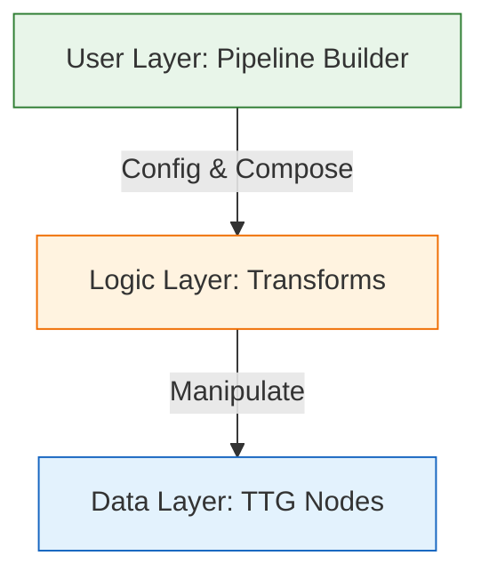
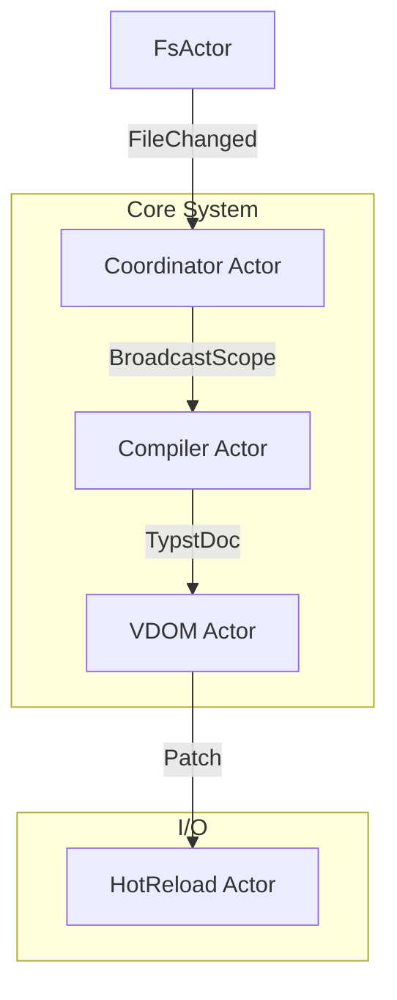

# VDOM 多阶段处理架构设计 (v5.0 - Complete)

> TTG (Trees That Grow) + GATs 实现类型安全、语义化、架构分离的多阶段文档处理
>
> **设计目标**：构建一个工业级、零开销、类型安全的 SSG 文档处理流水线。**作为 `typst_vdom` crate 发布**。
> **核心原则**：默认安全 (Correctness)，极致性能 (Performance)，易于扩展 (Extensibility)，API 友善 (Ergonomics)。

## 目录

1. [问题分析](#1-问题分析)
2. [核心理念与目标](#2-核心理念与目标)
3. [架构总览](#3-架构总览)
4. [关键设计决策](#4-关键设计决策) (Strategy)
5. [详细实现方案](#5-详细实现方案) (Tactics)
6. [开发者体验与 API](#6-开发者体验与-api) (Ease of Use)
7. [扩展性设计](#7-扩展性设计) (Extensibility)
8. [性能与内存布局](#8-性能与内存布局) (Performance)
9. [Actor 模型与 Bridge Pattern](#9-actor-模型与-bridge-pattern) (Integration)
10. [构建流水线优化](#10-构建流水线优化) (Optimization)
11. [测试策略](#11-测试策略) (Testing)
12. [迁移与落地](#12-迁移与落地)
13. [Crate 发布策略](#13-crate-发布策略) (Publishing)
14. [附录](#附录)

---

## 1. 问题分析

### 1.1 现状痛点

当前 VDOM (`vdom/mod.rs`) 虽然引入了 Raw/Indexed/Processed 阶段，但中间过程仍然是一个黑盒：

1.  **"超级转换器" (God Processor)**: `Processor` 结构体承载了太多职责（链接检查、SVG 优化、Heading 处理等），导致代码耦合，无法单独测试或复用。
2.  **隐式依赖链**: 必须先进行 "Link Check" 才能进行 "Link Resolve"，但这种依赖仅存在于代码逻辑中，编译器无法感知。假如开发者调整了顺序，可能会在运行时才发现 Panic 或逻辑错误。
3.  **状态丢失**: 元素从 `Indexed` 变到 `Processed` 是瞬间的，无法表达 "已检查但未解析" 这种中间渐进状态。
4.  **工程化缺失**: 缺乏统一的 **诊断系统 (Diagnostics)** 和 **上下文注入 (Context)**，导致错误处理和配置传递非常 ad-hoc。
5.  **配置传递混乱**: 各种 Transform 需要不同的全局配置（asset map, config, routes），目前缺乏统一且优雅的注入方式。

### 1.2 理想形态

我们希望这一条流水线像工厂流水线一样：
*   **每一步都被类型系统监控**: 如果试图打包一个还没组装的产品，流水线应该拒绝运行（编译失败）。
*   **自带质检报告**: Document 自带 `diagnostics` 通道，所有步骤产生的警告/错误统一收集。
*   **模块化插槽**: 可以随意拆卸、替换某个工序（Transform），只要接口能力 (Capability) 匹配。

---

## 2. 核心理念与目标

| 维度 | 目标 | 策略 |
|------|------|------|
| **Safety** | **编译时阻止逻辑错误** | 利用 Rust 类型系统 (GATs, Newtypes, Marker Traits) 编码处理顺序。 |
| **Observability** | **全链路诊断** | Document 携带 `Vec<Diagnostic>`，所有 Transform 只能追加不能丢弃诊断。 |
| **Flexibility** | **基于能力的可扩展性** | 使用 Capability System 代替简单的 Wrapper，允许非线性的步骤组合。 |
| **Performance** | **零抽象开销** | 大量使用 Zero-sized types (ZST) 和 phantom data，运行时无额外内存分配。 |

---

## 3. 架构总览

我们将架构分为两个维度：**数据分层**和**处理分层**。

### 3.1 数据分层 (三层状态模型)

```mermaid
graph TD
    Level1[Level 1: Phase (生命周期)] --> Level2[Level 2: Capability (流水线编排)]
    Level2 --> Level3[Level 3: Family State (微观状态)]

    style Level1 fill:#e1f5fe,stroke:#01579b
    style Level2 fill:#fff3e0,stroke:#ff6f00
    style Level3 fill:#f3e5f5,stroke:#4a148c
```

1.  **Level 1: Phase (生命周期)**
    *   **职责**: 控制内存布局（GATs `ElemExt<F>` 具体类型）
    *   **阶段**: `Raw` (堆分配) → `Indexed` (稳定ID) → `Processed` (内联优化) → `Rendered` (HTML)
    *   **性能影响**: 切换 Phase 需要 O(N) 的内存重排
    *   *编译时区分粗粒度阶段。*

2.  **Level 2: Capability (流水线编排)**
    *   **职责**: 编排 Transform 顺序
    *   **实现**: 使用 `Doc<P, C: Capabilities>` 携带类型标记，Transform 声明 `Requires` 和 `Provides`
    *   **性能影响**: **零开销** (`#[repr(transparent)]`)
    *   *编译时保证步骤依赖。*

3.  **Level 3: Family State (微观状态)**
    *   **职责**: 跟踪单个元素的具体数据演变
    *   **实现**: Enum 状态机 (`LinkState::Indexed` → `Checked` → `Resolved`)
    *   **性能影响**: Enum 判别开销（极小）
    *   *运行时与模式匹配结合。*

### 3.2 处理分层 (User → Logic → Data)



*   **Data Layer**: 纯数据结构，利用 GATs 极其紧凑地存储数据。
*   **Logic Layer**: 独立的 `Transform` 单元，负责状态流转。
*   **User Layer**: 傻瓜式 API，隐藏复杂的泛型参数。

---

## 4. 关键设计决策

### 决策 1: 三层状态模型
我们不应该用 Phase 去表达每一个微小的处理步骤（会导致 Phase 爆炸），也不应完全依赖运行时检查（不安全）。
**决定**: 采用 Phase (宏观类型) + Capability (处理进度) + FamilyState (微观数据) 的组合拳。

### 决策 2: 诊断与错误累积 (Diagnostics)
SSG 构建不应因为发现一个死链就立即 Panic，而应该收集所有错误并在最后统一报告。
**决定**: 在 `Document` 中内置 `diagnostics: Vec<Diagnostic>`。任何 Transform 必须接力传递此字段，**绝不允许**静默丢弃之前的错误信息。

### 决策 3: 基于 Capability 的扩展性
为了让 crate 对外提供极致的扩展性，简单的 Newtype Wrapper (`LinksChecked<P>`) 过于僵硬（只能线性组合）。
**决定**: 引入 **Capability System**。
*   用户可以定义新的 `Capability` (如 `LaTeXProcessed`)。
*   Pipeline 实际上是在不断累加 Document 的 "能力集"。
*   支持 DAG 依赖图，而非仅线性链。

### 决策 4: 同步核心与异步 IO 分离
**决定**:
*   **Core Pipeline** 保持 **纯同步**，专注内存数据变换（URL 解析、SVG 优化、锚点生成）。
*   **IO/Side Effects** (如外部链接检查器) 独立于核心 Pipeline，作为异步任务运行，只产生 `Diagnostics`，不直接修改 DOM 结构。
*   配置与上下文通过 `TransformContext` 统一注入。

### 决策 5: 为什么用 Capability System 而不是简单的 newtype wrapper？

```rust
// 简单 wrapper（之前的方案）
struct LinksChecked<P>(Document<P>);

// Capability System（现在的方案）
struct Doc<P, C: Capabilities>(Document<P>, PhantomData<C>);
```

**理由**：
1. **用户扩展性**：Capability 可以任意组合，wrapper 是固定顺序
2. **依赖图 vs 线性链**：Capability 支持 DAG 依赖，wrapper 只支持线性
3. **可选步骤**：Capability 可以跳过某步骤仍满足依赖
4. **类型推导友好**：避免深层嵌套类型 `A<B<C<D<...>>>>`

### 决策 6: Phase vs Capability 的职责划分

这是一个核心架构问题：什么时候用 Phase，什么时候用 Capability？

| 维度 | Phase | Capability |
|------|-------|------------|
| **语义** | 生命周期阶段 | 处理进度标记 |
| **内存影响** | 改变 struct 字段布局 | 无内存影响 (ZST) |
| **切换成本** | O(N) 全树重建 | O(1) 类型标记 |
| **适用场景** | 数据结构根本性变化 | 逻辑依赖检查 |

**具体划分**:

```rust
// Phase: 数据结构变化
Raw -> Indexed    // 添加 StableId 字段
Indexed -> Processed  // 内联优化、SmallString 替换

// Capability: 逻辑依赖
LinksChecked     // 标记链接已验证，数据不变
SvgOptimized     // 标记 SVG 已优化，只是属性变化
```

**反模式示例**:

```rust
// ❌ 错误：用 Phase 表达逻辑进度
enum Phase { Raw, LinksChecked, SvgOptimized, ... }  // Phase 爆炸！

// ❌ 错误：用 Capability 表达内存布局变化
// 因为 Capability 是 ZST，无法真正改变数据

// ✅ 正确：Phase 管结构，Capability 管进度
Document<Indexed> + (LinksChecked, SvgOptimized)
```

### 决策 7: Sealed vs Open Traits

| Trait | 开放性 | 理由 |
|-------|--------|------|
| `PhaseData` | **Sealed** | 核心类型，用户不应扩展 |
| `Capability` | **Semi-Open** | 用户可定义新能力 |
| `TagFamily` | **Semi-Open** | 用户可定义新元素族 |
| `CapTransform` | **Open** | 用户必须能自定义 Transform |
| `Plugin` | **Open** | 用户自定义插件 |

```rust
// Sealed trait 实现
mod sealed {
    pub trait Sealed {}
}

pub trait PhaseData: sealed::Sealed {
    type ElemExt<F: TagFamily>: ...;
    // ...
}

// 只有 crate 内部可以实现
impl sealed::Sealed for Raw {}
impl sealed::Sealed for Indexed {}
impl PhaseData for Raw { ... }
impl PhaseData for Indexed { ... }

// Semi-Open: 通过 feature flag 或 blanket impl 控制
pub trait Capability: 'static + Send + Sync {}
// 用户可以 impl，但核心行为受控制
```

### 决策 8: 错误处理策略

```rust
// 方案 A: Result 传播（传统 Rust）
fn transform(doc: Doc<P, C>) -> Result<Doc<P, Out>, Error>;

// 方案 B: Diagnostics 累积（本设计采用）
fn transform(doc: Doc<P, C>) -> Doc<P, Out>;  // diagnostics 在 doc 内部

// 方案 C: 混合
fn transform(doc: Doc<P, C>) -> Result<Doc<P, Out>, FatalError>;  // 只有致命错误才 Err
```

**决定**: 采用 **方案 B + 方案 C 的混合**：
- 可恢复错误（死链、无效属性）→ `diagnostics`
- 不可恢复错误（文档结构损坏）→ `Result::Err`

```rust
pub trait CapTransform<P: PhaseData, C: Capabilities> {
    fn transform(self, doc: Doc<P, C>) -> TransformResult<Doc<P, Self::Output>>;
}

pub enum TransformResult<T> {
    /// 成功（可能有警告）
    Ok(T),
    /// 部分成功（有错误但可继续）
    Partial(T),
    /// 致命失败（无法继续）
    Fatal(TransformError),
}

impl<T> TransformResult<T> {
    /// 忽略警告，继续处理
    pub fn unwrap_or_continue(self) -> Result<T, TransformError> {
        match self {
            Self::Ok(t) | Self::Partial(t) => Ok(t),
            Self::Fatal(e) => Err(e),
        }
    }
}
```

### 决策 9: 内存所有权模型

```rust
// 方案 A: 所有权转移（当前设计）
fn transform(self, doc: Doc<P, C>) -> Doc<P, Out>;

// 方案 B: 借用 + Clone
fn transform(&self, doc: &Doc<P, C>) -> Doc<P, Out>;

// 方案 C: 原地修改
fn transform(&self, doc: &mut Doc<P, C>);
```

**决定**: 采用 **方案 A (所有权转移)**：
- **优点**:
  - 编译器保证无悬空引用
  - 允许 Transform 消耗资源（如缓存）
  - 自然支持 `Send` / `Sync`
- **缺点**:
  - 无法保留原始文档（需要 clone）
  - 每步都是 "Move"

**缓解**: 提供 `doc.checkpoint()` 用于显式快照：

```rust
let doc = PipelineBuilder::new(raw_doc)
    .pipe(HeadProcessor)
    .checkpoint()  // 内部 clone，返回 (Doc, Arc<Doc>)
    .pipe(LinkChecker)
    .finish();
```

### 决策 10: 泛型参数顺序

```rust
// 方案 A: Phase 在前
Doc<P: PhaseData, C: Capabilities>

// 方案 B: Capability 在前
Doc<C: Capabilities, P: PhaseData>
```

**决定**: 采用 **方案 A**，因为：
- Phase 是更 "稳定" 的类型参数（通常在整个 pipeline 中固定为 Indexed）
- Capability 变化频繁，放后面利于省略默认值
- 符合 `Option<T>`, `Result<T, E>` 的惯例（核心类型在前）

---

## 5. 详细实现方案

### 5.1 Document 与 Diagnostics (工程化基础)

```rust
#[derive(Debug, Clone)]
pub struct Diagnostic {
    pub level: DiagnosticLevel, // Error, Warning, Info
    pub message: String,
    pub span: Option<Span>,           // 关联源码位置
    pub element_id: Option<StableId>, // 关联 DOM 节点
}

pub struct Document<P: PhaseData> {
    pub root: Element<P>,
    pub ext: P::DocExt,
    /// 诊断通道：只增不减
    pub diagnostics: Vec<Diagnostic>,
}

impl<P: PhaseData> Document<P> {
    pub fn push_error(&mut self, msg: impl Into<String>) { ... }
    pub fn push_warning(&mut self, msg: impl Into<String>) { ... }

    // 转换 phase 时保留 diagnostics
    pub fn map_phase<Q: PhaseData>(self, root: Element<Q>, ext: Q::DocExt) -> Document<Q> {
        Document {
            root,
            ext,
            diagnostics: self.diagnostics,
        }
    }
}
```

### 5.2 Capability System (核心扩展机制)

这是实现 "类型安全流水线" 的关键代码。我们需要在**编译时**检查 Transform 的依赖关系。

#### 5.2.1 能力标记与集合

```rust
// ============ 1. 能力标记 ============

/// 能力标记 trait - 所有能力必须实现
/// 使用 sealed pattern 防止下游 crate 绕过检查
pub trait Capability: sealed::Sealed + 'static + Send + Sync {
    /// 能力名称，用于调试和错误信息
    const NAME: &'static str;
}

mod sealed {
    pub trait Sealed {}

    // 允许用户定义的能力也被 seal
    impl<T: super::UserCapability> Sealed for T {}
}

/// 用户可扩展的能力 trait
pub trait UserCapability: 'static + Send + Sync {
    const NAME: &'static str;
}

// 自动为 UserCapability 实现 Capability
impl<T: UserCapability> Capability for T {
    const NAME: &'static str = T::NAME;
}

// ============ 内置能力 ============

/// Head 元数据已处理
pub struct HeadProcessedCap;
impl sealed::Sealed for HeadProcessedCap {}
impl Capability for HeadProcessedCap {
    const NAME: &'static str = "HeadProcessed";
}

/// 链接已检查（验证存在性）
pub struct LinksCheckedCap;
impl sealed::Sealed for LinksCheckedCap {}
impl Capability for LinksCheckedCap {
    const NAME: &'static str = "LinksChecked";
}

/// 链接已解析（相对路径 → 绝对路径）
pub struct LinksResolvedCap;
impl sealed::Sealed for LinksResolvedCap {}
impl Capability for LinksResolvedCap {
    const NAME: &'static str = "LinksResolved";
}

/// SVG 已优化
pub struct SvgOptimizedCap;
impl sealed::Sealed for SvgOptimizedCap {}
impl Capability for SvgOptimizedCap {
    const NAME: &'static str = "SvgOptimized";
}
```

#### 5.2.2 能力集合与查询

```rust
// ============ 2. 能力集合 ============

/// 能力集合 trait - 表示一组能力的类型
pub trait Capabilities: 'static + Send + Sync {}

// 空集合
impl Capabilities for () {}

// 递归定义：(Cap, Rest) 是能力集合
impl<C: Capability, Rest: Capabilities> Capabilities for (C, Rest) {}

// ============ 能力查询 ============

/// 检查能力集合 `Self` 是否包含能力 `C`
///
/// 编译器会在 pipeline 构建时检查此约束
#[diagnostic::on_unimplemented(
    message = "capability `{C}` is required but not available",
    label = "this transform requires `{C}`",
    note = "available capabilities: {Self}",
    note = "try adding the appropriate Transform earlier in the pipeline"
)]
pub trait HasCapability<C: Capability>: Capabilities {}

// 基础情况：(C, Rest) 包含 C
impl<C: Capability, Rest: Capabilities> HasCapability<C> for (C, Rest) {}

// 递归情况：(Other, Rest) 包含 C 如果 Rest 包含 C
impl<C, Other, Rest> HasCapability<C> for (Other, Rest)
where
    C: Capability,
    Other: Capability,
    Rest: Capabilities + HasCapability<C>,
{}

// ============ 辅助 trait：添加能力 ============

/// 向能力集合添加新能力
pub trait AddCapability<C: Capability>: Capabilities {
    type Output: Capabilities;
}

impl<C: Capability, Self_: Capabilities> AddCapability<C> for Self_ {
    type Output = (C, Self_);
}
```

#### 5.2.3 携带能力的文档容器

```rust
// ============ 3. 携带能力的文档容器 ============

/// 携带能力标记的文档包装器
///
/// `Doc<P, C>` 表示一个处于 Phase `P`、拥有能力集 `C` 的文档。
///
/// # 类型参数
///
/// * `P` - Phase (Raw, Indexed, Processed)
/// * `C` - Capabilities (能力集，默认为空 `()`)
///
/// # 零开销
///
/// 此类型使用 `#[repr(transparent)]`，与 `Document<P>` 内存布局相同。
/// `PhantomData<C>` 是零大小类型，不占用运行时内存。
#[repr(transparent)]
pub struct Doc<P: PhaseData, C: Capabilities = ()> {
    inner: Document<P>,
    _cap: PhantomData<C>,
}

impl<P: PhaseData, C: Capabilities> Doc<P, C> {
    /// 从 Document 创建，初始能力为空
    pub fn new(doc: Document<P>) -> Doc<P, ()> {
        Doc { inner: doc, _cap: PhantomData }
    }

    /// 设置能力标记（内部使用）
    pub(crate) fn with_cap<NewC: Capabilities>(doc: Document<P>) -> Doc<P, NewC> {
        Doc { inner: doc, _cap: PhantomData }
    }

    /// 提取内部 Document，丢弃能力信息
    pub fn into_inner(self) -> Document<P> {
        self.inner
    }

    /// 借用内部 Document
    pub fn as_inner(&self) -> &Document<P> {
        &self.inner
    }

    /// 可变借用内部 Document
    pub fn as_inner_mut(&mut self) -> &mut Document<P> {
        &mut self.inner
    }

    /// 添加能力标记
    pub fn add_cap<NewC: Capability>(self) -> Doc<P, (NewC, C)> {
        Doc {
            inner: self.inner,
            _cap: PhantomData,
        }
    }

    /// 获取诊断信息
    pub fn diagnostics(&self) -> &[Diagnostic] {
        &self.inner.diagnostics
    }

    /// 检查是否有错误
    pub fn has_errors(&self) -> bool {
        self.inner.diagnostics.iter().any(|d| d.level == DiagnosticLevel::Error)
    }
}

// Debug 实现：显示能力信息
impl<P: PhaseData, C: Capabilities> std::fmt::Debug for Doc<P, C> {
    fn fmt(&self, f: &mut std::fmt::Formatter<'_>) -> std::fmt::Result {
        f.debug_struct("Doc")
            .field("phase", &std::any::type_name::<P>())
            .field("capabilities", &std::any::type_name::<C>())
            .field("diagnostics_count", &self.inner.diagnostics.len())
            .finish()
    }
}
```

#### 5.2.4 Transform 接口

Transform 是 Pipeline 的核心组件。每个 Transform 声明它需要什么能力、提供什么能力。

```rust
// ============ 4. Transform 接口 ============

/// 携带能力约束的 Transform trait
///
/// # 类型参数
///
/// * `P` - Phase，Transform 操作的文档阶段
/// * `C` - 输入文档的能力集
///
/// # 关联类型
///
/// * `Requires` - 前置条件：需要输入文档具备的能力
/// * `Provides` - 产出：此 Transform 添加的能力
/// * `Output` - 输出文档的完整能力集
///
/// # 编译时检查
///
/// `where C: HasCapability<Self::Requires>` 约束确保
/// 编译器在构建 Pipeline 时检查依赖关系。
pub trait CapTransform<P: PhaseData, C: Capabilities> {
    /// 前置条件：需要哪些能力
    type Requires: Capability;

    /// 产出：提供哪个能力
    type Provides: Capability;

    /// 输出能力集（通常是 `(Provides, C)`）
    type Output: Capabilities;

    /// 执行转换
    ///
    /// # 约束
    ///
    /// `C: HasCapability<Self::Requires>` 在编译时检查，
    /// 确保调用者已经应用了必要的前置 Transform。
    fn transform(self, doc: Doc<P, C>) -> Doc<P, Self::Output>
    where
        C: HasCapability<Self::Requires>;

    /// Transform 名称，用于日志和调试
    fn name(&self) -> &'static str {
        std::any::type_name::<Self>()
    }
}

/// 无前置条件的 Transform（特殊情况）
///
/// 使用 `()` 作为 Requires 表示无依赖
pub struct NoCap;
impl Capability for NoCap {
    const NAME: &'static str = "None";
}
impl sealed::Sealed for NoCap {}

// 任何 Capabilities 都"包含" NoCap
impl<C: Capabilities> HasCapability<NoCap> for C {}
```

#### 5.2.5 内置 Transform 实现示例

```rust
// ============ HeadProcessor: 无依赖，产出 HeadProcessedCap ============

pub struct HeadProcessor;

impl<P: PhaseData, C: Capabilities> CapTransform<P, C> for HeadProcessor {
    type Requires = NoCap;              // 无依赖
    type Provides = HeadProcessedCap;
    type Output = (HeadProcessedCap, C);

    fn transform(self, doc: Doc<P, C>) -> Doc<P, Self::Output>
    where C: HasCapability<NoCap>
    {
        let mut inner = doc.into_inner();

        // 处理 <head> 元数据
        self.extract_metadata(&mut inner);

        Doc::with_cap(inner)
    }

    fn name(&self) -> &'static str { "HeadProcessor" }
}

// ============ LinkChecker: 需要 HeadProcessed ============

pub struct LinkChecker {
    pub strict: bool,
}

impl<P: PhaseData, C: Capabilities> CapTransform<P, C> for LinkChecker {
    type Requires = HeadProcessedCap;   // 需要 Head 已处理
    type Provides = LinksCheckedCap;
    type Output = (LinksCheckedCap, C);

    fn transform(self, doc: Doc<P, C>) -> Doc<P, Self::Output>
    where C: HasCapability<HeadProcessedCap>
    {
        let mut inner = doc.into_inner();

        // 检查所有链接，将错误推入 diagnostics
        self.check_links(&mut inner);

        Doc::with_cap(inner)
    }

    fn name(&self) -> &'static str { "LinkChecker" }
}

// ============ LinkResolver: 需要 LinksChecked ============

pub struct LinkResolver {
    pub base_url: String,
}

impl<P: PhaseData, C: Capabilities> CapTransform<P, C> for LinkResolver {
    type Requires = LinksCheckedCap;    // 需要链接已检查
    type Provides = LinksResolvedCap;
    type Output = (LinksResolvedCap, C);

    fn transform(self, doc: Doc<P, C>) -> Doc<P, Self::Output>
    where C: HasCapability<LinksCheckedCap>
    {
        let mut inner = doc.into_inner();

        // 解析相对链接为绝对链接
        self.resolve_links(&mut inner, &self.base_url);

        Doc::with_cap(inner)
    }

    fn name(&self) -> &'static str { "LinkResolver" }
}
```

### 5.3 Family State (微观状态机)

Family State 追踪单个元素的数据演变。与 Capability 不同，这是**运行时**状态。

```rust
// src/vdom/family.rs

/// 链接状态机
///
/// 表示链接在处理过程中的状态演变：
/// `Indexed` → `Checked` → `Resolved`
#[derive(Debug, Clone)]
pub enum LinkState {
    /// 初始状态：仅有原始 href
    Indexed(LinkIndexedState),
    /// 已检查：验证过链接有效性
    Checked(LinkCheckedState),
    /// 已解析：相对路径转为绝对路径
    Resolved(LinkResolvedState),
}

#[derive(Debug, Clone)]
pub struct LinkIndexedState {
    pub href: Option<String>,
    pub link_type: LinkType,
}

#[derive(Debug, Clone)]
pub struct LinkCheckedState {
    pub href: Option<String>,
    pub validation: LinkValidation,
}

#[derive(Debug, Clone)]
pub struct LinkResolvedState {
    pub resolved_url: String,
    pub is_external: bool,
}

/// 链接元素的扩展数据
pub struct LinkIndexedData {
    pub state: LinkState,
}

// 辅助方法，用于在 transform 中安全地 switch state
impl LinkIndexedData {
    pub fn as_checked(&self) -> Option<&LinkCheckedState> {
        match &self.state {
            LinkState::Checked(s) => Some(s),
            _ => None,
        }
    }

    pub fn transition_to_checked(&mut self, validation: LinkValidation) {
        if let LinkState::Indexed(indexed) = &self.state {
            self.state = LinkState::Checked(LinkCheckedState {
                href: indexed.href.clone(),
                validation,
            });
        }
    }
}
```

### 5.4 Transform 实现示例

```rust
// src/vdom/transforms/link_resolver.rs

pub struct LinkResolverConfig {
    pub base_url: String,
    pub route_table: Arc<RouteTable>,
}

pub struct LinkResolver {
    config: LinkResolverConfig,
}

impl LinkResolver {
    pub fn new(config: LinkResolverConfig) -> Self { Self { config } }
}

impl<P: PhaseData, C: Capabilities> CapTransform<P, C> for LinkResolver
where
    C: HasCapability<LinksCheckedCap>,
{
    type Requires = LinksCheckedCap;
    type Provides = LinksResolvedCap;
    type Output = (LinksResolvedCap, C);

    fn transform(self, doc: Doc<P, C>) -> Doc<P, Self::Output> {
        let mut inner = doc.into_inner();

        // 遍历并在原地修改 FamilyData
        // 如果发现无法解析的链接，Push diagnostic，而不是 panic
        self.resolve_recursive(&mut inner.root, &mut inner.diagnostics);

        Doc::with_cap(inner)
    }
}
```

### 5.5 Progress Chain 定义

```rust
// src/vdom/progress.rs

/// 定义 Progress wrapper 宏
macro_rules! define_progress {
    ($name:ident, $doc:literal) => {
        #[doc = $doc]
        #[repr(transparent)]
        pub struct $name<P: PhaseData>(Document<P>);

        impl<P: PhaseData> $name<P> {
            pub fn new(doc: Document<P>) -> Self { Self(doc) }
            pub fn into_inner(self) -> Document<P> { self.0 }
        }
    };
}

define_progress!(RawDoc, "初始 Raw 状态");
define_progress!(IndexedDoc, "已分配 StableID");
define_progress!(HeadProcessed, "Head 元数据已处理");
define_progress!(LinksChecked, "链接完整性已检查");
define_progress!(LinksResolved, "路径已解析");
define_progress!(MediaProcessed, "媒体资源已处理");
define_progress!(ReadyToRender, "所有处理完成");
```

### 5.6 Pipeline Builder & Context

```rust
// src/vdom/pipeline.rs

pub struct TransformContext {
    pub config: Arc<SiteConfig>,
    pub routes: Arc<RouteTable>,
    pub asset_map: Arc<AssetMap>,
}

/// Pipeline builder - 流式 API
pub struct PipelineBuilder<P: PhaseData, C: Capabilities> {
    doc: Doc<P, C>,
    ctx: Option<TransformContext>,
}

impl<P: PhaseData> PipelineBuilder<P, ()> {
    /// 从 Document 创建 pipeline
    pub fn new(doc: Document<P>) -> Self {
        Self { doc: Doc::new(doc), ctx: None }
    }
}

impl<P: PhaseData, C: Capabilities> PipelineBuilder<P, C> {
    pub fn with_context(mut self, ctx: TransformContext) -> Self {
        self.ctx = Some(ctx);
        self
    }

    /// 应用 Transform（类型安全）
    pub fn pipe<T>(self, transform: T) -> PipelineBuilder<P, T::Output>
    where
        T: CapTransform<P, C>,
        C: HasCapability<T::Requires>,
    {
        PipelineBuilder {
            doc: transform.transform(self.doc),
            ctx: self.ctx,
        }
    }

    /// 条件应用
    pub fn pipe_if<T>(self, condition: bool, transform: T) -> Self
    where
        T: CapTransform<P, C, Output = C>,
    {
        if condition {
            PipelineBuilder {
                doc: transform.transform(self.doc),
                ctx: self.ctx,
            }
        } else {
            self
        }
    }

    /// 完成并提取 Document
    pub fn finish(self) -> Document<P> {
        self.doc.into_inner()
    }
}

// ============ 使用示例 ============

let result = PipelineBuilder::new(doc)
    .with_context(ctx)
    .pipe(HeadProcessor)           // () → (HeadProcessed,)
    .pipe(LinkChecker)             // 需要 HeadProcessed
    .pipe(LinkResolver::new(cfg))  // 需要 LinksChecked
    .pipe(SvgOptimizer::new())
    .finish();
```

---

## 6. 开发者体验与 API (Ease of Use)

类型系统很强大，但不能折磨用户。我们通过 **Prelude** 和 **Builder** 模式封装复杂性。

### 6.1 极简 API (End User)

```rust
use vdom::prelude::*;

let result = Pipeline::new()
    .with_config(site_config)
    .run(raw_doc)?; // 自动执行标准流程：Index -> Process -> Render

// 获得结果
println!("{}", result.html);
// 查看问题
for err in result.diagnostics {
    eprintln!("{:?}", err);
}
```

### 6.2 灵活配置 (Power User)

```rust
use vdom::prelude::*;
use vdom::transforms::{LinkChecker, SvgOptimizer};

let mut pipeline = Pipeline::builder();

// 1. 配置标准步骤
pipeline.configure::<LinkChecker>(|cfg| {
    cfg.strict_mode = true;
});

// 2. 禁用不需要的步骤（灵活性）
pipeline.disable::<SvgOptimizer>();

// 3. 注入上下文（解决配置传递问题）
pipeline.set_context(TransformContext {
    base_url: "https://example.com".into(),
    ..Default::default()
});

let output = pipeline.build().run(doc);
```

### 6.3 类型别名 (Internal)

为了让类型错误可读，我们定义标准别名：

```rust
// 避免让用户看到 Document<LinksChecked<Indexed>> 这种天书
pub type IndexedDoc = Document<Indexed>;
pub type CheckedDoc = Doc<Indexed, (LinksCheckedCap,)>;
pub type ProcessedDoc = Document<Processed>;
```

### 6.4 预设 Pipeline（便捷 API）

```rust
/// 标准处理 pipeline
pub fn standard_pipeline<P: PhaseData>(doc: Document<P>) -> Document<Processed> {
    PipelineBuilder::new(doc)
        .pipe(HeadProcessor)
        .pipe(LinkChecker)
        .pipe(LinkResolver::default())
        .pipe(SvgOptimizer::default())
        .into_processed()
}

/// 最小 pipeline（跳过优化）
pub fn minimal_pipeline<P: PhaseData>(doc: Document<P>) -> Document<Processed> {
    PipelineBuilder::new(doc)
        .pipe(HeadProcessor)
        .pipe(LinkChecker)
        .pipe(LinkResolver::default())
        .pipe(SkipSvgOptimization)  // 跳过但标记能力
        .into_processed()
}
```

---

## 7. 扩展性设计 (Extensibility)

### 7.1 插件接口 (The Plugin Trait)

```rust
/// 用户自定义转换器
pub trait Plugin: Send + Sync {
    fn name(&self) -> &str;
    /// 在 Index 阶段之后、Process 阶段之前运行
    fn run(&self, doc: &mut Document<Indexed>, ctx: &TransformContext);
}

// 示例：代码块高亮插件
struct SyntaxHighlighter;
impl Plugin for SyntaxHighlighter {
    fn name(&self) -> &str { "SyntaxHighlighter" }
    fn run(&self, doc: &mut Document<Indexed>, _ctx: &TransformContext) {
        // 1. Visit 遍历所有 Node
        // 2. 找到 Family = Other(CodeBlock) 的节点
        // 3. 修改其内容
    }
}

// 注册使用
pipeline.add_plugin(SyntaxHighlighter::new());
```

*设计考量*：为什么 Plugin 只能在 `Indexed` 阶段操作？
*   因为这是 DOM 结构最稳定、信息最全（有 StableId）、且未被破坏性优化（如 SVG 路径烘焙）的时刻。
*   允许用户在任意 Phase 插入逻辑会导致 API 指数级复杂。约定优于配置。

### 7.2 用户自定义 Transform

```rust
// ============ 用户代码（下游 crate）============

use vdom::{Doc, CapTransform, Capabilities, HasCapability};
use vdom::caps::{LinksCheckedCap, HeadProcessedCap};

/// 用户自定义能力
pub struct LaTeXProcessedCap;
impl vdom::Capability for LaTeXProcessedCap {}

/// 用户自定义 Transform
pub struct LaTeXProcessor {
    pub katex_options: KaTeXOptions,
}

impl<P: PhaseData, C: Capabilities> CapTransform<P, C> for LaTeXProcessor
where
    C: HasCapability<HeadProcessedCap>,  // 需要 head 已处理
{
    type Requires = HeadProcessedCap;
    type Provides = LaTeXProcessedCap;
    type Output = (LaTeXProcessedCap, C);

    fn transform(self, doc: Doc<P, C>) -> Doc<P, Self::Output> {
        // 处理 LaTeX 公式...
        Doc::with_cap(process_latex(doc.into_inner(), &self.katex_options))
    }
}

// ============ 使用示例 ============

fn main() {
    let doc: Doc<Indexed, ()> = Doc::new(indexed_document);

    // 正确：满足依赖
    let processed = doc
        .pipe(HeadProcessor)           // () → (HeadProcessed,)
        .pipe(LaTeXProcessor::new())   // (HeadProcessed,) → (LaTeX, HeadProcessed,)
        .pipe(LinkChecker);            // ✅ 有 HeadProcessed

    // 错误：缺少依赖
    let wrong = doc
        .pipe(LaTeXProcessor::new());  // ❌ 编译错误：() 没有 HeadProcessed
}
```

### 7.3 用户自定义 Family

```rust
/// 标签族 trait - 用户可实现
pub trait TagFamily: 'static + Send + Sync {
    const NAME: &'static str;

    /// Indexed 阶段的数据类型
    type IndexedData: Debug + Clone + Default + Send + Sync;

    /// Processed 阶段的数据类型
    type ProcessedData: Debug + Clone + Default + Send + Sync;

    /// 识别函数：tag + attrs → 是否属于此 Family
    fn identify(tag: &str, attrs: &[(String, String)]) -> bool;

    /// 处理函数：IndexedData → ProcessedData
    fn process(indexed: &Self::IndexedData) -> Self::ProcessedData;
}

// ============ 用户自定义 Family ============

/// 代码块族（用户定义）
pub struct CodeBlockFamily;

#[derive(Debug, Clone, Default)]
pub struct CodeBlockIndexedData {
    pub language: Option<String>,
    pub line_numbers: bool,
}

#[derive(Debug, Clone, Default)]
pub struct CodeBlockProcessedData {
    pub highlighted_html: String,
    pub language: String,
}

impl TagFamily for CodeBlockFamily {
    const NAME: &'static str = "code-block";

    type IndexedData = CodeBlockIndexedData;
    type ProcessedData = CodeBlockProcessedData;

    fn identify(tag: &str, attrs: &[(String, String)]) -> bool {
        tag == "pre" && attrs.iter().any(|(k, _)| k == "data-lang")
    }

    fn process(indexed: &Self::IndexedData) -> Self::ProcessedData {
        CodeBlockProcessedData {
            highlighted_html: highlight(&indexed.language),
            language: indexed.language.clone().unwrap_or_default(),
        }
    }
}
```

### 7.4 FamilyExt 扩展机制 (Advanced)

为了让用户能够添加新的元素族（Family），我们设计了可扩展的 `FamilyExt` 机制：

```rust
// ============ 核心 FamilyExt - 内置 Family ============

/// 核心 FamilyExt - 由 crate 提供
#[derive(Debug, Clone)]
pub enum CoreFamilyExt<P: PhaseData> {
    Svg(P::ElemExt<SvgFamily>),
    Link(P::ElemExt<LinkFamily>),
    Heading(P::ElemExt<HeadingFamily>),
    Media(P::ElemExt<MediaFamily>),
    Other(P::ElemExt<OtherFamily>),
}

// ============ 可扩展 FamilyExt - 支持用户 Family ============

/// 可扩展 FamilyExt - 支持用户添加新的 Family
#[derive(Debug, Clone)]
pub enum FamilyExt<P: PhaseData, U: UserFamilies = ()> {
    Core(CoreFamilyExt<P>),
    User(U::Ext<P>),
}

/// 用户 Family 集合 trait
pub trait UserFamilies {
    type Ext<P: PhaseData>: Debug + Clone;
}

// 默认：无用户 Family
impl UserFamilies for () {
    type Ext<P: PhaseData> = std::convert::Infallible;
}

// ============ 用户扩展示例 ============

/// 用户的 Family 集合
pub struct MyFamilies;

impl UserFamilies for MyFamilies {
    type Ext<P: PhaseData> = MyFamilyExt<P>;
}

#[derive(Debug, Clone)]
pub enum MyFamilyExt<P: PhaseData> {
    CodeBlock(P::ElemExt<CodeBlockFamily>),
    MathBlock(P::ElemExt<MathBlockFamily>),
}

// 使用时的类型
type MyDocument<P> = Document<P, MyFamilies>;
```

### 7.5 扩展性 vs 类型安全权衡

```
                    类型安全
                        │
                        │    ┌─────────────────┐
                   高 ──┼────│  Capability     │
                        │    │  System         │
                        │    └─────────────────┘
                        │
                        │    ┌─────────────────┐
                   中 ──┼────│  Progress       │
                        │    │  Wrapper        │
                        │    └─────────────────┘
                        │
                        │    ┌─────────────────┐
                   低 ──┼────│  Runtime        │
                        │    │  Dispatch       │
                        │    └─────────────────┘
                        │
                        └────────────────────────► 扩展性
                             低      中      高
```

**推荐策略**：

1. **核心 crate**：使用 Capability System（高类型安全）
2. **用户扩展**：通过 `impl CapTransform` 和 `impl TagFamily`
3. **便捷 API**：提供预设 pipeline，隐藏复杂性

---

## 8. 性能与内存布局 (Performance)

性能是 Rust 的底色。本架构在以下方面做了极致优化：

### 8.1 内存紧凑性 (Compact Layout)

利用 GATs，我们确保每个阶段的 Node 只包含该阶段必要的数据。

*   **Raw Phase**: `Link { href: String }` → 只有字符串堆分配。
*   **Processed Phase**: `Link { resolved: SmallString<32>, is_external: bool }` → 甚至可能内联存储，无堆分配。

**对比**: 传统 `Box<dyn Any>` 或 `HashMap` 扩展字段方案，每个节点都有巨大的指针开销和内存碎片。TTG 方案是 **Flat Memory**。

### 8.2 阶段转换成本 (The Phase Shift Cost)

是的，`Raw` → `Indexed` 需要重新分配整个树。

*   **缓解策略**:
    *   **Vector Arena**: 探索将所有 Node 存储在一个扁平的 `Vec<NodeData>` Arena 中，树结构仅存储 `u32` 索引。这样 Phase Shift 只是生成一个新的 Arena，具有极佳的缓存局部性 (Cache Locality)。
    *   *(当前版本先保持 Box 树结构，Arena 可作为后续内部优化，不影响 API)*。

### 8.3 并行化潜力 (Parallelism)

Pipeline 本身是串行的（逻辑依赖），但 **单个 Transform 内部** 可以并行。

```rust
impl<C: Capabilities> CapTransform<Indexed, C> for ImageOptimizer {
    fn transform(self, doc: Doc<Indexed, C>) -> Doc<Indexed, Self::Output> {
        let mut inner = doc.into_inner();

        // 使用 Rayon 并行遍历树
        inner.root.par_visit_mut(|node| {
            if let Node::Image(img) = node {
                self.optimize(img);
            }
        });

        Doc::with_cap(inner)
    }
}
```

由于 `Document` 拥有所有权，且 `Send`，这种并行化是 Rust 借用检查器天然支持的。

### 8.4 类型安全保证总结

| 检查项 | 机制 | 时机 |
|--------|------|------|
| Transform 顺序 | `HasCapability<T::Requires>` | 编译时 |
| Phase 兼容性 | `P: PhaseData` 约束 | 编译时 |
| Family 类型安全 | GAT `ElemExt<F>` | 编译时 |
| 能力完整性 | `into_processed()` 约束 | 编译时 |
| 自定义 Transform | trait bounds | 编译时 |

---

## 9. Actor 模型与 Bridge Pattern (Integration)

本节描述如何将 VDOM Pipeline 与 Actor 并发模型集成，实现高性能的热重载系统。

### 9.1 Actor 拓扑设计



### 9.2 Actor Protocol Definition

精确定义 Actor 间的通信契约：

```rust
// ============ FsActor -> Coordinator ============
pub enum FsMsg {
    /// Batch of changed files (debounced)
    FilesChanged(Vec<PathBuf>),
}

// ============ Coordinator -> Compiler ============
pub enum CompilerMsg {
    /// Request compilation of specific files
    Compile {
        files: Vec<PathBuf>,
        /// Injects current build configuration (Prod/Dev)
        driver: Box<dyn BuildDriver>,
    },
}

// ============ Compiler -> VDOM ============
pub enum VdomMsg {
    /// New Typst artifacts ready for VDOM processing
    ProcessArtifacts {
        path: PathBuf,
        doc: Arc<typst::Document>,
    }
}

// ============ VDOM -> HotReload ============
pub enum PatchMsg {
    /// Diffs ready to be broadcast
    BroadcastPatches {
        path: String, // URL path
        patches: Vec<Patch>,
    }
}
```

### 9.3 Bridge Pattern (`src/compiler/bridge.rs`)

这是解耦 `typst_lib` 和 `vdom` 的关键适配层。

**目的**:
- `typst_lib` 只负责生成 `typst::Document`（纯编译）。
- `bridge` 负责 `typst::Document` → `vdom::Document` → `indexed::Document` 的转换流水线。
- 保持依赖单向：`compiler` → `typst_lib`, `compiler` → `vdom`，但 `typst_lib` **不知道** `vdom` 的存在。

```rust
// src/compiler/bridge.rs

pub struct CompilerBridge;

impl CompilerBridge {
    /// Convert Typst document to Tola VDOM and apply all transforms
    pub fn to_vdom(
        typst_doc: &typst::Document,
        driver: &dyn BuildDriver
    ) -> Result<Document<Indexed>> {
        // 1. Raw Conversion (typst -> vdom)
        let raw_doc = vdom::from_typst(typst_doc)?;

        // 2. Transformation Pipeline
        let indexed_doc = PipelineBuilder::new(raw_doc)
            .pipe(Indexer::new(driver))      // Inject StableIds
            .pipe(HeadProcessor)             // Extract metadata
            .pipe(LinkChecker)               // Validate links
            .pipe(LinkResolver::default())   // Fix relative paths
            .finish();

        Ok(indexed_doc)
    }

    /// Full pipeline: compile + transform + diff
    pub fn compile_and_diff(
        path: &Path,
        driver: &dyn BuildDriver,
        cache: &mut VdomCache,
    ) -> Result<Vec<Patch>> {
        let typst_doc = typst_lib::compile(path)?;
        let new_vdom = Self::to_vdom(&typst_doc, driver)?;

        let patches = if let Some(old_vdom) = cache.get(path) {
            vdom::diff(&old_vdom, &new_vdom)
        } else {
            vec![Patch::Replace { html: new_vdom.to_html() }]
        };

        cache.insert(path.to_owned(), new_vdom);
        Ok(patches)
    }
}
```

### 9.4 状态迁移计划 (State Migration)

将全局状态迁移到 Actor 内部，消除锁竞争：

#### VDOM Cache 迁移

```rust
// 现状：全局静态 + Mutex
static VDOM_CACHE: LazyLock<Mutex<HashMap<PathBuf, Document<Indexed>>>> = ...;

// 迁移后：Actor 内部状态
pub struct VdomActor {
    cache: HashMap<PathBuf, Document<Indexed>>,
    // 无需 Mutex！Actor 邮箱自动序列化访问
}

impl Actor for VdomActor {
    fn handle(&mut self, msg: VdomMsg) {
        match msg {
            VdomMsg::ProcessArtifacts { path, doc } => {
                let indexed = CompilerBridge::to_vdom(&doc, &Development)?;

                // 直接访问，无锁
                let patches = self.diff_and_cache(&path, indexed);

                self.send(HotReloadActor, PatchMsg::BroadcastPatches {
                    path: path.to_string(),
                    patches,
                });
            }
        }
    }
}
```

#### WebSocket Broadcast 迁移

```rust
// 现状：全局 BROADCAST channel
static BROADCAST: LazyLock<broadcast::Sender<...>> = ...;

// 迁移后：HotReload Actor 管理所有连接
pub struct HotReloadActor {
    connections: Vec<WebSocketSender>,
}

impl Actor for HotReloadActor {
    fn handle(&mut self, msg: PatchMsg) {
        match msg {
            PatchMsg::BroadcastPatches { path, patches } => {
                let json = serde_json::to_string(&patches)?;
                for conn in &mut self.connections {
                    conn.send(json.clone());
                }
            }
        }
    }
}
```

### 9.5 逐步迁移计划 (Strangler Fig Pattern)

采取"并存-替换"策略，而非一次性重写：

*   **Step 1: 激活 Coordinator**
    *   启用 `Cargo.toml` 中的 `actor` feature。
    *   在 `serve.rs` 启动时初始化 `sys = System::new()`。
    *   将 `notify` 的回调函数改为向 `FsActor` 发送消息。

*   **Step 2: 替换 Compiler**
    *   填充 `src/actor/compiler.rs` 的 `do_compile` 方法，接入真正的 `typst_lib`。
    *   实现 rayon 线程池的非阻塞调用 (`tokio::task::spawn_blocking`)。

*   **Step 3: 状态内化**
    *   将 `VDOM_CACHE` 移入 `VdomActor` 内部。
    *   将 `BROADCAST` 移入 `HotReloadActor` 内部。
    *   删除全局静态变量。

### 9.6 为什么坚持 Actor 模型？

虽然目前项目规模尚小，但 Actor 模型强制了**状态隔离**。对于热重载系统，最大的 Bug 来源就是多线程下的状态竞争（`World` 状态 vs `Render` 状态）。Actor 模型通过消息传递，自然地序列化了对 `World` 的修改，从根本上消除了 Data Race。

### 9.7 Driver Pattern 与 Actor 的关系

`BuildDriver` trait 是构建流程的抽象 (Prod vs Dev)。它与 Actor 模型不冲突：
*   Compiler Actor 内部会持有一个 `Box<dyn BuildDriver>`。
*   在 Dev 模式下，注入 `DevelopmentDriver` (生成 data-ids, 启用缓存)。
*   在 Prod 模式下，注入 `ProductionDriver` (开启优化, 禁用热重载)。

```rust
// 扩展的 Driver Pattern
pub trait BuildDriver: Send + Sync {
    fn emit_ids(&self) -> bool;
    fn cache_vdom(&self) -> bool;

    // 新增
    fn minify_html(&self) -> bool;
    fn optimize_svg(&self) -> bool;
    fn source_maps(&self) -> bool;
    fn incremental(&self) -> bool;
}

pub struct Production;
impl BuildDriver for Production {
    fn emit_ids(&self) -> bool { false }
    fn cache_vdom(&self) -> bool { false }
    fn minify_html(&self) -> bool { true }
    fn optimize_svg(&self) -> bool { true }
    fn source_maps(&self) -> bool { false }
    fn incremental(&self) -> bool { false }
}

pub struct Development;
impl BuildDriver for Development {
    fn emit_ids(&self) -> bool { true }
    fn cache_vdom(&self) -> bool { true }
    fn minify_html(&self) -> bool { false }
    fn optimize_svg(&self) -> bool { false }  // 开发时跳过优化
    fn source_maps(&self) -> bool { true }
    fn incremental(&self) -> bool { true }
}
```

---

## 10. 构建流水线优化 (Optimization)

在架构理顺后，我们需要解决"两遍编译"的性能问题。

### 10.1 问题分析：两遍编译

当前构建流程：
1. **第一遍**: 编译所有文件，提取 metadata (title, date, tags 等)，构建 `pages.json`。
2. **第二遍**: 重新编译所有文件，这次注入完整的 `pages.json` (因为某些页面如 index 需要列出所有文章)。

这导致每次完整构建都有 **2N** 的编译开销。

### 10.2 智能跳过 (Smart Skip)

**优化策略**：记录每个页面是否访问了虚拟文件系统 (`/_data`)。

```rust
pub struct CompileResult {
    pub html: String,
    pub vdom: Document<Indexed>,
    /// 该页面是否访问了 /_data 虚拟文件
    pub accessed_virtual_fs: bool,
}

pub fn build_site(config: &SiteConfig) -> Result<()> {
    // Pass 1: 编译所有，收集 metadata
    let mut results: HashMap<PathBuf, CompileResult> = HashMap::new();
    for path in content_files {
        results.insert(path, compile_page(&path)?);
    }

    // 生成 pages.json
    let pages_json = generate_pages_json(&results);

    // Pass 2: 只重新编译访问了 /_data 的页面
    for (path, result) in &mut results {
        if result.accessed_virtual_fs {
            // 需要重新编译（因为依赖 pages.json）
            *result = compile_page_with_data(&path, &pages_json)?;
        }
        // 否则：直接使用 Pass 1 的结果！
    }

    // 写入输出
    for (path, result) in results {
        write_output(&path, &result.html)?;
    }

    Ok(())
}
```

**收益**：
- 静态页面 (About, Post Detail) 通常不访问 `/_data`，可以跳过第二遍编译。
- 列表页面 (Index, Archive) 访问 `/_data`，需要两遍编译。
- 典型博客：80% 的页面可以跳过第二遍，总体提升 40% 构建速度。

### 10.3 增量虚拟文件

**问题**: 更新一篇文章会导致 `pages.json` 变化，进而导致所有依赖它的页面重编。

**优化策略**: 细粒度依赖追踪。

```rust
pub struct VirtualFs {
    /// pages.json 的摘要
    pages_hash: u64,
    /// 记录每个页面访问了哪些虚拟文件
    access_log: HashMap<PathBuf, Vec<VirtualPath>>,
}

impl VirtualFs {
    /// 判断页面是否需要重编
    pub fn needs_recompile(&self, path: &Path, new_pages_hash: u64) -> bool {
        if self.pages_hash == new_pages_hash {
            return false; // pages.json 没变
        }

        // 检查该页面访问的具体字段是否变化
        if let Some(accesses) = self.access_log.get(path) {
            for access in accesses {
                if self.field_changed(access, new_pages_hash) {
                    return true;
                }
            }
            false // 访问的字段都没变
        } else {
            false // 没有访问任何虚拟文件
        }
    }
}
```

### 10.4 构建系统统一

当前存在两套构建代码：

```
build.rs                       actor/coordinator.rs
    │                              │
    ▼                              ▼
compiler/pages.rs              hotreload/logic/compile.rs
    │                              │
    ▼                              ▼
process_page()                 compile_page()
```

两套代码，逻辑重复！

**统一方案**：

```rust
// 统一入口点
pub fn compile_page<D: BuildDriver>(
    driver: D,
    path: &Path,
    config: &SiteConfig,
) -> CompileResult {
    // 共享逻辑
}

// build.rs 使用
pub fn build_site<D: BuildDriver>(driver: D, config: &SiteConfig) -> Result<...> {
    for path in content_files {
        compile_page(driver, &path, config)?;
    }
}

// actor/compiler.rs 使用
impl CompilerActor {
    fn handle_compile(&mut self, paths: Vec<PathBuf>) {
        for path in paths {
            let result = compile_page(Development, &path, &self.config);
            // 发送结果到 VdomActor
        }
    }
}
```

---

## 11. 测试策略 (Testing)

架构解耦的最大收益是可测试性。

### 11.1 单元测试 (Pure Core)

VDOM 核心逻辑是纯函数，无需 Mock：

```rust
#[cfg(test)]
mod tests {
    use super::*;

    #[test]
    fn test_stable_id_deterministic() {
        let elem1 = Element::new("div").with_text("hello");
        let elem2 = Element::new("div").with_text("hello");

        let id1 = StableId::compute(&elem1);
        let id2 = StableId::compute(&elem2);

        assert_eq!(id1, id2, "Same content should produce same StableId");
    }

    #[test]
    fn test_diff_minimal_patches() {
        let old = Document::from_html("<div>old</div>");
        let new = Document::from_html("<div>new</div>");

        let patches = vdom::diff(&old, &new);

        assert_eq!(patches.len(), 1);
        assert!(matches!(patches[0], Patch::UpdateText { .. }));
    }

    #[test]
    fn test_capability_type_safety() {
        // 这个测试通过编译即证明类型系统正确
        let doc = Doc::<Indexed, ()>::new(Document::default());

        // 正确：HeadProcessor 不需要任何前置能力
        let doc = doc.pipe(HeadProcessor);

        // 正确：LinkChecker 需要 HeadProcessed，现在有了
        let doc = doc.pipe(LinkChecker);

        // 以下代码如果取消注释会编译失败：
        // let wrong = Doc::<Indexed, ()>::new(Document::default())
        //     .pipe(LinkChecker); // ❌ 缺少 HeadProcessed
    }
}
```

### 11.2 集成测试 (Actors)

测试 Actor 之间的消息传递，无需启动真实服务：

```rust
#[tokio::test]
async fn test_compiler_actor_produces_vdom() {
    // 创建测试用 channel
    let (tx, mut rx) = mpsc::channel(10);

    // 启动 CompilerActor
    let actor = CompilerActor::new(tx, test_config());

    // 发送编译请求
    actor.send(CompilerMsg::Compile {
        files: vec![PathBuf::from("test.typ")],
        driver: Box::new(Development),
    });

    // 验证输出
    let msg = rx.recv().await.unwrap();
    assert!(matches!(msg, VdomMsg::ProcessArtifacts { .. }));
}

#[tokio::test]
async fn test_vdom_actor_produces_patches() {
    let (tx, mut rx) = mpsc::channel(10);
    let mut actor = VdomActor::new(tx);

    // 发送初始文档
    actor.handle(VdomMsg::ProcessArtifacts {
        path: "test.typ".into(),
        doc: Arc::new(create_test_doc("v1")),
    });

    // 验证初始是 Replace
    let msg = rx.recv().await.unwrap();
    assert!(matches!(msg, PatchMsg::BroadcastPatches { patches, .. } if patches.len() == 1));

    // 发送更新
    actor.handle(VdomMsg::ProcessArtifacts {
        path: "test.typ".into(),
        doc: Arc::new(create_test_doc("v2")),
    });

    // 验证是增量 Patch
    let msg = rx.recv().await.unwrap();
    if let PatchMsg::BroadcastPatches { patches, .. } = msg {
        assert!(patches.iter().any(|p| matches!(p, Patch::UpdateText { .. })));
    }
}
```

### 11.3 端到端测试 (E2E)

```rust
#[test]
fn test_full_pipeline_integration() {
    let typst_source = r#"
        = Hello World
        This is a #link("https://example.com")[test link].
    "#;

    // 完整流程
    let result = Pipeline::new()
        .with_config(test_config())
        .run_from_source(typst_source)
        .unwrap();

    // 验证 HTML 输出
    assert!(result.html.contains("<h1"));
    assert!(result.html.contains("data-stable-id"));

    // 验证诊断信息
    assert!(result.diagnostics.is_empty(), "No warnings expected");

    // 验证链接被正确解析
    assert!(result.html.contains("https://example.com"));
}
```

### 11.4 测试覆盖率目标

| 模块 | 目标覆盖率 | 测试类型 |
|------|-----------|----------|
| `vdom/diff.rs` | >95% | Unit |
| `vdom/id.rs` | >95% | Unit |
| `vdom/transforms/*` | >80% | Unit + Integration |
| `compiler/bridge.rs` | >80% | Integration |
| `actor/*` | >70% | Integration |
| Pipeline E2E | >60% | E2E |

---

## 12. 迁移与落地

为了平滑过渡，我们采取 **Strangler Fig Pattern** (并存-替换策略)。

### Phase 0: 门面模式 (The Facade)

不改变现有调用代码，只替换内部实现。

```rust
// 旧接口 - 保持兼容
pub struct Processor;
impl Transform for Processor {
    fn transform(self, doc: Doc) -> Doc {
        // 内部转发给新 Pipeline
        Pipeline::input(doc).standard().run()
    }
}
```

### Phase 1: 基础设施 (Infrastructure)

*   **文件**: `src/vdom/node.rs` (Add `diagnostics`), `src/vdom/capability.rs` (New)
*   **目标**: 建立 Capability trait 系统和 Document 结构更新
*   **影响**: 所有创建 `Document` 的地方都需要初始化 `diagnostics` 字段（简单）

### Phase 2: 拆解 Processor (Deconstruct)

*   **文件**: `src/vdom/transforms/*.rs`
*   **目标**: 将 `Processor` 拆解为 `LinkChecker`, `LinkResolver`, `SvgOptimizer` 等独立 Struct
*   **Legacy Bridge**: `Processor` 暂时保留，但在内部调用这些新 Struct
*   *此时尚不强制 Capability 类型检查，先保证逻辑拆分*

### Phase 3: 引入状态 (Stateify)

*   **Breaking Change**: 将 `LinkIndexedData` 等结构体改为 Enum 状态机 (`LinkState`)
*   **影响**: 所有访问 `indexed.link_data` 的代码都需要修改为 pattern matching
*   *这是最痛的一步，需要集中精力完成*

### Phase 4: 强制流水线 (Enforce)

*   **目标**: 修改 Transform 的 `transform` 签名，使用 Capability 类型
*   **更新**: 在 `compile.rs` 中使用 `.pipe().pipe()` 链式调用构建正式流水线
*   **移除**: 旧的 `Processor` 黑盒调用

### Phase 5: 插件系统 (Plugin System)

*   最后实现插件系统开放给用户

---

## 13. Crate 拆分与发布策略 (Modularization)

### 13.1 架构决策：聚焦 HTML

#### 为什么不支持 PDF 等其他输出格式？

| 考量 | 结论 |
|------|------|
| **Typst 原生 PDF 更优** | `typst compile` 直接输出的 PDF 质量最高，无需经过 VDOM |
| **热重载不适用** | PDF 是静态格式，无法增量更新，与 VDOM 核心优势不匹配 |
| **架构复杂度** | HTML DOM 和 PDF 内容模型完全不同，强行统一会损害两者 |
| **投入产出比** | 大量工作换来的是用户直接用 Typst 就能获得的功能 |

**结论**：VDOM 聚焦 **HTML/XML DOM 处理**，PDF 输出由 Typst 原生处理。

如果用户需要同时输出 HTML 和 PDF：

```rust
// tola/src/build.rs
match config.output_format {
    Format::Html => {
        let vdom = tola_vdom::from_typst_html(&typst_doc);
        let html = vdom.pipe(standard_pipeline()).render();
        fs::write(output_path, html)?;
    }
    Format::Pdf => {
        // 绕过 VDOM，直接使用 Typst 原生 PDF
        typst::export::pdf(&typst_doc, output_path)?;
    }
}
```

### 13.2 三 Crate 拆分架构

为了实现关注点分离和最大化复用，项目拆分为三个独立 crate：

```
┌─────────────────────────────────────────────────────────────┐
│                      tola (主应用)                          │
│          CLI, serve, build, deploy, config                  │
│          compiler::bridge (连接 typst 和 vdom)              │
└─────────────────────────────────────────────────────────────┘
                           │
       ┌───────────────────┼───────────────────┐
       ▼                   ▼                   ▼
┌─────────────┐     ┌─────────────┐     ┌─────────────┐
│ tola_core   │     │ tola_vdom   │     │ tola_typst  │
│             │     │             │     │             │
│ diagnostic  │     │ node/       │     │ world       │
│ actor       │◄────│ diff        │     │ compile     │
│ cache       │     │ transform   │     │ font        │
│ pipeline    │     │ family      │     │ package     │
│ freshness   │     │ hotreload   │     │ file cache  │
└─────────────┘     └─────────────┘     └─────────────┘
     无依赖           依赖 tola_core      依赖 typst
```

#### 各 Crate 职责

| Crate | 职责 | 对外依赖 | 可独立使用 |
|-------|------|----------|------------|
| **tola_core** | 通用基础设施 | 无（纯 Rust） | ✅ 任何项目可用 |
| **tola_vdom** | HTML/XML DOM 处理 | `tola_core` | ✅ 任何 HTML 处理场景 |
| **tola_typst** | Typst 编译器封装 | `typst`, `tola_core` | ✅ 任何 Typst 项目 |
| **tola** | 应用整合 | 以上所有 | - |

#### 通用基础设施 vs HTML 特定功能

```
┌─────────────────────────────────────────────────────────────────────┐
│                    tola_core (通用基础设施)                          │
│         这些与输入/输出格式无关，可被任何项目复用                       │
├─────────────────────────────────────────────────────────────────────┤
│  ┌──────────────┐  ┌──────────────┐  ┌──────────────┐              │
│  │   Actor 模型  │  │   错误处理   │  │   诊断系统    │              │
│  │  消息传递     │  │ Result/累积  │  │  Diagnostic  │              │
│  └──────────────┘  └──────────────┘  └──────────────┘              │
│  ┌──────────────┐  ┌──────────────┐  ┌──────────────┐              │
│  │   缓存系统    │  │  Pipeline    │  │   新鲜度检查  │              │
│  │  Freshness   │  │  Transform   │  │  Hash-based  │              │
│  └──────────────┘  └──────────────┘  └──────────────┘              │
└─────────────────────────────────────────────────────────────────────┘
                              │
                              ▼
┌─────────────────────────────────────────────────────────────────────┐
│                    tola_vdom (HTML 特定功能)                         │
├─────────────────────────────────────────────────────────────────────┤
│  ┌──────────────┐  ┌──────────────┐  ┌──────────────┐              │
│  │  DOM 节点    │  │  Diff 算法   │  │   热重载     │              │
│  │ Element/Text │  │  LCS/Patch   │  │  WebSocket   │              │
│  └──────────────┘  └──────────────┘  └──────────────┘              │
│  ┌──────────────┐  ┌──────────────┐  ┌──────────────┐              │
│  │  Family 系统  │  │  HTML 渲染   │  │  StableId   │              │
│  │ Link/SVG/... │  │  Serializer  │  │ 内容哈希     │              │
│  └──────────────┘  └──────────────┘  └──────────────┘              │
└─────────────────────────────────────────────────────────────────────┘
```

### 13.3 tola_core Crate

> **注意**：`tola_core` 不包含 diagnostic，因为诊断信息的"位置"概念在不同领域完全不同：
> - Typst: 源码行列号 (`Span`)
> - VDOM: DOM 节点 ID (`StableId`)
>
> 各 crate 应定义自己的诊断类型。

```toml
# tola_core/Cargo.toml
[package]
name = "tola_core"
version = "0.1.0"
edition = "2021"
rust-version = "1.75"
license = "MIT OR Apache-2.0"
description = "Core infrastructure for document processing pipelines"
keywords = ["pipeline", "transform", "cache"]
categories = ["development-tools"]

[features]
default = ["std"]
std = []
serde = ["dep:serde"]
parallel = ["dep:rayon"]

[dependencies]
smallvec = "1.11"
serde = { version = "1.0", features = ["derive"], optional = true }
rayon = { version = "1.8", optional = true }
```

```rust
// tola_core/src/lib.rs

pub mod pipeline;     // Transform trait, Pipeline builder
pub mod cache;        // Cache trait, Freshness checking
pub mod hash;         // 通用哈希工具

// 注意：不包含 diagnostic 和 actor
// - diagnostic: 各 crate 自己定义（位置概念不同）
// - actor: 应用级并发模型，属于主应用
```

### 13.4 tola_vdom Crate

```toml
# tola_vdom/Cargo.toml
[package]
name = "tola_vdom"
version = "0.1.0"
edition = "2021"
rust-version = "1.75"
license = "MIT OR Apache-2.0"
description = "Type-safe, multi-phase HTML/XML DOM processing"
keywords = ["vdom", "html", "dom", "diff", "transform"]
categories = ["parsing", "web-programming"]

[features]
default = ["std"]
std = []
serde = ["dep:serde", "tola_core/serde"]
parallel = ["dep:rayon", "tola_core/parallel"]
hotreload = ["dep:tokio"]  # WebSocket 热重载

[dependencies]
tola_core = { version = "0.1", path = "../tola_core" }
smallvec = "1.11"
serde = { version = "1.0", features = ["derive"], optional = true }
rayon = { version = "1.8", optional = true }
tokio = { version = "1.35", features = ["sync"], optional = true }
```

```rust
// tola_vdom/src/lib.rs

pub mod node;         // Document, Element, Node, Text
pub mod phase;        // Raw, Indexed, Processed, PhaseData
pub mod family;       // TagFamily, FamilyExt
pub mod capability;   // Capability, HasCapability
pub mod transform;    // CapTransform, PipelineBuilder
pub mod diff;         // diff 算法
pub mod id;           // StableId

#[cfg(feature = "hotreload")]
pub mod hotreload;    // WebSocket, Patch 应用

pub mod prelude;      // 常用类型重导出
```

**注意**：`tola_vdom` 没有 typst 依赖！Typst 转换在主应用的 `compiler::bridge` 中处理。

### 13.5 tola_typst Crate

```toml
# tola_typst/Cargo.toml
[package]
name = "tola_typst"
version = "0.1.0"
edition = "2021"
rust-version = "1.75"
license = "MIT OR Apache-2.0"
description = "High-performance Typst compiler integration"
keywords = ["typst", "compiler", "document"]
categories = ["compilers"]

[features]
default = ["format"]
format = ["colored"]  # 诊断格式化辅助函数

[dependencies]
tola_core = { version = "0.1", path = "../tola_core" }
typst = "0.12"        # Typst 核心
typst-html = "0.12"   # HTML 输出
typst-svg = "0.12"    # SVG 渲染
colored = { version = "2", optional = true }
```

```rust
// tola_typst/src/lib.rs

mod world;            // SystemWorld
mod font;             // 全局字体管理
mod package;          // 包存储
mod file;             // 文件缓存
mod library;          // 标准库
pub mod diagnostic;   // Typst 诊断（结构化 + 格式化）

pub use world::SystemWorld;

/// 编译 Typst 文件为 HtmlDocument
pub fn compile_html(
    path: &Path,
    root: &Path,
) -> Result<(typst_html::HtmlDocument, Vec<PathBuf>), CompileError>;

/// 预热全局资源
pub fn warmup(font_dirs: &[&Path]);

/// 清除文件缓存
pub fn clear_cache();
```

#### 13.5.1 诊断 API 设计

诊断模块提供**结构化数据 + 可选格式化辅助函数**，用户可以：
- 直接用辅助函数（简单场景）
- 访问结构化数据自定义格式化（高级场景）

```rust
// tola_typst/src/diagnostic.rs

// ===== 核心结构化类型（始终公开）=====

/// 结构化诊断信息
#[derive(Debug, Clone)]
pub struct TypstDiagnostic {
    pub severity: Severity,
    pub message: String,
    pub span: Option<SpanLocation>,
    pub hints: Vec<String>,
}

#[derive(Debug, Clone, Copy, PartialEq, Eq)]
pub enum Severity {
    Error,
    Warning,
}

/// 源码位置信息（从 typst::Span 解析）
#[derive(Debug, Clone)]
pub struct SpanLocation {
    pub path: String,
    pub start_line: usize,      // 1-based
    pub start_col: usize,       // 0-based (与 typst-cli 一致)
    pub lines: Vec<String>,     // 涉及的源码行
    pub highlight_start_col: usize,
    pub highlight_end_col: usize,
}

impl SpanLocation {
    /// 从 typst Span 解析位置信息
    pub fn from_span<W: World>(world: &W, span: typst::syntax::Span) -> Option<Self>;

    /// 是否跨多行
    pub fn is_multiline(&self) -> bool;
}

// ===== 格式化辅助函数（feature = "format"）=====

#[cfg(feature = "format")]
pub mod format {
    use super::*;

    /// 格式化诊断列表（带颜色，类似 typst-cli 输出）
    pub fn format_diagnostics<W: World>(
        world: &W,
        diags: &[typst::diag::SourceDiagnostic]
    ) -> String;

    /// 格式化单个诊断（带颜色）
    pub fn format_one(diag: &TypstDiagnostic) -> String;

    /// 格式化单个诊断（无颜色，用于日志文件）
    pub fn format_plain(diag: &TypstDiagnostic) -> String;
}
```

**用户使用方式**：

```rust
use tola_typst::diagnostic::{TypstDiagnostic, SpanLocation};

// 方式 1: 直接用辅助函数（大多数场景）
#[cfg(feature = "format")]
let output = tola_typst::diagnostic::format::format_diagnostics(&world, &errors);
println!("{}", output);

// 方式 2: 自定义格式化（高级场景）
let diag = TypstDiagnostic::from(&typst_error);
if let Some(span) = &diag.span {
    // 访问结构化数据
    eprintln!("Error at {}:{}: {}", span.path, span.start_line, diag.message);
}
```

### 13.6 主应用 Bridge 模块

`compiler::bridge` 是连接 `tola_typst` 和 `tola_vdom` 的唯一位置：

```rust
// tola/src/compiler/bridge.rs

use tola_typst;
use tola_vdom::{Document, Raw, from_html};

/// 从 Typst HtmlDocument 转换为 VDOM
///
/// 这是 typst 和 vdom 的唯一交汇点
pub fn from_typst_html(doc: &typst_html::HtmlDocument) -> Document<Raw> {
    // 转换逻辑...
}

/// 完整的编译流水线
pub fn compile_vdom<D: BuildDriver>(
    driver: &D,
    path: &Path,
    root: &Path,
) -> Result<VdomResult, CompileError> {
    // 1. Typst 编译
    let (html_doc, accessed_files) = tola_typst::compile_html(path, root)?;

    // 2. 转换为 VDOM
    let raw_doc = from_typst_html(&html_doc);

    // 3. 处理流水线
    let processed = raw_doc
        .pipe(Indexer::new())
        .pipe(standard_pipeline());

    // 4. 渲染
    let html = HtmlRenderer::new().render(&processed);

    Ok(VdomResult { html, ... })
}
```

### 13.7 API 稳定性分级

我们将公开 API 分为三个稳定性级别：

| 级别 | 标记 | 承诺 | 示例 |
|------|------|------|------|
| **Stable** | 无特殊标记 | SemVer 保证，minor 版本不破坏 | `Document`, `Element`, `Pipeline` |
| **Semi-stable** | `#[doc(hidden)]` 注释说明 | 可能在 minor 版本调整签名 | `CapTransform`, `TagFamily` |
| **Unstable** | `#[cfg(feature = "unstable")]` | 随时可能变化 | 内部优化、实验性功能 |

```rust
// 稳定 API - 承诺向后兼容
pub struct Document<P: PhaseData> { ... }
pub struct Element<P: PhaseData> { ... }
pub fn standard_pipeline(doc: Document<Raw>) -> Document<Processed> { ... }

// 半稳定 API - 高级用户使用，签名可能微调
/// **Semi-stable**: 此 trait 的方法签名可能在 minor 版本中调整
pub trait CapTransform<P: PhaseData, C: Capabilities> { ... }

// 不稳定 API - 需要 feature flag
#[cfg(feature = "unstable")]
pub mod internals {
    pub fn debug_dump_tree(doc: &Document<impl PhaseData>) -> String { ... }
}
```

### 13.8 公开 API 设计原则

#### 原则 1: 渐进式复杂度 (Progressive Complexity)

用户应该能够从简单开始，按需学习高级功能：

```rust
// Level 1: 一行代码完成常见任务
let html = typst_vdom::to_html(typst_doc)?;

// Level 2: 自定义配置
let html = typst_vdom::Pipeline::new()
    .with_config(config)
    .run(typst_doc)?
    .to_html();

// Level 3: 完全控制
let indexed = typst_vdom::convert::from_typst(typst_doc)?;
let processed = PipelineBuilder::new(indexed)
    .pipe(HeadProcessor)
    .pipe(MyCustomTransform::new())
    .pipe(LinkResolver::new(&config))
    .finish();
let html = HtmlRenderer::new().render(&processed);
```

#### 原则 2: 错误信息友好 (Helpful Error Messages)

编译错误应该指导用户如何修复：

```rust
// 如果用户忘记了必要的 Transform，编译器应该给出有用的错误
// 不好的错误：
//   error[E0277]: the trait bound `(): HasCapability<LinksCheckedCap>` is not satisfied

// 好的错误（通过 static_assertions 或自定义 trait 实现）：
//   error: LinkResolver requires LinksCheckedCap capability.
//          Did you forget to add `.pipe(LinkChecker)` before `.pipe(LinkResolver)`?

// 实现方式：使用诊断属性
#[diagnostic::on_unimplemented(
    message = "`{Self}` does not have `{C}` capability",
    label = "missing capability",
    note = "try adding the appropriate Transform before this step"
)]
pub trait HasCapability<C: Capability>: Capabilities {}
```

#### 原则 3: 零成本抽象 (Zero-Cost Abstraction)

所有类型标记在运行时不产生开销：

```rust
// Doc wrapper 是零大小类型
#[repr(transparent)]
pub struct Doc<P: PhaseData, C: Capabilities = ()> {
    inner: Document<P>,
    _cap: PhantomData<C>,  // ZST, 无运行时开销
}

// 验证
const _: () = {
    assert!(std::mem::size_of::<Doc<Indexed, ()>>() == std::mem::size_of::<Document<Indexed>>());
    assert!(std::mem::size_of::<Doc<Indexed, (LinksCheckedCap, HeadProcessedCap)>>()
            == std::mem::size_of::<Document<Indexed>>());
};
```

#### 原则 4: 类型推导友好 (Type Inference Friendly)

避免让用户写复杂的类型注解：

```rust
// 好：类型自动推导
let doc = PipelineBuilder::new(raw_doc)
    .pipe(HeadProcessor)
    .pipe(LinkChecker)
    .finish();

// 避免：需要用户手动标注泛型
let doc: Doc<Indexed, (LinksCheckedCap, HeadProcessedCap)> = ...;  // ❌ 不友好
```

### 13.9 Feature Flags 设计

```rust
// src/lib.rs

#[cfg(feature = "std")]
mod std_impl;

#[cfg(feature = "serde")]
mod serde_impl;

#[cfg(feature = "parallel")]
mod parallel;

#[cfg(feature = "actor")]
pub mod actor;

// 条件编译的公开 API
#[cfg(feature = "serde")]
impl<P: PhaseData> serde::Serialize for Document<P> { ... }

#[cfg(feature = "parallel")]
impl<P: PhaseData> Document<P> {
    /// 并行遍历所有节点
    pub fn par_visit<F>(&self, f: F) where F: Fn(&Node<P>) + Sync { ... }
}
```

### 13.10 版本演进路线

| 版本 | 里程碑 | 稳定性 |
|------|--------|--------|
| 0.1.0 | 核心类型 + Pipeline | Alpha |
| 0.2.0 | Capability System | Beta |
| 0.3.0 | Plugin System | Beta |
| 0.4.0 | Actor Integration | RC |
| 1.0.0 | API 冻结，SemVer 保证 | Stable |

### 13.11 文档与示例

每个公开 API 必须包含：

```rust
/// Converts a Typst document to an indexed VDOM representation.
///
/// This is the primary entry point for processing Typst documents.
/// The returned `Document<Indexed>` contains stable IDs for each element,
/// enabling efficient diffing for hot-reload.
///
/// # Arguments
///
/// * `typst_doc` - A compiled Typst document
/// * `driver` - Build configuration (Production/Development)
///
/// # Returns
///
/// A `Result` containing the indexed document or a conversion error.
///
/// # Example
///
/// ```rust
/// use typst_vdom::{convert, Development};
///
/// let typst_doc = typst::compile("= Hello")?;
/// let indexed = convert::from_typst(&typst_doc, &Development)?;
///
/// // 使用 indexed 进行后续处理
/// assert!(indexed.root.children().len() > 0);
/// ```
///
/// # Errors
///
/// Returns `ConversionError::InvalidStructure` if the Typst document
/// contains unsupported elements.
///
/// # Performance
///
/// This operation is O(n) where n is the number of elements in the document.
/// For large documents (>10k elements), consider using the `parallel` feature.
pub fn from_typst(
    typst_doc: &typst::Document,
    driver: &dyn BuildDriver,
) -> Result<Document<Indexed>, ConversionError> {
    // ...
}
```

### 13.12 Breaking Change 处理

当需要进行 breaking change 时：

1. **提前废弃**: 在 minor 版本中标记 `#[deprecated]`
2. **迁移指南**: 提供详细的迁移文档
3. **Major 版本**: 在下一个 major 版本中移除

```rust
// v0.3.0: 废弃旧 API
#[deprecated(since = "0.3.0", note = "use `Pipeline::new()` instead")]
pub fn process_document(doc: Document<Raw>) -> Document<Processed> {
    Pipeline::new().run(doc)
}

// v1.0.0: 移除废弃 API
// （删除上述函数）
```

### 附录 A: 完整类型流程图

```
Document<Raw> ──(Indexer)──► Doc<Idx, ()>
                                  │
                                  ▼ HeadProcessor (Req: None, Prov: HeadChecked)
                             Doc<Idx, (HeadChecked,)>
                                  │
                                  ▼ LinkChecker (Req: HeadChecked, Prov: LinkChecked)
                             Doc<Idx, (LinkChecked, HeadChecked,)>
                                  │
                                  ▼ LinkResolver (Req: LinkChecked, Prov: LinkResolved)
                             Doc<Idx, (LinkResolved, LinkChecked, HeadChecked,)>
                                  │
                                  ▼ SvgOptimizer (Req: None, Prov: SvgOpt)
                             Doc<Idx, (SvgOpt, LinkResolved, LinkChecked, HeadChecked,)>
                                  │
                                  ▼ ToProcessed (Req: All, Output: Document<Processed>)
                             Document<Processed>
```

### 附录 B: 生态对比与灵感

| 特性 | 本方案 | tower (Service) | axum (Handler) | bevy (System) |
|------|--------|-----------------|----------------|---------------|
| **组合方式** | Capability Traits | Layer / Stack | Extractors | System params |
| **类型检查** | 编译时 (PhantomData) | 编译时 | 编译时 | 运行时/宏 |
| **用户扩展** | impl CapTransform | impl Service | impl Handler | impl System |
| **数据形态** | 树形 (DOM) | 流式 (Request) | 流式 (Request) | 平面 (Component) |
| **GAT 支持** | ✅ | ❌ | ❌ | ❌ |

**设计灵感来源**：
- **tower**：Service + Layer 组合模式
- **axum**：Extractor 依赖注入
- **bevy**：System 参数约束

*本设计借鉴了 Tower 的 Layer 思想和 Bevy 的无痛组合体验，针对 DOM 树形处理进行了特化。*

### 附录 C: Crate 公开 API 设计

#### C.1 模块结构

```
vdom/
├── lib.rs              # 公开 API 入口
├── phase.rs            # Phase, PhaseData (sealed)
├── family.rs           # TagFamily (semi-open)
├── capability.rs       # Capability system
├── pipeline.rs         # PipelineBuilder
├── node/               # Document, Element, Node, Text
├── transform.rs        # Transform trait
├── transforms/         # 内置 Transform 实现
│   ├── indexer.rs
│   ├── head.rs
│   ├── links.rs
│   ├── svg.rs
│   └── render.rs
└── prelude.rs          # 常用类型重导出
```

#### C.2 Prelude 导出

```rust
// src/prelude.rs - 用户只需 `use vdom::prelude::*;`

pub use crate::{
    // 核心类型
    Document, Element, Node, Text,

    // Phase
    Raw, Indexed, Processed, Rendered,
    Phase, PhaseData,

    // Family
    TagFamily, FamilyExt,
    SvgFamily, LinkFamily, HeadingFamily, MediaFamily, OtherFamily,

    // Transform
    Transform, CapTransform,

    // Capability
    Capability, Capabilities, HasCapability,
    HeadProcessedCap, LinksCheckedCap, LinksResolvedCap, SvgOptimizedCap,

    // Pipeline
    PipelineBuilder, Pipeline,

    // 内置 Transform
    Indexer, HeadProcessor, LinkChecker, LinkResolver, SvgOptimizer, HtmlRenderer,

    // 便捷函数
    standard_pipeline, minimal_pipeline,
};
```

### 附录 D: 实现复杂度估算

| 组件 | 代码行数估算 | 复杂度 | 优先级 |
|------|-------------|--------|--------|
| Capability traits | ~100 | 低 | P0 |
| HasCapability impl | ~150 | 中 | P0 |
| Doc wrapper | ~80 | 低 | P0 |
| CapTransform trait | ~50 | 低 | P0 |
| PipelineBuilder | ~200 | 中 | P0 |
| 内置 Transform 重构 | ~500 | 中 | P1 |
| Family State 重构 | ~400 | 中 | P1 |
| FamilyExt 扩展机制 | ~300 | 高 | P2 |
| Plugin System | ~200 | 中 | P2 |
| 宏支持 | ~400 | 高 | P3 |

**总计**：约 2400 行新/重构代码

### 附录 E: 设计决策记录 (ADR)

#### 为什么不用 `enum` 包装所有进度状态？

```rust
// 不推荐：运行时分发，失去类型安全
enum ProgressWrapper<P: PhaseData> {
    Raw(Document<P>),
    HeadProcessed(Document<P>),
    LinksChecked(Document<P>),
    // ...
}
```

**理由**：
1. 运行时才知道当前状态，无法编译时检查
2. 需要 match/if-let 解包，代码冗长
3. 无法利用类型系统保证 Transform 顺序

#### 为什么 FamilyState 用 `enum` 而不是泛型？

```rust
// 不推荐：泛型传播
pub struct LinkIndexedData<S: LinkState> { ... }

// 推荐：enum 状态机
pub struct LinkIndexedData {
    pub state: LinkState,  // enum
}
```

**理由**：
1. FamilyState 是运行时概念（部分元素可能处于不同状态）
2. enum 支持运行时查询（`state.is_resolved()`）
3. 避免泛型传播到 Element, Node, Document

#### 为什么保留 `src/driver.rs`？

`BuildDriver` trait 是构建流程的抽象 (Prod vs Dev)。它与 Actor 模型不冲突：
*   Compiler Actor 内部会持有一个 `Box<dyn BuildDriver>`。
*   在 Dev 模式下，注入 `DevelopmentDriver` (生成 data-ids)。
*   在 Prod 模式下，注入 `ProductionDriver` (开启优化)。

---

### 附录 F: 技术债务清理 (Technical Debt Cleanup)

#### F.1 需要清理的遗留代码

- [x] **Delete Orphaned Files**: `src/hotreload/diff.rs` (unused, logic moved to `vdom/diff.rs`).
- [x] **Remove `Node::Frame`**:
    - 既然采用了"立即 SVG 转换"策略，`Node::Frame` 枚举变体目前是死代码。
    - **决定**: 移除 `Node::Frame`，将所有 Frame 在转换阶段直接降级为 `Element::svg`。
    - *注：未来若需支持 AVIF 等光栅化格式，可恢复此变体用于延迟渲染。*
- [x] **Standardize Identity**: `NodeId` 已从 vdom 核心模块移除，全部使用 `StableId`。
    - 移除了 `IndexedElemExt.node_id` 字段
    - 简化了 `IndexedDocExt.xxx_nodes: Vec<NodeId>` 为 `xxx_count: usize`
    - 创建了 `PageSeed` newtype 用于页面种子
    - 拆分了 `node.rs` 为 `node/` 子模块（element, text, document, family_ext, types）
- [x] **Remove Dead Code**: 无 `#[allow(dead_code)]`，已清理完毕。
- [x] **Harden SVG Parsing**: `convert.rs` 目前使用手动字符串解析 SVG 属性，较为脆弱。考虑引入轻量级 XML 解析器或增强测试覆盖。

#### F.2 模块解耦清单

| 模块 | 当前状态 | 目标状态 | 优先级 |
|------|----------|----------|--------|
| `typst_lib` | 知道 `vdom` 的存在 | 只负责 `path -> typst::Document` | P0 |
| `utils/minify.rs` | 直接调用 `config::cfg()` | 接受 `MinifyOptions` 参数 | P1 |
| `hotreload/` | 依赖全局 `BROADCAST` | 移入 `HotReloadActor` | P1 |
| `compile.rs` | 使用全局 `VDOM_CACHE` | 移入 `VdomActor` | P1 |

---

### 附录 G: 未来考量 (Future Considerations)

#### G.1 AVIF/光栅化支持 (Deferred Rasterization)

目前 `Element::svg` 策略对矢量图非常完美。但如果未来需要支持将公式/图表渲染为 AVIF/PNG 以减小体积或保护字体版权，我们需要 **恢复并改造 `Node::Frame`**。

**问题**: 光栅化 (Rasterization) 是 CPU 密集型操作，不能在 `Raw` 转换阶段同步进行，否则会阻塞构建。

**方案**:
1. **恢复 `Node::Frame`**: 在 `Raw` 阶段持有 `Arc<typst::layout::Frame>`。
2. **新增 `Rasterizer` Transform**: 在 Actor 模型中，并行地将 `Node::Frame` 转换为 `Node::Element(img)`。
3. **并行计算**: 利用 Rayon 或 Actor Pool 进行并行渲染。

```rust
// 未来的 Frame 处理
pub struct RasterizerTransform {
    format: ImageFormat, // Svg, Avif, Png
    quality: u8,
}

impl<C: Capabilities> CapTransform<Indexed, C> for RasterizerTransform {
    type Requires = ();
    type Provides = FramesRasterizedCap;
    type Output = (FramesRasterizedCap, C);

    fn transform(self, doc: Doc<Indexed, C>) -> Doc<Indexed, Self::Output> {
        let mut inner = doc.into_inner();

        // 并行光栅化所有 Frame
        inner.root.par_visit_mut(|node| {
            if let Node::Frame(frame) = node {
                let img = self.rasterize(frame);
                *node = Node::Element(img);
            }
        });

        Doc::with_cap(inner)
    }
}
```

#### G.2 Salsa 增量计算：放在哪一层？

> **结论先行**：Salsa 只在主应用层 (`tola`) 有价值，不应放在 `tola_typst` 或 `tola_vdom` 中。

##### 为什么 tola_typst 不需要 Salsa？

**关键事实**：Typst 内部已经使用 `comemo`（增量计算框架）！

```rust
// typst 内部已经这样做了
#[comemo::memoize]
fn compile(source: &str) -> Document { ... }
```

如果我们在 `tola_typst` 再加一层 Salsa：

```rust
#[salsa::tracked]
fn typst_compile(db, content: String) -> HtmlDocument {
    typst::compile(&content)  // typst 内部已经 memoize
}
```

**这是双重缓存，Salsa 层完全多余。**

##### 为什么 tola_vdom 不需要 Salsa？

VDOM 处理链分析：

| 步骤 | 复杂度 | Salsa 价值？ |
|------|--------|-------------|
| `from_typst_html()` | O(n) | 输入变了必须重算 |
| `Indexer` | O(n) | 输入变了必须重算 |
| `Pipeline` | O(n) | 输入变了必须重算 |
| `diff()` | O(n²) 最坏 | 输入变了必须重算 |

**核心问题**：VDOM 的输入什么时候变？

```
用户编辑文件 → typst 重编译 → HtmlDocument 变了 → VDOM 输入变了 → 必须重算
```

Salsa 的价值在于"输入不变时跳过计算"：
- 文件没变 → typst 不重编译 → VDOM 输入不变 → **简单 HashMap 缓存足够**
- 文件变了 → typst 重编译 → VDOM 输入变了 → **必须重算，Salsa 帮不上忙**

多页面场景（改了页面 A，页面 B 复用）？这只是文件级缓存：

```rust
// 简单到不需要 Salsa
struct VdomCache {
    cache: HashMap<PathBuf, (u64, Document<Indexed>)>,  // (content_hash, doc)
}

fn get_or_compute(&mut self, path: &Path, html_doc: &HtmlDocument) -> &Document<Indexed> {
    let hash = compute_hash(html_doc);
    if self.cache.get(path).map(|(h, _)| *h) == Some(hash) {
        return &self.cache[path].1;
    }
    let doc = from_typst_html(html_doc).pipe(Indexer::new());
    self.cache.insert(path.clone(), (hash, doc));
    &self.cache[path].1
}
```

##### 什么时候真正需要 Salsa？

**跨页面依赖追踪**：

```rust
// 页面 index.html 显示最新文章列表
fn index_html(db) -> Html {
    let recent_posts = get_recent_posts(db);  // 依赖其他页面的 metadata
    render_index(recent_posts)
}

// 改了 post-3.typ 的 metadata → recent_posts 变了 → index.html 需要重编译
```

这才是 Salsa 的真正场景：
- 追踪 "index.html 依赖 all_posts"
- 追踪 "all_posts 依赖每个 post 的 metadata"
- 一个 post 变了，自动知道 index.html 需要更新

**但这是应用级逻辑**：
- 需要"所有页面"的概念
- 需要"虚拟文件 pages.json"
- 需要站点配置

这些不属于 `tola_vdom` 作为通用库的职责！

##### Salsa 架构决策总结

| Crate | Salsa | 理由 |
|-------|-------|------|
| **tola_typst** | ❌ 不需要 | Typst 内部已有 comemo |
| **tola_vdom** | ❌ 不需要 | 简单 HashMap 缓存足够 |
| **tola (主应用)** | ⚠️ 可选 | 只有跨页面依赖追踪需要 |

##### 主应用中的 Salsa（如需要）

```rust
// tola/src/salsa_db.rs - 只在主应用层

#[salsa::db]
pub trait TolaDb: salsa::Database {
    // 应用级输入
    fn file_content(&self, path: PathBuf) -> Arc<String>;
    fn site_config(&self) -> Arc<SiteConfig>;
}

#[salsa::tracked]
fn all_pages_metadata(db: &dyn TolaDb) -> Vec<PageMeta> {
    // 跨页面依赖：这才需要 Salsa
    db.all_content_files()
        .iter()
        .map(|f| page_metadata(db, f.clone()))
        .collect()
}

#[salsa::tracked]
fn pages_json(db: &dyn TolaDb) -> String {
    let pages = all_pages_metadata(db);
    serde_json::to_string(&pages).unwrap()
}

// 当 post-3.typ 变化时，Salsa 自动：
// 1. 重算 page_metadata(post-3.typ)
// 2. 触发 all_pages_metadata 失效
// 3. 触发 pages_json 失效
// 4. 触发依赖 pages_json 的 index.html 重编译
```

**给 tola_vdom 用户的好处**：
- 默认无 Salsa 依赖，简单轻量
- 自带 diff/hotreload，开箱即用
- 如需增量计算，用户在自己的应用层加 Salsa

#### G.3 WebAssembly 编译目标

将 VDOM 核心编译为 WASM，支持浏览器端预览：

```rust
#[cfg(target_arch = "wasm32")]
#[wasm_bindgen]
pub fn diff_documents(old_html: &str, new_html: &str) -> JsValue {
    let old = Document::from_html(old_html);
    let new = Document::from_html(new_html);
    let patches = vdom::diff(&old, &new);
    serde_wasm_bindgen::to_value(&patches).unwrap()
}
```

---

### 附录 H: 实施优先级总表

| 任务 | 优先级 | 复杂度 | 依赖 | 预计工时 |
|------|--------|--------|------|----------|
| Capability System 基础 | P0 | 低 | 无 | 2天 |
| Document + Diagnostics | P0 | 低 | 无 | 1天 |
| PipelineBuilder | P0 | 中 | Capability | 2天 |
| Bridge Pattern | P0 | 中 | 无 | 2天 |
| 内置 Transform 拆分 | P1 | 中 | PipelineBuilder | 3天 |
| Family State 重构 | P1 | 中 | 无 | 3天 |
| Actor 状态迁移 | P1 | 高 | Bridge | 4天 |
| Plugin System | P2 | 中 | PipelineBuilder | 2天 |
| FamilyExt 扩展 | P2 | 高 | Family State | 3天 |
| 构建优化 (Smart Skip) | P2 | 中 | Bridge | 2天 |
| 测试覆盖率提升 | P2 | 中 | 以上全部 | 持续 |
| 宏支持 | P3 | 高 | FamilyExt | 3天 |

**总预计工时**: 约 4 周 (单人全职)

---

### 附录 I: 相关文档链接

- [docs/GLOBAL_STATE_ANALYSIS.md](docs/GLOBAL_STATE_ANALYSIS.md) - 全局状态分析
- [docs/PATCH_ARCHITECTURE.md](docs/PATCH_ARCHITECTURE.md) - Patch 架构设计
- [docs/TTG_ARCHITECTURE.md](docs/TTG_ARCHITECTURE.md) - TTG 架构概述
- [docs/TTG_REFINEMENT_SUMMARY.md](docs/TTG_REFINEMENT_SUMMARY.md) - TTG 精炼总结
- [PLAN_VDOM.md](PLAN_VDOM.md) - 原始 VDOM 迁移计划

---

*文档版本: 2026-01-03 v5.1 (Modularized)*
*整合自: v1 (Actor/Bridge), v2 (FamilyExt/API), v3 (DX/Performance), v4 (Capability)*
*新增: 三 Crate 拆分架构 (tola_core, tola_vdom, tola_typst)，聚焦 HTML 输出*
*目标: 模块化发布，支持工业级 SSG 文档处理*
