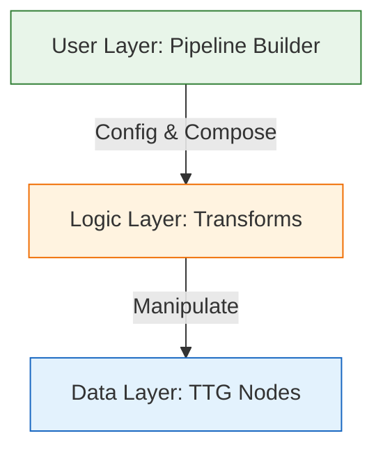

# VDOM 多阶段处理架构设计 (v3.0 - Final)

> TTG (Trees That Grow) + GATs 实现类型安全、语义化、架构分离的多阶段文档处理
>
> **设计目标**：构建一个工业级、零开销、类型安全的 SSG 文档处理流水线。
> **核心原则**：默认安全 (Correctness)，极致性能 (Performance)，易于扩展 (Extensibility)。

## 目录

1. [架构总览](#1-架构总览)
2. [类型系统设计 (Correctness)](#2-类型系统设计-correctness)
3. [开发者体验与 API (Ease of Use)](#3-开发者体验与-api-ease-of-use)
4. [扩展性设计 (Extensibility)](#4-扩展性设计-extensibility)
5. [性能与内存布局 (Performance)](#5-性能与内存布局-performance)
6. [迁移与落地](#6-迁移与落地)

---

## 1. 架构总览

我们将架构自底向上分为三层，层层递进解决不同维度的问题：



*   **Data Layer**: 纯数据结构，利用 GATs 极其紧凑地存储数据。
*   **Logic Layer**: 独立的 `Transform` 单元，负责状态流转。
*   **User Layer**: 傻瓜式 API，隐藏复杂的泛型参数。

---

## 2. 类型系统设计 (Correctness)

为了保证**绝对正确性**（编译时拦截逻辑错误），我们采用 "三维状态定位"：

1.  **Macro Phase (大阶段)**: `Raw` -> `Indexed` -> `Processed`
    *   *作用*：决定内存布局（Struct 字段）。
    *   *性能影响*：切换 Phase 需要 O(N) 的内存重排（Re-allocation）。
2.  **Micro Progress (微进度)**: `LinksChecked` -> `LinksResolved`
    *   *作用*：决定逻辑顺序。通过 Newtype Wrapper 实现。
    *   *性能影响*：**零开销** (`#[repr(transparent)]`)。
3.  **Family State (原子状态)**: `LinkState::Initial` -> `Checked`
    *   *作用*：决定具体数据的有效性。
    *   *性能影响*：Enum 判别开销（极小）。

### 2.1 诊断优先 (Diagnostics First)

为了保证鲁棒性，系统的 "血脉" 中必须流淌着诊断信息。

```rust
pub struct Document<P: PhaseData> {
    pub root: Element<P>,
    pub ext: P::DocExt,
    /// 任何步骤都不能丢弃已有的诊断信息
    pub diagnostics: Vec<Diagnostic>,
}

pub struct Diagnostic {
    pub level: DiagnosticLevel,
    pub message: String,
    pub source: Option<DiagnosticSource>, // 源码位置或 DOM ID
}
```

---

## 3. 开发者体验与 API (Ease of Use)

类型系统很强大，但不能折磨用户。我们通过 **Prelude** 和 **Builder** 模式封装复杂性。

### 3.1 极简 API (End User)

```rust
use vdom::prelude::*;

let result = Pipeline::new()
    .with_config(site_config)
    .run(raw_doc)?; // 自动执行标准流程：Index -> Process -> Render

// 获得结果
println!("{}", result.html);
// 查看问题
for err in result.diagnostics {
    eprintln!("{:?}", err);
}
```

### 3.2 灵活配置 (Power User)

```rust
use vdom::prelude::*;
use vdom::transforms::{LinkChecker, SvgOptimizer};

let mut pipeline = Pipeline::builder();

// 1. 配置标准步骤
pipeline.configure::<LinkChecker>(|cfg| {
    cfg.strict_mode = true;
});

// 2. 禁用不需要的步骤（灵活性）
pipeline.disable::<SvgOptimizer>();

// 3. 注入上下文（解决配置传递问题）
pipeline.set_context(TransformContext {
    base_url: "https://example.com".into(),
    ..Default::default()
});

let output = pipeline.build().run(doc);
```

### 3.3 内部实现 (StandardPipeline)

为了让类型错误可读，我们在内部定义标准别名：

```rust
// 避免让用户看到 Document<LinksChecked<Indexed>> 这种天书
pub type IndexedDoc = Document<Indexed>;
pub type CheckedDoc = LinksChecked<Indexed>;
```

---

## 4. 扩展性设计 (Extensibility)

如何让用户添加自定义逻辑（比如 "给所有 `<pre>` 标签添加 copy 按钮"）？

### 4.1 插件接口 (The Plugin Trait)

```rust
/// 用户自定义转换器
pub trait Plugin: Send + Sync {
    fn name(&self) -> &str;
    /// 在 Index 阶段之后、Process 阶段之前运行
    fn run(&self, doc: &mut Document<Indexed>, ctx: &TransformContext);
}

// 示例：代码块高亮插件
struct SyntaxHighlighter;
impl Plugin for SyntaxHighlighter {
    fn name(&self) -> &str { "SyntaxHighlighter" }
    fn run(&self, doc: &mut Document<Indexed>, _ctx: &TransformContext) {
        // 1. Visit 遍历所有 Node
        // 2. 找到 Family = Other(CodeBlock) 的节点
        // 3. 修改其内容
    }
}
```

### 4.2 注册插件

```rust
pipeline.add_plugin(SyntaxHighlighter::new());
```

*设计考量*：为什么 Plugin 只能在 `Indexed` 阶段操作？
*   因为这是 DOM 结构最稳定、信息最全（有 StableId）、且未被破坏性优化（如 SVG 路径烘焙）的时刻。
*   允许用户在任意 Phase 插入逻辑会导致 API 指数级复杂。约定优于配置。

---

## 5. 性能与内存布局 (Performance)

性能是 Rust 的底色。本架构在以下方面做了极致优化：

### 5.1 内存紧凑性 (Compact Layout)

利用 GATs，我们确保每个阶段的 Node 只包含该阶段必要的数据。

*   **Raw Phase**: `Link { href: String }` -> 只有字符串堆分配。
*   **Processed Phase**: `Link { resolved: SmallString<32>, is_external: bool }` -> 甚至可能内联存储，无堆分配。

**对比**: 传统 `Box<dyn Any>` 或 `HashMap` 扩展字段方案，每个节点都有巨大的指针开销和内存碎片。TTG 方案是**Flat Memory**。

### 5.2 阶段转换极其昂贵？(The Phase Shift Cost)

是的，`Raw` -> `Indexed` 需要重新分配整个树。

*   **缓解策略**:
    *   **Vector Arena**: 探索将所有 Node 存储在一个扁平的 `Vec<NodeData>` Arena 中，树结构仅存储 `u32` 索引。这样 Phase Shift 只是生成一个新的 Arena，具有极佳的缓存局部性 (Cache Locality)。
    *   *(当前版本先保持 Box 树结构，Arena 可作为后续内部优化，不影响 API)*。

### 5.3 并行化潜力 (Parallelism)

Pipeline 本身是串行的（逻辑依赖），但**单个 Transform 内部**可以并行。

```rust
impl Transform<Indexed> for ImageOptimizer {
    fn transform(self, mut doc: Document<Indexed>) -> Document<Indexed> {
        // 使用 Rayon 并行遍历树
        doc.root.par_visit_mut(|node| {
            if let Node::Image(img) = node {
                self.optimize(img);
            }
        });
        doc
    }
}
```

由于 `Document` 拥有所有权，且 `Send`，这种并行化是 Rust 借用检查器天然支持的。

---

## 6. 迁移与落地

为了平滑过渡，我们采取 "Legacy Wrapper" 策略。

### Phase 0: The Facade (门面模式)
不改变现有调用代码，只替换内部实现。

```rust
// 旧接口
pub struct Processor;
impl Transform for Processor {
    fn transform(self, doc: Doc) -> Doc {
        // 内部转发给新 Pipeline
        Pipeline::input(doc).standard().run()
    }
}
```

### Phase 1: Core Types
实现 GATs 和 Family State Enums。这是工作量最大的部分。

### Phase 2: Pipeline Implementation
实现 `vdom/pipeline.rs` 和 `vdom/progress.rs`。

### Phase 3: Plugin System
最后实现插件系统开放给用户。

---

## 总结

v3.0 设计在保持类型安全（Correctness）的基础上，通过 **Pipeline Builder** 和 **Plugin System** 解决了易用性和扩展性问题。通过 **Diagnostic System** 提供了工业级的可观测性。这就完成了从 "学术性设计" 到 "工程化产品" 的跨越。
