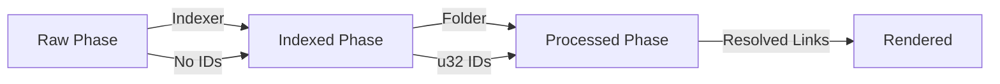
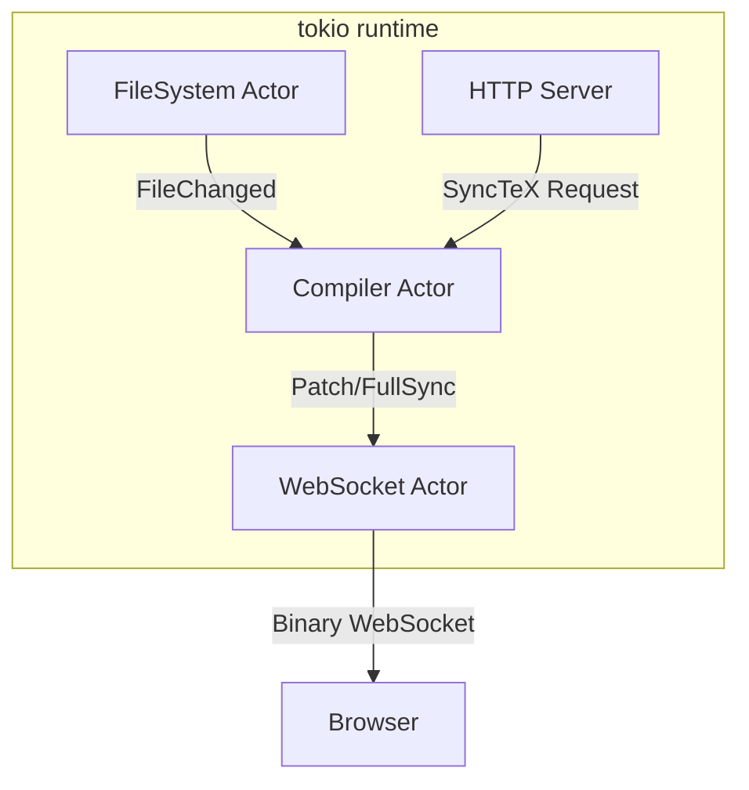
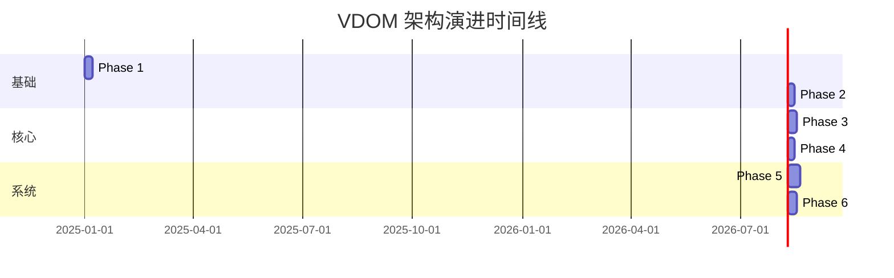

# tola-ssg VDOM & rkyv 架构重构计划 (PLAN.md)

本文档基于对 `typst-preview` (tinymist) 源码的深度分析，针对 `tola-ssg` 当前的 VDOM 架构提出重构方案。

## 0. 架构深度对比 (Architecture Deep Dive)

### 0.1 核心差异：数据源与身份 (Origin & Identity)

| 特性 | typst-preview (tinymist) | tola-ssg (Current) | tola-ssg (Target) |
|------|--------------------------|--------------------|-------------------|
| **数据源** | Typst Artifact (`Frame`) | Typst HTML Export | Typst HTML Export |
| **渲染目标** | Canvas / SVG | HTML (DOM) | HTML (DOM) |
| **节点粒度** | 绘制指令 (Text, Shape, Image) | 语义化标签 (Div, P, Span) | 语义化标签 (Div, P, Span) |
| **身份标识** | `Span` based + Content Hash | `u32` 自增 ID (不稳定) | **Hybrid (Span + Hash)** |
| **Patch 协议** | 二进制 (Custom/rkyv) | JSON (serde) | **二进制 (rkyv)** |

**分析**:
`typst-preview` 的优势在于它直接操作 Typst 的 `Frame`，利用了 Typst 内部稳定的 `Span` ID。
`tola-ssg` 因为经过了 `typst-html` 转换，丢失了原始 `Span` 信息（或者很难对应）。因此，我们必须**在 VDOM 构建阶段 (Indexer) 重建稳定身份**。

> **[Decision Record] 为什么不试图恢复 Span?**
>
> 经分析 `src/vdom/convert.rs`，Span 丢失是因为:
> 1. `HtmlNode::Text` 显式忽略了 `_span` 字段。
> 2. `Frame` 被过早渲染为 SVG 字符串，丢失了结构化信息。
>
> 虽然技术上可以修复，但我们选择 **Content Hash (`StableId`)** 方案，因为它：
> *   **更鲁棒**: 即使 `typst-html` 生成了不对应原本 Span 的辅助标签 (`div` 容器)，Hash 依然能稳定工作。
> *   **解耦**: 不依赖上游 `typst-html` 是否暴露内部 Span 信息。

### 0.2 TTG 模式的演进 (The Evolution of TTG)

你目前的 Trees-That-Grow (TTG) 实现非常先进，利用 GAT (`PhaseData::ElemExt<F>`) 实现了编译期状态机。我们要将 `rkyv` 和 `StableId` 融入这一体系，而不是推翻它。

**Current TTG Flow:**


**Target TTG Flow:**
```mermaid
graph LR
    Raw -->|Indexer (Hashing)| Indexed[Indexed Phase] -->|Folder| Processed
    Processed -->|Diff Engine| Patch[Binary Patch]

    subgraph "Identity System"
    Indexed -- StableId (u64) --> Processed
    end
```

---

## 1. 核心技术方案 (Technical Solutions)

### 1.1 稳定身份标识 (Stable Identity)

> [!IMPORTANT]
> **2024-12-29 研究结论**: 经过对 `typst-html` API 的深度分析，发现 **Span 信息是完全可用的**，无需自造 ID 系统。

#### 1.1.1 Typst Span API 分析

**关键发现**:

| 类型 | Span 可用性 | API |
|------|-------------|-----|
| `HtmlNode::Text` | ✅ **有** | `Text(EcoString, Span)` - 第二个字段即 Span |
| `HtmlElement` | ✅ **有** | `span: Span` 字段 |
| `HtmlFrame` | ⚠️ 间接 | 通过 `inner: Frame` 访问 |

**Span 特性** (来自 typst-syntax 文档):
- 8 字节，`Copy`，null-optimized (`Option<Span>` 也是 8 字节)
- 使用 **Numbered IDs** 而非 byte range，跨编辑稳定
- `span.id()` 返回 `Option<FileId>`，可定位源文件
- AST 节点层次化编号，支持增量编译

#### 1.1.2 策略决策 (Decision Record)

**问题**: 自造 StableId vs 复用 Typst Span？

| 方案 | 优点 | 缺点 |
|------|------|------|
| **复用 Span (推荐)** | 零成本、跨编辑稳定、支持 SyncTeX | 依赖 typst 内部结构 |
| 自造 Content Hash | 完全解耦 | 需要额外计算、无法支持 SyncTeX |
| 混合策略 | 最大兼容 | 复杂度高、两套 ID 空间 |

**结论**: 采用 **Span-First 策略**：
1. **Primary**: 直接使用 `Span` 的内部 u64 表示
2. **Fallback**: 仅对 `Span::detached()` 节点使用 Content Hash

**理由**:
- `HtmlElement.span` 字段**已经存在**，只是当前 `convert.rs` 未使用
- Span 的 numbered IDs 专为增量编译设计，**比 Content Hash 更稳定**
- 启用 SyncTeX (Click-to-Source) 功能必须依赖 Span

#### 1.1.3 实现方案

在 `src/vdom/id.rs` 中：

```rust
use typst::syntax::Span;

/// 稳定节点标识符
///
/// 优先使用 Typst Span (跨编辑稳定)，仅对 detached 节点使用 Hash fallback
#[derive(Clone, Copy, PartialEq, Eq, Hash, Debug)]
#[derive(rkyv::Archive, rkyv::Serialize, rkyv::Deserialize)]
pub struct StableId(u64);

impl StableId {
    /// 从 Typst Span 创建 (推荐)
    ///
    /// Typst Span 内部已经是 u64，直接复用
    pub fn from_span(span: Span) -> Option<Self> {
        // Span::detached() 没有有效 ID，返回 None
        if span.is_detached() {
            return None;
        }
        // Span 内部是 NonZeroU64，安全转换
        Some(Self(span.into_raw()))
    }

    /// Content Hash fallback (仅用于 detached 节点)
    pub fn from_content_hash(tag: &str, attrs: &[(String, String)], children: &[StableId]) -> Self {
        let mut hasher = blake3::Hasher::new();
        hasher.update(tag.as_bytes());
        for (k, v) in attrs {
            hasher.update(k.as_bytes());
            hasher.update(v.as_bytes());
        }
        for child in children {
            hasher.update(&child.0.to_le_bytes());
        }
        Self(hasher.finalize().as_bytes()[..8].try_into().unwrap())
    }

    /// 用于 SyncTeX: 尝试恢复原始 Span
    pub fn try_as_span(&self) -> Option<Span> {
        Span::from_raw(self.0)
    }
}
```

修改 [convert.rs](file:///Users/kawayww/proj/tola-ssg/src/vdom/convert.rs) 以提取 Span：

```diff
// Line 100: 不再忽略 span
- HtmlNode::Text(text, _span) => Some(Node::Text(Text {
+ HtmlNode::Text(text, span) => Some(Node::Text(Text {
      content: text.to_string(),
-     ext: (),
+     ext: RawTextExt { span: Some(*span) },
  })),

// Line 64: 提取 HtmlElement.span
fn convert_element(&mut self, elem: &HtmlElement) -> Element<Raw> {
+   let span = elem.span;  // HtmlElement 有 span 字段!
    // ...
}
```

> [!NOTE]
> **Phase 扩展**: `RawTextExt` 和 `RawElemExt` 需要新增 `span: Option<Span>` 字段，在 Indexer 阶段转换为 `StableId`。

### 1.2 下一代 Indexer (Next-Gen Indexer)

修改 `src/vdom/transforms/indexer.rs`。

```rust
impl Indexer {
    fn index_node(&mut self, node: Node<Raw>) -> Node<Indexed> {
        // ... 递归 ...

        // 尝试从 Node 中获取 Span (Raw阶段需新增 span 字段)
        let span_id = node.span().map(|s| s.into_u64());

        // 计算 ID
        let stable_id = StableId::compute(span_id, ...);

        // ...
    }
}
```

### 1.3 rkyv 集成 & 零拷贝 Diff (Zero-Copy Diffing)

**深度优化策略 (Deep Optimization)**:
正如研究报告指出，`rkyv` 不仅仅用于序列化，更是改变内存模型的关键。
我们要实现 **新 VDOM (Heap)** 与 **旧 VDOM (Archived/Mmap)** 的直接对比，**彻底消除反序列化开销**。

在 `src/vdom/diff.rs` 中实现跨类型比较：

```rust
// 伪代码：直接比较 Heap Node 与 Archived Node
impl PartialEq<ArchivedNode> for Node<Processed> {
    fn eq(&self, other: &ArchivedNode) -> bool {
        // 1. 极速哈希检查 (O(1))
        if self.ext().hash == other.ext().hash { // 假设 extension 存储了 hash
            return true;
        }
        // 2. 字段逐一比较 (无需反序列化 other)
        // ...
    }
}
```

### 1.5 统一 AST 与极致类型安全 (Unified AST & Absolute Type Safety)

**现有问题**: 目前 `tola-ssg` 的 `Element` 结构体同时保留了 `attrs` (Stringly Typed) 和 `ext` (Strongly Typed)。这可能导致数据不一致（Source of Truth 问题）。

**重构目标**:
1.  **语义消费 (Semantic Consumption)**: 在 `Indexer` 阶段，特定 Family (如 `Link`) 的关键属性 (如 `href`) **必须**被消费并存入 `ext`，并从 `attrs` 中移除。保障语义数据的唯一性。
2.  **扩展变体 (Extension Variant)**:
    引入 `Node::Extension(P::Closure)` 变体 (参考 GATs 论文)。允许在 `Processed` 阶段引入 `Raw` 阶段不存在的新节点类型（如 `Component` 或 `ReactiveBlock`），而无需使用 `Box<dyn Any>`。

```rust
// In src/vdom/core/ast.rs
pub enum Node<P: Phase> {
    // 为什么需要 Box?
    // 1. 防止无限递归大小: Element 包含 SmallVec<[Node; 8]>。若不 Box，sizeof(Node) 无限大。
    // 2. 内存优化: Text 节点很小。如果不 Box Element，Text 节点将被迫占用 Element 的巨大空间。
    Element(Box<Element<P>>),
    Text(Text<P>),
    Frame(Box<Frame<P>>),
    Extension(P::Closure),
}

// In src/vdom/transforms/indexer.rs
// 强制语义转换: raw href -> ProcessedData::resolved_url
// 编译器强制检查: 如果是 LinkFamily，必须处理 href。
```

> **[Decision Record] 关于 Box 包装的必要性**
> 用户疑问: *为什么 Element 和 Frame 需要 Box 包装？能去掉吗？*
>
> **结论**: **不能去掉，这是 Rust 内存布局的硬性要求与优化策略。**
> 1.  **Infinite Size (无限大小)**: `Element` 内部通过 `SmallVec<[Node; 8]>` 内联存储了 8 个子节点。如果 `Node::Element` 不也是指针 (Box)，那么 `Node` 的大小将取决于 `Element`，而 `Element` 取决于 8 个 `Node`... 这构成了无限递归。必须在某处引入指针 (Box) 来打破递归。
> 2.  **Enum Variant Size**: Rust Enum 的大小等于最大 Variant 的大小。`Element` 非常大 (Tag + Attrs + Children + Ext)，而 `Text` 非常小。如果去掉 Box，所有的 `Text` 节点都将占用和 `Element` 一样大的内存空间（包含大量 Padding），造成极大的内存浪费。
> 3.  **rkyv 兼容性**: `Box` 在 `rkyv` 中有完美的 `ArchivedBox` 映射（相对指针），非常适合构建零拷贝结构。

这种设计利用 Rust 类型系统确保了 VDOM 在每个阶段的合法性 (Make Invalid States Unrepresentable)。

在 `src/hotreload/protocol.rs` 定义二进制协议。

**关键注意事项 (来自架构洞察):**
> *   **本地缓存策略**: 如果未来使用 rkyv 做磁盘缓存，必须在文件名中包含 **架构指纹** (e.g., `.cache/main_x86_64_linux.rkyv`)。如果架构不匹配，直接丢弃。不要跨架构复用，因为 rkyv 是内存布局敏感的。
> *   **传输协议**: 对于 WebSocket 传输，rkyv 完美的 Zero-Copy 特性非常适合高频的 Patch 发送。

**编译期架构指纹 (Compile-Time Fingerprint)**:

使用 `cfg` + `const` 在编译期确定架构指纹，比运行时检测更高效、更安全：

```rust
// src/utils/platform.rs

/// 编译期架构指纹 (零运行时开销)
pub const ARCH_FINGERPRINT: &str = {
    #[cfg(all(target_arch = "x86_64", target_os = "linux"))]
    { "x86_64_linux" }

    #[cfg(all(target_arch = "x86_64", target_os = "macos"))]
    { "x86_64_macos" }

    #[cfg(all(target_arch = "aarch64", target_os = "macos"))]
    { "aarch64_macos" }

    #[cfg(all(target_arch = "aarch64", target_os = "linux"))]
    { "aarch64_linux" }

    #[cfg(all(target_arch = "x86_64", target_os = "windows"))]
    { "x86_64_windows" }

    #[cfg(not(any(
        all(target_arch = "x86_64", target_os = "linux"),
        all(target_arch = "x86_64", target_os = "macos"),
        all(target_arch = "aarch64", target_os = "macos"),
        all(target_arch = "aarch64", target_os = "linux"),
        all(target_arch = "x86_64", target_os = "windows"),
    )))]
    { concat!(env!("CARGO_CFG_TARGET_ARCH"), "_", env!("CARGO_CFG_TARGET_OS")) }
};

/// 生成带架构指纹的缓存路径
pub fn cache_path(base: &str, name: &str) -> PathBuf {
    PathBuf::from(base).join(format!("{}_{}.rkyv", name, ARCH_FINGERPRINT))
}
```

**使用示例**:

```rust
// 缓存 VDOM
let cache_file = cache_path(".cache", "index");
// 结果: .cache/index_aarch64_macos.rkyv (在 Apple Silicon Mac 上)

// 验证缓存有效性
fn is_cache_valid(path: &Path) -> bool {
    path.file_name()
        .and_then(|n| n.to_str())
        .map(|n| n.contains(ARCH_FINGERPRINT))
        .unwrap_or(false)
}
```

```rust
use rkyv::{Archive, Deserialize, Serialize};

#[derive(Archive, Serialize, Deserialize, Debug)]
#[archive(check_bytes)]
pub enum PatchOp {
    /// 替换: 极速二进制 blob 替换
    Replace {
        target: StableId,
        /// 预渲染好的 HTML 片段 (UTF-8 bytes)
        #[with(rkyv::with::Raw)]
        html: Vec<u8>
    },

    /// 移动: 这是 typst-preview 高效的核心
    Move {
        target: StableId,
        new_parent: StableId,
        /// None = append to end
        before: Option<StableId>
    },

    /// 属性更新
    UpdateAttrs {
        target: StableId,
        attrs: Vec<(String, Option<String>)>
    },

    // ... Insert, Remove ...
}

/// 根消息类型
#[derive(Archive, Serialize, Deserialize, Debug)]
pub enum ServerMessage {
    /// 全量同步 (首次加载或强制刷新)
    FullSync {
        root_id: StableId,
        html: Vec<u8>
    },
    /// 增量 Patch
    Patch(Vec<PatchOp>),
}
```

### 1.4 Client Applier (The "Runtime")

不需要 WASM (初期)。我们可以编写一个超轻量的 **Vanilla JavaScript** Runtime，直接操作 `DataView` 解析 `rkyv` 数据。

**二进制流格式建议 (The Tola Protocol):**

```javascript
// 极简 Runtime，无任何框架依赖，无构建步骤
class TolaRuntime {
    constructor() {
        this.nodes = new Map();
    }

    applyPatch(buffer) {
        // 使用 DataView 直接读取二进制 PatchOp
        // 避免复杂的反序列化层
        const view = new DataView(buffer);
        // ...
    }
}
```

---

### 1.6 模块化架构设计 (Modular Architecture)

为了实现 "高度可维护" 与 "职责分离"，我们将 VDOM 模块重组为三层架构：

**Layer 1: Core (The Kernel)**
*   `src/vdom/core/id.rs`: `StableId` 定义。
*   `src/vdom/core/ast.rs`: `Node<P>`, `Element<P>` (Unified AST)。纯数据，无业务逻辑。
*   `src/vdom/core/traits.rs`: `Phase`, `Family` 核心 Trait。

**Layer 2: Features (The Domain)**
*   `src/vdom/features/link.rs`: Link 家族的数据定义 (`LinkData`) 与处理逻辑 (`process_link`)。
*   `src/vdom/features/svg.rs`: SVG 优化逻辑 (Blackbox hashing)。
*   每个 Family 独占一个模块，**数据与逻辑封装在一起** (Co-location)。

**Layer 3: Ops (The Pipeline)**
*   `src/vdom/ops/index.rs`: `Indexer` Transform (Raw -> Indexed)。
*   `src/vdom/ops/diff.rs`: Diff 算法 (Two-Pass LCS)。
*   `src/vdom/ops/render.rs`: HTML 渲染器。

**优势**:
*   **AST 纯净**: AST 不包含任何业务逻辑，只负责结构。
*   **特性隔离**: 修改 "Link" 逻辑时，绝不会破坏 "Heading" 逻辑。
*   **流水线清晰**: 每个 Op 都是一个独立的转换函数，输入输出类型明确。

### 1.7 并发模型与 Actor 架构 (Concurrency & Actor Architecture)

> [!CAUTION]
> **2024-12-29 严谨分析**: 本节基于对当前代码库的深度审查，**不盲目断言 Actor 可行**。

#### 1.7.1 当前架构分析 (Current Architecture Analysis)

**[watch.rs](file:///Users/kawayww/proj/tola-ssg/src/watch.rs) 现状**:

```rust
// 当前: 阻塞式事件循环
loop {
    match rx.recv_timeout(debouncer.timeout()) {
        Ok(Ok(event)) => debouncer.add(event),
        Err(Timeout) if debouncer.ready() => {
            let result = content_cache.filter(&debouncer.take());
            handle_changes(&result.changed, &mut status, &root);
        }
    }
}
```

**[hotreload/server.rs](file:///Users/kawayww/proj/tola-ssg/src/hotreload/server.rs) 现状**:

```rust
// 当前: 极度嵌套的类型签名
struct Broadcaster {
    clients: Mutex<Vec<Arc<Mutex<Option<WebSocket<TcpStream>>>>>>,
    //       ^^^^^ ^^^ ^^^^^ ^^^^^^ <- 4 层包装
}

// 全局静态 + 手动内存管理
static BROADCAST: Lazy<Broadcaster> = Lazy::new(Broadcaster::new);
```

| 现有问题 | 严重性 | Actor 能否解决 |
|----------|--------|----------------|
| 嵌套 `Mutex` 类型 | ⚠️ 中 | ✅ 是 (channel 替代) |
| 全局 `static` 状态 | ⚠️ 中 | ✅ 是 (Actor 封装) |
| 阻塞式事件循环 | ⚠️ 中 | ✅ 是 (async Actor) |
| `rayon` 并行编译 | ℹ️ 低 | ❓ 需评估 (见下) |

#### 1.7.2 Actor 架构提案 (Proposed Actor Architecture)



**Actor 定义**:

```rust
// FileSystem Actor
struct FsActor {
    rx: mpsc::Receiver<FsEvent>,
    tx_compiler: mpsc::Sender<CompilerMsg>,
    debouncer: Debouncer,        // 移入 Actor
    content_cache: ContentCache, // 移入 Actor
}

// Compiler Actor (核心)
struct CompilerActor {
    rx: mpsc::Receiver<CompilerMsg>,
    tx_ws: broadcast::Sender<WsMsg>,

    // 独占状态 (无需 Arc/Mutex)
    config: SiteConfig,
    dependency_graph: DependencyGraph,
    previous_vdom: Option<DocumentCache>, // rkyv mmap
}

// WebSocket Actor
struct WsActor {
    rx: broadcast::Receiver<WsMsg>,
    clients: Vec<WebSocket>,  // 直接持有，无需 Mutex
}
```

#### 1.7.3 性能分析 (Performance Analysis)

> [!WARNING]
> **诚实评估**: Actor 模型有性能**损失**也有**收益**，需权衡。

| 维度 | 当前阻塞模型 | Actor 模型 | 分析 |
|------|--------------|------------|------|
| **启动延迟** | 0 (无 runtime) | ~1-5ms (tokio 初始化) | 可接受 |
| **消息传递** | 无 (直接调用) | ~100ns/msg (channel) | 可接受 |
| **并行编译** | ✅ rayon | ❓ 需重新设计 | **关键** |
| **内存占用** | 低 | 略高 (channel buffer) | 可接受 |

**关键问题: Rayon 与 Tokio 的兼容性**

当前 `compiler/watch.rs` 使用 `rayon::par_iter` 进行并行编译：

```rust
// 当前: rayon 并行
files.par_iter().filter_map(|path| {
    process_page(&path, config, clean, None, false).err()
}).collect()
```

**Actor 模型下的选择**:

1. **方案 A**: Actor 内使用 `spawn_blocking` 调用 rayon
   ```rust
   tokio::task::spawn_blocking(|| {
       files.par_iter().map(|p| compile(p)).collect()
   }).await
   ```
   - ✅ 兼容现有代码
   - ⚠️ 增加一次线程切换开销

2. **方案 B**: 完全异步化编译 (需大量重构)
   - ❌ `typst::compile` 是同步的，无法完全异步化
   - ❌ 需要自建任务调度

**推荐**: 方案 A，保留 rayon 并行能力。

#### 1.7.4 正确性与语义分析 (Correctness & Semantic Analysis)

**Backpressure 语义**:

当前 `watch.rs` 使用 `Debouncer` 进行 300ms 防抖 + 800ms 冷却：

```rust
const DEBOUNCE_MS: u64 = 300;
const REBUILD_COOLDOWN_MS: u64 = 800;
```

**Actor 模型下的正确性保证**:

```rust
impl CompilerActor {
    async fn run(mut self) {
        while let Some(msg) = self.rx.recv().await {
            match msg {
                CompilerMsg::FileChanged(paths) => {
                    // 关键: 在处理期间丢弃新消息
                    self.rx.close(); // 暂停接收
                    let result = self.compile(&paths).await;
                    self.tx_ws.send(result);
                    self.rx = self.respawn_receiver(); // 恢复
                }
            }
        }
    }
}
```

> [!CAUTION]
> **语义变化**: 上述实现与当前防抖逻辑**语义不同**。
> 当前 Debouncer 会**合并 300ms 内的所有事件**，而简单 Actor 会**逐个处理**。
> 需要在 FsActor 中保持 Debouncer 逻辑。

#### 1.7.5 参考实现: ds-store-killer 的 Watcher-First 模式

> [!TIP]
> 来自 [ds-store-killer](https://github.com/kawayww/ds-store-killer) 的关键模式：**先建立 channel，再执行初始扫描**。

**问题**: 传统模式存在 "vacuum period"（真空期）—— 初始扫描期间发生的文件变更会被遗漏：

```text
传统模式 (有问题):
┌─────────────────┐ ┌──────────────────┐ ┌────────────────┐
│  Initial Scan   │ │  Setup Watcher   │ │  Event Loop    │
│  (耗时操作)     │ │                  │ │                │
└────────┬────────┘ └────────┬─────────┘ └───────┬────────┘
         │                   │                   │
         ▼                   ▼                   ▼
    ─────────────────────────────────────────────────────▶ time
              ▲
              │ ❌ 这里发生的事件全部丢失!
```

**ds-store-killer 解决方案**: Watcher-First Pattern

```rust
// 来自 ds-store-killer/src/watcher.rs
pub fn run(paths: &[&Path], ...) -> Result<(), String> {
    // 1. 先建立 channel 和 watcher (立即开始缓冲事件)
    let (tx, rx) = channel();
    let mut watcher = RecommendedWatcher::new(tx, Config::default())?;

    for p in paths {
        watcher.watch(p, RecursiveMode::Recursive)?;
    }

    // 2. 初始扫描 (此时事件已在 channel 中缓冲)
    log::watch("Performing initial cleanup...");
    for p in paths {
        scan_streaming(p, true, &excludes, |path| {
            try_delete(path, force, notify);
        });
    }

    // 3. 进入事件循环 (处理初始扫描期间积累的事件)
    loop {
        match rx.recv() { ... }
    }
}
```

**关键洞察**:

```text
Watcher-First 模式 (零丢失):
┌──────────────────┐ ┌─────────────────┐ ┌────────────────┐
│  Setup Watcher   │ │  Initial Scan   │ │  Event Loop    │
│  + Channel Ready │ │  (events buffer)│ │  (drain buffer)│
└────────┬─────────┘ └────────┬────────┘ └───────┬────────┘
         │                    │                  │
         ▼                    ▼                  ▼
    ─────────────────────────────────────────────────────▶ time
         ▲                    ▲
         │ ✅ 开始缓冲        │ ✅ 缓冲中
```

**对 tola-ssg 的启示**:

```rust
// 应用到 Actor 模型
impl FsActor {
    pub async fn new(paths: Vec<PathBuf>) -> Self {
        // 1. 先建立 channel
        let (tx, rx) = mpsc::channel(100);

        // 2. 立即启动 watcher (开始缓冲)
        let watcher = notify::recommended_watcher(move |res| {
            let _ = tx.blocking_send(res);
        }).unwrap();

        for p in &paths {
            watcher.watch(p, RecursiveMode::Recursive).unwrap();
        }

        // 3. 执行初始构建 (events 在 channel 中缓冲)
        initial_build(&paths).await;

        // 4. 返回 Actor (准备处理缓冲的事件)
        Self { rx, watcher, debouncer: Debouncer::new() }
    }
}
```

**收益**:
- ✅ 零事件丢失 (No Vacuum Period)
- ✅ 初始构建与事件监听**并行** (事件在 channel 缓冲)
- ✅ 模式简单，易于理解和测试

### 1.8 Actor 与 TTG 协同分析 (Actor + TTG Synergy)

> [!IMPORTANT]
> **核心问题**: Actor 模型能否简化 TTG 的复杂类型签名？

#### 1.8.1 GAT 类型复杂度来源

查看 [family.rs](file:///Users/kawayww/proj/tola-ssg/src/vdom/family.rs) 中的 `into_default_ext`:

```rust
pub fn into_default_ext<P: super::phase::PhaseData>(self) -> super::node::FamilyExt<P>
where
    P::ElemExt<SvgFamily>: Default,
    P::ElemExt<LinkFamily>: Default,
    P::ElemExt<HeadingFamily>: Default,
    P::ElemExt<MediaFamily>: Default,
    P::ElemExt<OtherFamily>: Default,
{
    // 5 个 where 约束！
}
```

**问题分解**:

| 类型复杂度来源 | Actor 能否简化 | 原因 |
|----------------|----------------|------|
| GAT `P::ElemExt<F>` | ❌ **否** | 编译期特性，与运行时无关 |
| `where` 约束传播 | ❌ **否** | Rust 类型系统要求，非并发问题 |
| `Send + Sync` bound | ✅ **是** | Actor 边界消除跨线程需求 |
| `Arc<Mutex<..>>` | ✅ **是** | 独占所有权消除共享需求 |

#### 1.8.2 诚实结论

> [!WARNING]
> **Actor 模型不能简化 GAT 类型签名**。
>
> GAT 的 `where` 约束是**编译期**类型系统的表现，与**运行时**并发模型无关。
> Actor 只能解决**运行时所有权和共享**问题，不能让 `P::ElemExt<F>: Default` 消失。

**Actor 真正解决的问题**:

1. ✅ 消除 `Arc<Mutex<Document<Processed>>>` 的需求
2. ✅ 允许 `Transform` 消费 `self` 而无需担心锁
3. ✅ 简化 `hotreload/server.rs` 的嵌套 Mutex 类型
4. ❌ **不能**简化 `PhaseData` trait 的 where 子句
5. ❌ **不能**减少 GAT 相关的编译时间

#### 1.8.3 类型签名改善路径

如果目标是简化类型签名，应考虑：

1. **Trait Object 降级** (牺牲性能换简洁):
   ```rust
   // 用 Box<dyn FamilyData> 替代 GAT
   // ❌ 丢失编译期类型安全
   ```

2. **Macro 生成** (隐藏复杂度):
   ```rust
   // 已在 macros.rs 中使用
   impl_family_accessors!(Svg, Link, Heading, Media, Other);
   ```

3. **Type Alias** (语法糖):
   ```rust
   type IndexedSvg = IndexedElemExt<SvgFamily>;
   // 仅改善可读性，不减少约束
   ```

#### 1.8.4 与现有代码的集成

**需要修改的文件**:

| 文件 | 改动 | 复杂度 |
|------|------|--------|
| [watch.rs](file:///Users/kawayww/proj/tola-ssg/src/watch.rs) | 提取为 `FsActor` | 中 |
| [hotreload/server.rs](file:///Users/kawayww/proj/tola-ssg/src/hotreload/server.rs) | 替换 `Broadcaster` 为 `WsActor` | 低 |
| [serve.rs](file:///Users/kawayww/proj/tola-ssg/src/serve.rs) | 集成 tokio runtime | 中 |
| [compiler/watch.rs](file:///Users/kawayww/proj/tola-ssg/src/compiler/watch.rs) | 提取为 `CompilerActor` | 高 |

**依赖变化**:

```toml
[dependencies]
tokio = { version = "1", features = ["rt-multi-thread", "sync", "macros"] }
# 移除 notify 的同步 API，使用 notify-debouncer-full
```

#### 1.8.5 决策矩阵

| 场景 | Actor 收益 | 实现成本 | 推荐 |
|------|-----------|----------|------|
| 消除 `Mutex` 嵌套 | ⭐⭐⭐ 高 | ⭐⭐ 中 | ✅ 推荐 |
| VDOM 独占所有权 | ⭐⭐⭐ 高 | ⭐⭐ 中 | ✅ 推荐 |
| 简化 GAT 签名 | ❌ 无 | N/A | ❌ 不适用 |
| 提升编译吞吐 | ⭐ 低 (rayon 已优化) | ⭐⭐⭐ 高 | ⚠️ 谨慎 |
| 支持 SyncTeX | ⭐⭐ 中 | ⭐⭐ 中 | ✅ 推荐 |

#### 1.8.6 Actor 模型全面优势分析

> [!NOTE]
> 以下是 Actor 模型在各个维度的详细优势分析，基于当前代码库的实际痛点。

##### 1. 性能 (Performance)

| 维度 | 当前问题 | Actor 解决方案 | 收益 |
|------|----------|----------------|------|
| **响应性** | 构建期间阻塞事件循环，无法响应新变更 | 异步 Actor 解耦事件接收与处理 | ⭐⭐⭐ |
| **Backpressure** | 快速连续保存时累积大量重复构建 | Channel 缓冲 + 最新状态合并 | ⭐⭐⭐ |
| **锁争用** | `BROADCAST.clients.lock()` 每次发送都加锁 | 无锁 channel 替代 Mutex | ⭐⭐ |
| **并行编译** | ✅ rayon 已优化 | `spawn_blocking` 保留现有优化 | ⭐ (中性) |

**具体改进**:

```rust
// 当前: 阻塞式，构建期间无法接收新事件
loop {
    let event = rx.recv_timeout(...); // 阻塞
    handle_changes(...);              // 阻塞
}

// Actor: 解耦接收与处理
impl FsActor {
    async fn run(mut self) {
        loop {
            tokio::select! {
                Some(event) = self.rx.recv() => {
                    self.debouncer.add(event);
                }
                _ = tokio::time::sleep(self.debouncer.timeout()) => {
                    if self.debouncer.ready() {
                        // 非阻塞发送给 CompilerActor
                        self.tx_compiler.send(self.debouncer.take()).await;
                    }
                }
            }
        }
    }
}
```

##### 2. 正确性 (Correctness)

| 维度 | 当前问题 | Actor 解决方案 | 收益 |
|------|----------|----------------|------|
| **状态隔离** | `DEPENDENCY_GRAPH` 全局 `RwLock`，多处访问 | Compiler Actor 独占 | ⭐⭐⭐ |
| **消息顺序** | 无保证（事件可能乱序处理） | MPSC channel 保证 FIFO | ⭐⭐ |
| **死锁风险** | 嵌套 `Mutex` 可能死锁 | 无锁 channel 无死锁 | ⭐⭐⭐ |
| **竞态条件** | `ContentCache` 与 `Debouncer` 需协调 | 同一 Actor 内串行执行 | ⭐⭐⭐ |

**当前死锁风险示例**:

```rust
// hotreload/server.rs 当前代码
fn send(&self, msg: HotReloadMessage) {
    let mut clients = self.clients.lock().unwrap(); // 锁 1
    clients.retain(|client| {
        let mut guard = client.lock().unwrap();     // 锁 2 (嵌套!)
        // 如果 send 阻塞，锁 1 一直持有
    });
}
```

**Actor 消除死锁**:

```rust
// Actor 版本: 无嵌套锁
impl WsActor {
    async fn run(mut self) {
        while let Ok(msg) = self.rx.recv().await {
            // 直接迭代，无需锁
            self.clients.retain_mut(|ws| {
                ws.send(msg.clone()).is_ok()
            });
        }
    }
}
```

##### 3. 类型安全 (Type Safety)

| 维度 | 当前问题 | Actor 解决方案 | 收益 |
|------|----------|----------------|------|
| **消息类型** | `HotReloadMessage` 是 JSON，运行时解析 | 强类型 enum，编译期检查 | ⭐⭐⭐ |
| **状态访问** | 全局 `static` 可被任意代码访问 | Private Actor 状态，仅消息接口 | ⭐⭐⭐ |
| **生命周期** | `'static` 要求泄漏到全局 | Actor 拥有自己的生命周期 | ⭐⭐ |

**类型安全改进**:

```rust
// 当前: 弱类型消息
pub struct HotReloadMessage {
    pub msg_type: String,  // "reload", "patch", "connected"
    pub reason: Option<String>,
    pub ops: Option<Vec<serde_json::Value>>,  // 任意 JSON
}

// Actor: 强类型消息
enum WsMsg {
    Reload { reason: String },
    Patch { ops: Vec<PatchOp> },  // 编译期类型检查
    Connected { version: String },
}
// 编译器保证: 不会发送错误类型的消息
```

##### 4. 可维护性 (Maintainability)

| 维度 | 当前问题 | Actor 解决方案 | 收益 |
|------|----------|----------------|------|
| **单一职责** | `watch.rs` 520行，混合多种职责 | 每个 Actor 一种职责 | ⭐⭐⭐ |
| **可测试性** | 需要 mock 全局 `BROADCAST` | Actor 可注入 mock channel | ⭐⭐⭐ |
| **故障隔离** | panic 可能导致全局状态不一致 | Actor panic 只影响自身 | ⭐⭐ |
| **代码组织** | 状态分散在多处 | 状态封装在 Actor 内部 | ⭐⭐⭐ |

**单一职责拆分**:

```rust
// 当前 watch.rs 混合:
// - 文件系统事件接收
// - 防抖逻辑
// - 内容哈希计算
// - 依赖图查询
// - 编译调度
// - 错误处理
// 全部在一个 520 行文件中

// Actor 拆分后:
struct FsActor { /* 事件接收 + 防抖 */ }
struct CompilerActor { /* 编译 + 依赖图 + VDOM */ }
struct WsActor { /* WebSocket 管理 */ }
// 每个 Actor < 150 行，单一职责
```

**可测试性改进**:

```rust
// 当前: 难以测试 (依赖全局 static)
#[test]
fn test_broadcast() {
    // 无法隔离 BROADCAST 全局状态
}

// Actor: 易于测试
#[tokio::test]
async fn test_compiler_actor() {
    let (tx, rx) = mpsc::channel(10);
    let (ws_tx, mut ws_rx) = broadcast::channel(10);

    let actor = CompilerActor::new(rx, ws_tx);
    tokio::spawn(actor.run());

    // 发送测试消息
    tx.send(CompilerMsg::FileChanged(vec![path])).await;

    // 验证输出
    let msg = ws_rx.recv().await.unwrap();
    assert!(matches!(msg, WsMsg::Patch { .. }));
}
```

##### 5. 架构清晰 & 职责分离 (Architecture Clarity)

**当前架构问题**:

```text
┌─────────────────────────────────────────────────────────────┐
│                      serve.rs (混合)                        │
│  ┌─────────┐  ┌──────────┐  ┌────────────┐  ┌────────────┐  │
│  │ HTTP    │  │ WebSocket│  │ FileWatch  │  │ Compile    │  │
│  │ Handler │  │ Broadcast│  │ (blocking) │  │ (rayon)    │  │
│  └────┬────┘  └────┬─────┘  └─────┬──────┘  └─────┬──────┘  │
│       │            │              │               │          │
│       └────────────┴──────────────┴───────────────┘          │
│                          全局 static 耦合                     │
└─────────────────────────────────────────────────────────────┘
```

**Actor 架构优势**:

```text
┌─────────────────────────────────────────────────────────────┐
│                    tokio runtime (解耦)                      │
│                                                              │
│  ┌─────────┐  FileChanged  ┌──────────┐  Patch  ┌─────────┐ │
│  │ FsActor │──────────────▶│ Compiler │────────▶│ WsActor │ │
│  │         │               │  Actor   │         │         │ │
│  │ 单一职责│               │ 单一职责 │         │ 单一职责│ │
│  │ 事件+   │               │ 编译+    │         │ 广播+   │ │
│  │ 防抖    │               │ VDOM+Diff│         │ 连接    │ │
│  └─────────┘               └──────────┘         └─────────┘ │
│       ▲                          ▲                          │
│       │ SyncTeX                  │ HTTP                     │
│  ┌────┴─────────────────────────┴────────────┐              │
│  │              HTTP Server                   │              │
│  │         (无状态，仅路由)                    │              │
│  └───────────────────────────────────────────┘              │
└─────────────────────────────────────────────────────────────┘
```

**数据流可视化**:

```mermaid
graph LR
    subgraph "明确的单向数据流"
        FS[FsActor] -->|FileChanged| C[CompilerActor]
        C -->|Patch/Reload| WS[WsActor]
        WS -->|Binary| Browser
        HTTP -->|SyncTeX| C
    end

    style FS fill:#2d5016
    style C fill:#1e3a5f
    style WS fill:#5c3d2e
```



**显式边界契约**:

```rust
// 每个 Actor 的接口都是显式的 enum
enum FsEvent {
    Created(PathBuf),
    Modified(PathBuf),
    Deleted(PathBuf),
}

enum CompilerMsg {
    FileChanged(Vec<PathBuf>),
    SyncTexRequest { node_id: StableId, reply: oneshot::Sender<SourceLocation> },
    Shutdown,
}

enum WsMsg {
    Patch(Vec<PatchOp>),
    Reload { reason: String },
}

// 编译器强制保证:
// - FsActor 只能发送 CompilerMsg::FileChanged
// - HTTP 只能发送 CompilerMsg::SyncTexRequest
// - CompilerActor 只能发送 WsMsg
```

##### 6. 总结: Actor 优势一览

| 维度 | 优势点 | 收益等级 |
|------|--------|----------|
| **性能** | 响应性、Backpressure、无锁 | ⭐⭐⭐ |
| **正确性** | 状态隔离、无死锁、消息顺序 | ⭐⭐⭐ |
| **类型安全** | 强类型消息、编译期检查 | ⭐⭐⭐ |
| **可维护性** | 单一职责、可测试性、故障隔离 | ⭐⭐⭐ |
| **架构清晰** | 单向数据流、显式边界、可视化 | ⭐⭐⭐ |
| **简化 GAT** | N/A (编译期问题，非运行时) | ❌ |

### 1.9 配置迁移与版本兼容 (Versioning & UX)

**用户提问**: *0.6.5 -> 0.7.0 的友好提示机制?*

**策略**:
1.  **SemVer Check**: 在 `tola.toml` 头部引入 `version = "0.6.5"`。
2.  **Friendly Panic**: 启动时检查 `Config.version` vs `pkg_version!()`。
    *   Compatible: 此时无声通过。
    *   Mismatch: "检测到配置文件版本 (0.6.5) 落后于程序版本 (0.7.0)。"
3.  **Actionable Hints**:
    *   "请运行 `tola migrate` 尝试自动升级。"
    *   "或者查看变更日志: https://tola.dev/changelog/v0.7.0"
4.  **Schema Evolution**: 使用 `serde` 的 `alias` 或 custom deserializer 保持向后兼容性一到两个小版本，给予用户缓冲期。

---

## 2. 演进路线图 (Evolution Roadmap)



---

### Phase 1: 稳定身份系统 (Stable Identity System)

**目标**: 实现 Span-First StableId 策略，确保跨编译 ID 稳定

**涉及文件**:

| 文件 | 操作 | 说明 |
|------|------|------|
| [NEW] `src/vdom/id.rs` | 创建 | `StableId` 定义与实现 |
| [MODIFY] `src/vdom/convert.rs` | 修改 | 提取 `HtmlElement.span` 和 `HtmlNode::Text` 的 Span |
| [MODIFY] `src/vdom/phase.rs` | 修改 | 添加 `RawElemExt.span: Option<Span>` |
| [MODIFY] `src/vdom/folder.rs` | 修改 | `IndexFolder` 转换 Span → StableId |
| [NEW] `tests/stable_id.rs` | 创建 | 稳定性测试 |

**具体任务**:

1. **创建 `src/vdom/id.rs`**:
   ```rust
   pub struct StableId(u64);

   impl StableId {
       pub fn from_span(span: Span) -> Option<Self>;
       pub fn from_content_hash(tag: &str, attrs: &[..], children: &[..]) -> Self;
       pub fn try_as_span(&self) -> Option<Span>;
   }
   ```

2. **修改 `convert.rs`**:
   ```diff
   - HtmlNode::Text(text, _span) => ...
   + HtmlNode::Text(text, span) => Node::Text(Text {
   +     content: text.to_string(),
   +     ext: RawTextExt { span: Some(*span) },
   + })
   ```

3. **扩展 Phase 数据结构**:
   ```rust
   // phase.rs
   pub struct RawElemExt {
       pub span: Option<Span>,  // 新增
   }

   pub struct IndexedElemExt<F: TagFamily> {
       pub id: StableId,        // 新增
       pub family_data: F::IndexedData,
   }
   ```

**验证标准**:
- [ ] 相同源码编译 N 次，所有节点 `StableId` 完全一致
- [ ] 编辑源文件后，未修改部分的 `StableId` 保持不变
- [ ] `StableId::try_as_span()` 可恢复原始 Span

**依赖**: 无 (基础阶段)

**复杂度**: ⭐⭐ (中等)

---

### Phase 2: 二进制 Patch 协议 (Binary Patch Protocol)

**目标**: 定义 rkyv 序列化的 PatchOp 协议，替代 JSON

**涉及文件**:

| 文件 | 操作 | 说明 |
|------|------|------|
| [NEW] `src/hotreload/protocol.rs` | 创建 | `PatchOp`, `ServerMessage` 定义 |
| [MODIFY] `src/hotreload/message.rs` | 修改 | 迁移到 rkyv |
| [MODIFY] `src/hotreload/server.rs` | 修改 | 发送 Binary WebSocket Message |
| [NEW] `src/utils/platform.rs` | 创建 | `ARCH_FINGERPRINT` 编译期常量 |
| [MODIFY] `Cargo.toml` | 修改 | 添加 `rkyv` 依赖 |

**具体任务**:

1. **添加依赖**:
   ```toml
   [dependencies]
   rkyv = { version = "0.8", features = ["validation"] }
   ```

2. **定义协议**:
   ```rust
   // protocol.rs
   #[derive(Archive, Serialize, Deserialize)]
   #[archive(check_bytes)]
   pub enum PatchOp {
       Replace { target: StableId, html: Vec<u8> },
       UpdateText { target: StableId, text: String },
       Remove { target: StableId },
       Insert { parent: StableId, position: u32, html: Vec<u8> },
       Move { target: StableId, new_parent: StableId, position: u32 },
       UpdateAttrs { target: StableId, attrs: Vec<(String, Option<String>)> },
   }

   #[derive(Archive, Serialize, Deserialize)]
   pub enum ServerMessage {
       Patch(Vec<PatchOp>),
       FullReload { reason: String },
       Connected { version: String },
   }
   ```

3. **修改 WebSocket 发送**:
   ```rust
   // server.rs
   fn send_binary(&self, msg: &ServerMessage) {
       let bytes = rkyv::to_bytes::<_, 1024>(msg).unwrap();
       for client in &self.clients {
           client.send(Message::Binary(bytes.to_vec()));
       }
   }
   ```

**验证标准**:
- [ ] `PatchOp` 可正确序列化/反序列化
- [ ] WebSocket 发送 Binary 消息
- [ ] 架构指纹 `ARCH_FINGERPRINT` 在编译期确定

**依赖**: Phase 1 (需要 StableId)

**复杂度**: ⭐⭐ (中等)

---

### Phase 3: LCS Diff 引擎 (LCS-Based Diff Engine)

**目标**: 基于 StableId 的 LCS 差分算法，检测移动操作

**涉及文件**:

| 文件 | 操作 | 说明 |
|------|------|------|
| [MODIFY] `src/hotreload/diff.rs` | 重写 | LCS 算法实现 |
| [NEW] `src/hotreload/lcs.rs` | 创建 | 最长公共子序列核心算法 |
| [NEW] `tests/diff_lcs.rs` | 创建 | Diff 测试用例 |

**具体任务**:

1. **LCS 核心算法**:
   ```rust
   // lcs.rs
   pub fn lcs<T: Eq>(old: &[T], new: &[T]) -> Vec<Edit<T>> {
       // Myers' diff algorithm or similar
   }

   pub enum Edit<T> {
       Keep(usize, usize),    // old_idx, new_idx
       Insert(usize, T),      // position, value
       Delete(usize),         // old_idx
       Move(usize, usize),    // old_idx, new_idx
   }
   ```

2. **Diff 实现**:
   ```rust
   // diff.rs
   pub fn diff_children(
       old: &[Node<Processed>],
       new: &[Node<Processed>],
   ) -> Vec<PatchOp> {
       // 提取 StableId 列表
       let old_ids: Vec<_> = old.iter().map(|n| n.stable_id()).collect();
       let new_ids: Vec<_> = new.iter().map(|n| n.stable_id()).collect();

       // LCS 对比
       let edits = lcs(&old_ids, &new_ids);

       // 转换为 PatchOp
       edits_to_patches(edits, old, new)
   }
   ```

3. **Move 检测**:
   ```rust
   fn detect_moves(edits: &[Edit]) -> Vec<PatchOp> {
       // 如果一个 Delete 的 ID 在 Insert 中出现，则为 Move
       let deleted: HashSet<_> = edits.iter()
           .filter_map(|e| matches!(e, Edit::Delete(id) => id))
           .collect();

       edits.iter().filter_map(|e| {
           if let Edit::Insert(pos, id) = e {
               if deleted.contains(id) {
                   return Some(PatchOp::Move { ... });
               }
           }
           None
       }).collect()
   }
   ```

**验证标准**:
- [ ] 节点移动生成 `PatchOp::Move` 而非 Delete+Insert
- [ ] 纯文本变更生成 `PatchOp::UpdateText`
- [ ] 属性变更生成 `PatchOp::UpdateAttrs`
- [ ] Diff 性能: 1000 节点 < 10ms

**依赖**: Phase 1 + Phase 2

**复杂度**: ⭐⭐⭐ (较高)

---

### Phase 4: JavaScript Runtime

**目标**: 实现浏览器端 VDOM Patch 应用器

**涉及文件**:

| 文件 | 操作 | 说明 |
|------|------|------|
| [NEW] `src/hotreload/runtime.js` | 创建 | Vanilla JS Runtime |
| [MODIFY] `src/hotreload/server.rs` | 修改 | 注入 Runtime 脚本 |
| [NEW] `tests/runtime.html` | 创建 | 浏览器测试页面 |

**具体任务**:

1. **Runtime 核心**:
   ```javascript
   // runtime.js
   const Tola = {
       idMap: new Map(),  // StableId -> Element

       hydrate() {
           document.querySelectorAll('[data-tola-id]').forEach(el => {
               this.idMap.set(el.dataset.tolaId, el);
           });
       },

       applyPatch(ops) {
           for (const op of ops) {
               const target = this.idMap.get(op.target);
               switch (op.type) {
                   case 'replace': this.replace(target, op.html); break;
                   case 'text': target.textContent = op.text; break;
                   case 'remove': target.remove(); this.idMap.delete(op.target); break;
                   case 'insert': this.insert(op.parent, op.position, op.html); break;
                   case 'move': this.move(target, op.newParent, op.position); break;
                   case 'attrs': this.updateAttrs(target, op.attrs); break;
               }
           }
       },

       // ... 具体实现方法
   };
   ```

2. **HTML 注入**:
   ```rust
   // 在 Element 渲染时添加 data-tola-id
   fn render_element(elem: &Element<Rendered>) -> String {
       format!(
           "<{tag} data-tola-id=\"{id}\" {attrs}>{children}</{tag}>",
           id = elem.ext.stable_id,
           // ...
       )
   }
   ```

3. **WebSocket 集成**:
   ```javascript
   ws.onmessage = async (e) => {
       const data = await e.data.arrayBuffer();
       const msg = Tola.deserialize(new Uint8Array(data));
       if (msg.type === 'patch') {
           Tola.applyPatch(msg.ops);
       }
   };
   ```

**验证标准**:
- [ ] `hydrate()` 正确建立 ID → Element 映射
- [ ] 所有 PatchOp 类型正确应用
- [ ] 无 DOM 操作内存泄漏
- [ ] 支持 rkyv 二进制解析 (或 JSON fallback)

**依赖**: Phase 2 + Phase 3

**复杂度**: ⭐⭐ (中等)

---

### Phase 5: Actor 并发模型 (Actor Concurrency Model)

**目标**: 重构 watch/hotreload 为 Actor 架构

**涉及文件**:

| 文件 | 操作 | 说明 |
|------|------|------|
| [NEW] `src/actor/mod.rs` | 创建 | Actor 模块入口 |
| [NEW] `src/actor/fs.rs` | 创建 | `FsActor` |
| [NEW] `src/actor/compiler.rs` | 创建 | `CompilerActor` |
| [NEW] `src/actor/ws.rs` | 创建 | `WsActor` |
| [NEW] `src/actor/messages.rs` | 创建 | Actor 消息定义 |
| [MODIFY] `src/watch.rs` | 重构 | 提取逻辑到 FsActor |
| [MODIFY] `src/hotreload/server.rs` | 重构 | 替换为 WsActor |
| [MODIFY] `src/serve.rs` | 修改 | 集成 tokio runtime |
| [MODIFY] `Cargo.toml` | 修改 | 添加 tokio 依赖 |

**具体任务**:

1. **添加依赖**:
   ```toml
   [dependencies]
   tokio = { version = "1", features = ["rt-multi-thread", "sync", "macros", "time"] }
   ```

2. **消息定义**:
   ```rust
   // messages.rs
   pub enum FsMsg {
       FileChanged(Vec<PathBuf>),
       Shutdown,
   }

   pub enum CompilerMsg {
       Compile(Vec<PathBuf>),
       SyncTeX { id: StableId, reply: oneshot::Sender<SourceLocation> },
       Shutdown,
   }

   pub enum WsMsg {
       Patch(Vec<PatchOp>),
       Reload { reason: String },
       ClientConnected(WebSocket),
   }
   ```

3. **FsActor (Watcher-First 模式)**:
   ```rust
   // fs.rs
   impl FsActor {
       pub async fn new(paths: Vec<PathBuf>, tx: mpsc::Sender<CompilerMsg>) -> Self {
           // 1. 先建立 channel
           let (notify_tx, notify_rx) = std::sync::mpsc::channel();

           // 2. 立即启动 watcher
           let watcher = notify::recommended_watcher(notify_tx)?;
           for p in &paths { watcher.watch(p, Recursive)?; }

           // 3. 返回 Actor (初始构建由外部触发)
           Self { notify_rx, tx, debouncer: Debouncer::new() }
       }

       pub async fn run(mut self) {
           loop {
               tokio::select! {
                   Ok(Ok(event)) = tokio::task::spawn_blocking(|| self.notify_rx.recv()) => {
                       self.debouncer.add(event);
                   }
                   _ = tokio::time::sleep(self.debouncer.timeout()) => {
                       if self.debouncer.ready() {
                           self.tx.send(CompilerMsg::Compile(self.debouncer.take())).await;
                       }
                   }
               }
           }
       }
   }
   ```

4. **CompilerActor**:
   ```rust
   // compiler.rs
   impl CompilerActor {
       pub async fn run(mut self) {
           while let Some(msg) = self.rx.recv().await {
               match msg {
                   CompilerMsg::Compile(paths) => {
                       // spawn_blocking 保留 rayon 并行
                       let result = tokio::task::spawn_blocking(move || {
                           self.compile_and_diff(&paths)
                       }).await?;

                       self.ws_tx.send(WsMsg::Patch(result)).await;
                   }
                   CompilerMsg::SyncTeX { id, reply } => {
                       let loc = self.resolve_synctex(id);
                       let _ = reply.send(loc);
                   }
                   CompilerMsg::Shutdown => break,
               }
           }
       }
   }
   ```

**验证标准**:
- [ ] 构建期间可继续接收文件事件 (无阻塞)
- [ ] 无嵌套 Mutex，无死锁风险
- [ ] 保留 rayon 并行编译能力
- [ ] SyncTeX 请求正确响应
- [ ] Watcher-First 模式零事件丢失

**依赖**: Phase 1-4 (所有前置阶段)

**复杂度**: ⭐⭐⭐⭐ (高)

---

### Phase 6: 持久化缓存与查询系统 (Persistence & Query)

**目标**: 实现 VDOM 磁盘缓存，支持 0ms 热启动

**涉及文件**:

| 文件 | 操作 | 说明 |
|------|------|------|
| [NEW] `src/cache/mod.rs` | 创建 | 缓存模块入口 |
| [NEW] `src/cache/storage.rs` | 创建 | redb/sled 存储层 |
| [NEW] `src/cache/query.rs` | 创建 | 查询式依赖系统 |
| [MODIFY] `src/actor/compiler.rs` | 修改 | 集成缓存 |
| [MODIFY] `Cargo.toml` | 修改 | 添加 redb 依赖 |

**具体任务**:

1. **添加依赖**:
   ```toml
   [dependencies]
   redb = "2"
   ```

2. **缓存键设计**:
   ```rust
   // storage.rs
   pub struct CacheKey {
       pub path_hash: u64,
       pub mtime: SystemTime,
       pub arch: &'static str,  // ARCH_FINGERPRINT
   }

   impl CacheKey {
       pub fn to_bytes(&self) -> [u8; 24] {
           // path_hash (8) + mtime (8) + arch_hash (8)
       }
   }
   ```

3. **VDOM 缓存**:
   ```rust
   // storage.rs
   pub struct VdomCache {
       db: Database,
   }

   impl VdomCache {
       pub fn get(&self, key: &CacheKey) -> Option<&ArchivedDocument<Processed>> {
           // rkyv zero-copy mmap
           let bytes = self.db.get(key.to_bytes())?;
           rkyv::check_archived_root::<Document<Processed>>(&bytes).ok()
       }

       pub fn put(&self, key: CacheKey, doc: &Document<Processed>) {
           let bytes = rkyv::to_bytes::<_, 65536>(doc).unwrap();
           self.db.put(key.to_bytes(), bytes);
       }
   }
   ```

4. **查询式依赖**:
   ```rust
   // query.rs
   pub struct QuerySystem {
       cache: VdomCache,
       deps: DependencyGraph,
   }

   impl QuerySystem {
       pub fn get_vdom(&self, path: &Path) -> Document<Processed> {
           let key = CacheKey::from_path(path);

           // 命中缓存
           if let Some(cached) = self.cache.get(&key) {
               return cached.deserialize();
           }

           // 缓存未命中，编译并存储
           let doc = compile(path);
           self.cache.put(key, &doc);
           doc
       }

       pub fn invalidate(&mut self, changed: &[PathBuf]) {
           for path in changed {
               self.cache.remove(path);
               // 传播失效
               for dep in self.deps.get_dependents(path) {
                   self.cache.remove(dep);
               }
           }
       }
   }
   ```

**验证标准**:
- [ ] 缓存命中时 0ms 加载 VDOM
- [ ] 架构指纹不匹配时自动丢弃缓存
- [ ] 依赖变更正确传播失效
- [ ] 缓存大小可配置，支持 LRU 淘汰

**依赖**: Phase 2 (需要 rkyv 协议)

**复杂度**: ⭐⭐⭐ (较高)

---

### 阶段依赖图

```mermaid
graph TD
    P1[Phase 1: StableId] --> P2[Phase 2: Patch协议]
    P1 --> P3[Phase 3: Diff引擎]
    P2 --> P3
    P2 --> P4[Phase 4: JS Runtime]
    P3 --> P4
    P1 --> P5[Phase 5: Actor模型]
    P2 --> P5
    P3 --> P5
    P4 --> P5
    P2 --> P6[Phase 6: 持久化]
    P5 --> P6

    style P1 fill:#2d5016
    style P2 fill:#1e3a5f
    style P3 fill:#5c3d2e
    style P4 fill:#4a2c4a
    style P5 fill:#8b4513
    style P6 fill:#2f4f4f
```



---

## 3. 风险与缓解措施 (Risks & Mitigations)

| 风险 | 影响 | 缓解措施 |
|------|------|----------|
| Typst Span API 变更 | StableId 依赖 `Span::into_raw()` | 封装在 `StableId` 内部，版本检查 |
| rkyv 架构敏感性 | 跨平台缓存失效 | 编译期 `const ARCH_FINGERPRINT` (详见 1.3) |
| Actor 消息堆积 | 内存压力 | Backpressure + 最近状态合并 |
| GAT 编译时间 | 开发体验 | 模块化、增量编译 |

---

## 4. 核心价值 (Core Value)

正如架构分析所言，从 Bitmap 到 SVG 再到 **增量渲染** 是必然的进化。
你的目标不仅仅是生成静态页面，而是让 "**本地刷新像 WebApp 一样快**"。
这就是 `tola-ssg` 的核心竞争力。

---

## Appendix A: 关键 API 参考

### typst-html (v0.14.2)

```rust
// HtmlNode variants
pub enum HtmlNode {
    Tag(Tag),                     // Introspection marker
    Text(EcoString, Span),        // ✅ Span available!
    Element(HtmlElement),
    Frame(HtmlFrame),
}

// HtmlElement fields
pub struct HtmlElement {
    pub tag: HtmlTag,
    pub attrs: HtmlAttrs,
    pub children: EcoVec<HtmlNode>,
    pub parent: Option<Location>,
    pub span: Span,               // ✅ Span available!
    pub pre_span: bool,
}
```

### typst-syntax Span

```rust
/// 8-byte, Copy, null-optimized
pub struct Span { /* NonZeroU64 */ }

impl Span {
    pub fn id(&self) -> Option<FileId>;
    pub fn is_detached(&self) -> bool;
    pub fn into_raw(self) -> u64;          // For StableId
    pub fn from_raw(raw: u64) -> Option<Self>; // For SyncTeX
}
```

---

**准备好开始 Phase 1 了吗？**
