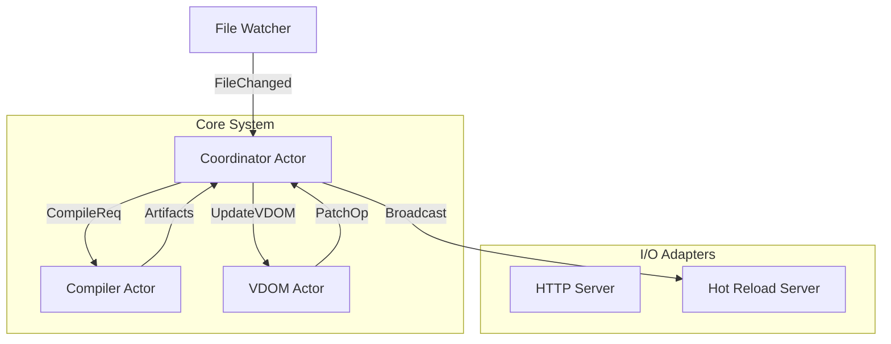
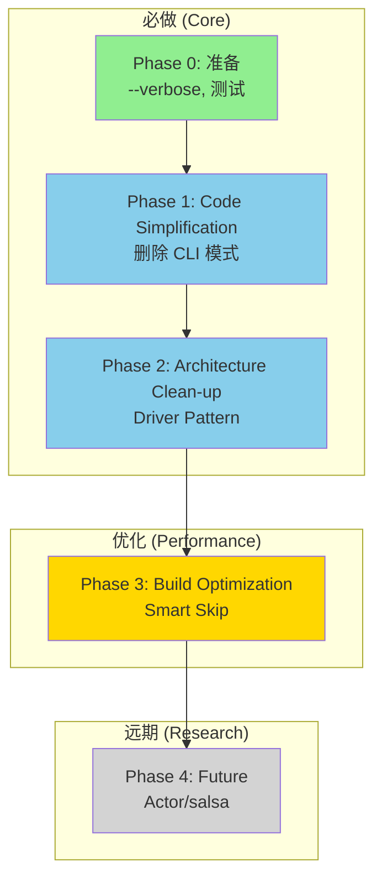

# Tola SSG Architecture 2.0: Actor Model & VDOM Strategy

本文档制定了 Tola SSG 的下一代架构，旨在通过 **Actor 模型** 实现模块解耦，并通过 **一致性哈希** 与 **Opaque Frames** 策略解决 VDOM 性能与稳定性问题。

## Implementation Status Legend

| 标记 | 含义 |
|------|------|
| ✅ **DONE** | 已完成实现 |
| 🚧 **WIP** | 部分实现或进行中 |
| 📋 **PLANNED** | 计划中，尚未开始 |
| ❌ **DEPRECATED** | 已放弃或不再计划 |

---

# Part I: System Architecture (The Actor Model) 📋 **PLANNED**

> [!NOTE]
> Actor 模块代码位于 `src/actor/`，但需要 `actor` feature flag 启用。
> 当前主流程 (`watch.rs`) 仍使用直接函数调用，未采用消息传递。

## 1. 核心理念 (Core Philosophy)
*   **No Shared State**: 模块之间不共享 Mutex/Arc，只通过 Channel 通信。
*   **Message Driven**: 所有的行为（编译、Diff、广播）都由消息触发。
*   **Pure Core**: VDOM 核心逻辑是纯函数，不依赖任何 Runtime。

### 1.1 为什么 Actor 模型能解耦？
*   **物理隔离**: 无法跨 Actor 调用函数，必须发消息。杜绝了“随手调用”导致的耦合。
*   **接口明确**: `Message` Enum 是唯一的 API。
*   **复杂度封闭**: Actor 内部的状态和生命周期对外不可见。

#### 1.1.1 误区澄清：并发 vs 解耦
你可能会担心 Actor 模型通常用于高并发场景（如聊天服务），用在这里是否杀鸡用牛刀？
*   **定位**: 在 Tola 中，我们使用 **粗粒度 Actor (System Components)** 而非细粒度 Actor (Entities)。
*   **目的**: 我们的首要目的是 **架构治理 (Decoupling)** 和 **消除全局状态 (State Isolation)**。并发性能提升只是顺带的红利。
*   **收益**: 它把“复杂的函数调用网”变成了“清晰的数据流水线”。对于编译器和热重载这种 Pipeline 系统，这是降低心智负担的最佳模型。

#### 1.1.2 深入分析：并发收益与流水线 (Parallelism Deep Dive)
虽然 Actor 模型提供了并发能力，但我们需要诚实评估其在 SSG 场景下的实际收益：

1.  **单文件热重载 (Serial Dependency)**:
    *   场景：用户修改单个文件。
    *   流程：`Compile(A) -> VDOM(A) -> Broadcast(A)`
    *   分析：这是严格的数据依赖，Actor 无法打破串行约束，此时主要收益是**解耦**而非速度。

2.  **多文件/批量构建 (Pipeline Parallelism)**:
    *   场景：修改模板触发多个页面重建，或初始构建。
    *   流程：
        ```text
        t0: Compile(A)
        t1: Compile(B) + VDOM(A)        <-- 并行发生
        t2: Compile(C) + VDOM(B) + Broadcast(A)
        ```
    *   收益：这是 Actor 模型的**核心性能红利**。编译与 VDOM 处理自动重叠，无需手动管理线程池。

3.  **I/O 重叠**:
    *   场景：WebSocket 广播慢客户端。
    *   收益：Broadcast Actor 处理网络 I/O 时，Compiler Actor 可继续响应新的文件变更，避免被慢客户端阻塞。

## 2. 系统拓扑 (System Topology)



## 3. 模块职责定义 (Module Responsibilities)

### 3.1 `crate::vdom` (The Pure Core) ✅ **CORE COMPLETE**
**绝对纯净**。不依赖 compiler/network/fs。
*   **Structs**: `Node`, `Document`, `StableId` ✅
*   **Algos**: `diff(old, new) -> Patch` ✅, `lcs` ✅, `fold(doc) -> doc` ✅
*   **Render**: `html_renderer` ✅, `xml_renderer` 📋 **PLANNED**
*   **Input**: `Node` tree -> **Output**: `PatchOps` / `String`

> [!NOTE]
> **Diff 迁移已完成**: `diff` 和 `lcs` 算法已迁移到 `src/vdom/diff.rs` 和 `src/vdom/lcs.rs`。
> `hotreload` 模块现在只包含 re-exports 和 WebSocket 传输逻辑。

> [!TIP]
> **模块简化**: `folder.rs` 和 `transform.rs` 职责重叠，建议合并：
> - `Folder` trait (底层遍历) + `Transform` trait (高层 API) → 统一为 `Transform`
> - `ProcessFolder` 保留实现，但移入 `transform.rs`
> - 对外只暴露 `Transform` trait 和 `doc.pipe()` API

### 3.2 `crate::actor::compiler` 📋 **PLANNED**
*   **职责**: 封装 Typst Universe。
*   **Input**: `PathBuf` (Changed file)
*   **Output**: `Vec<u8>` (PDF), `PagedDocument` (Typst DOM)
*   **State**: 持有 `typst::World` 实例，负责增量编译缓存。

> **Current Reality**: 编译逻辑在 `src/typst_lib/` 和 `src/compiler/`，直接调用。

### 3.3 `crate::actor::vdom` (The Bridge) 📋 **PLANNED**
*   **职责**: 将 Typst DOM 转换为 Tola VDOM，并在 Actor 内部封装 **TTG/GATs** 的类型复杂度。
*   **Action**:
    1. Konvertieren (Typst -> Raw VDOM)
    2. Pipeline (Index -> **Slugify IDs** -> Process -> Render)
    3. **Diff**: 维护上一帧状态，计算 Patch。
    4. **Generate**: 调用 XML Generators 生成 RSS/Sitemap VDOM (当 Meta 变动时)。
*   **Output**: `DiffResult` (包含 Patches)

> **Current Reality**: VDOM 转换集成在 `src/vdom/mod.rs` (`compile_for_dev`)，缓存在全局 `VDOM_CACHE`。

### 3.4 `crate::actor::hotreload` 📋 **PLANNED**
*   **职责**: 纯粹的 WebSocket 广播器。
*   **Action**: 接收 `Broadcast(PatchOps)` -> 序列化 -> 发送。

> **Current Reality**: WebSocket 逻辑在 `src/hotreload/server.rs`，通过静态函数调用。


### 3.5 Actor Type Safety (Typestates) ❌ **RECONSIDERING**

> [!WARNING]
> 经评估，Typestate 模式对于单次同步编译调用**过度复杂**，收益不明确。
> 编译器可以用更简单的 `impl Compiler { fn compile(&self) -> Result<...> }` 方式实现。

原提案保留供参考，但实现计划暂停。

## 4. 迁移策略 (Migration Strategy)

### 4.1 `src/watch.rs` -> `Coordinator Actor`
*   拆分 `Debouncer` 和 `ContentCache` 到独立的 `FileWatcherActor`。
*   `handle_changes` 不再直接调用编译，而是发送消息给 Coordinator。

### 4.2 `src/compiler/*.rs` -> `Compiler Actor`
*   移除 `process_page_for_dev` 中的副作用（写文件），使其变为纯计算函数。
*   `typst::World` 移入 Actor State。

### 4.3 `src/serve.rs` -> Bootstrapper
*   `serve.rs` 仅负责 `tokio::spawn` 启动所有 Actor 并连接 Channels。

### 4.4 `src/hotreload` -> Reliable Messenger
*   `diff` 逻辑移回 `vdom/diff.rs`。
*   `HotReloadServer` 只保留 WebSocket 通讯逻辑。

### 4.5 XML Generators Integration (RSS/Sitemap) 📋 **PLANNED**
*   **现状**: `src/generator/{rss,sitemap}.rs` 使用手动 String 拼接或 `rss` crate Builder 模式生成 XML。
*   **迁移** (优先级低):
    *   改造 Generators 使其返回 `vdom::Document` 树，而不是 String。
    *   在 `vdom` 核心层增加 `xml_renderer.rs`，支持将 VDOM 渲染为 XML。

> **Note**: 当前实现工作正常，此迁移为架构一致性优化，非必需。
### 4.6 Data Store Refactoring (`src/data`) 📋 **PLANNED**
*   **现状**: `src/data` 依赖全局可变状态 `GLOBAL_SITE_DATA` (`LazyLock<RwLock>`)。
*   **Hot Reload** 增加了 `VDOM_CACHE` (`src/hotreload/cache.rs`) 另一个全局状态。
*   **迁移** (待 Actor 实现后):
    *   废弃 `GLOBAL_SITE_DATA` 和 `VDOM_CACHE` 静态变量。
    *   `SiteData` 将作为 `Compiler Actor` 的内部 State。
    *   `VdomCache` 将作为 `VDOM Actor` 的内部 State。

> [!IMPORTANT]
> **当前仍使用全局状态**。迁移依赖 Actor Model 实现。

### 4.7 Cleanup `src/typst_lib`
*   **现状**: `src/typst_lib` 目前包含了一些便捷函数 (如 `compile_vdom`)，直接调用了 `crate::vdom` 进行转换。这导致了 `Compiler` 和 `VDOM` 的耦合。
*   **迁移**:
    *   移除 `typst_lib` 中所有涉及 `crate::vdom` 的代码。
    *   `typst_lib` 只负责产生 `typst::Document` 或 `typst_html::HtmlDocument` (AST)。
    *   **VDOM Actor** 接收这个 AST，并负责调用 `vdom::from_typst` 进行转换。
    *   **目标**: `typst_lib` 应该是一个纯粹的 Typst 编译器封装，完全不知道 Tola VDOM 的存在。

### 4.8 Slug & Anchor Generation
*   **现状**: `src/utils/xml/processor.rs` 在 HTML 字符串处理阶段解析 `h1-h6` 并注入 ID。
*   **迁移**:
    *   移入 VDOM Pipeline (`vdom::transform::slugify_headless`).
    *   在 VDOM 树遍历阶段直接给 `Element::Heading` 节点添加 `id` 属性。
    *   **Slug Utils**: `src/utils/slug.rs` 保持为纯工具库，供 VDOM 和 Compiler 共享。

### 4.9 Additional Decoupling Improvements 📋 **PLANNED**

#### 4.9.1 Utils 与 Config 解耦
*   **现状**: `src/utils/` 下 16+ 个模块通过 `use crate::config` 直接依赖配置。
*   **问题**: 工具函数应该是纯函数，不应依赖全局状态。
*   **迁移**:
    *   工具函数接受**参数**而非读取全局配置。
    *   例如 `minify(content, config)` → `minify(content, MinifyOptions { ... })`

#### 4.9.2 vdom 模块简化
*   **folder.rs + transform.rs 合并**:
    *   `Folder` trait (底层遍历) + `Transform` trait (高层 API) → 统一 `Transform`
    *   `ProcessFolder` 移入 `transform.rs`
    *   对外只暴露 `Transform` trait 和 `doc.pipe()` API
*   **phase.rs 拆分** (可选):
    *   当前 phase.rs 有 500+ 行，可拆分为每个 Phase 一个文件
    *   `phase/raw.rs`, `phase/indexed.rs`, `phase/processed.rs`

#### 4.9.3 全局 `cfg()` 函数替换
*   **现状**: `cfg()` 返回 `&'static SiteConfig`，多处直接调用。
*   **问题**: 隐式全局状态，难以测试，违反依赖注入原则。
*   **迁移**:
    *   关键函数显式接收 `&SiteConfig` 参数
    *   `cfg()` 仅在入口点 (`main.rs`, `serve.rs`) 调用
    *   内部模块通过参数传递

#### 4.9.4 Diff 统一与迁移
*   **现状**: `src/hotreload/diff.rs` 存在两套实现：
    *   `diff_documents(Processed, Processed)` - 旧版
    *   `diff_indexed_documents(Indexed, Indexed)` - 新版
*   **迁移**:
    *   移动到 `src/vdom/diff.rs`
    *   删除旧版 `diff_documents`
    *   `hotreload` 只调用 vdom 的 diff API

#### 4.9.5 大文件拆分
*   **现状**: 多个模块过于庞大，职责不清：
    *   `compiler/pages.rs` (764 行) - 混合编译、写入、元数据
    *   `compiler/meta.rs` (961 行) - 混合类型定义、路径计算、缓存
    *   `utils/slug.rs` (27KB) - 包含大量测试
*   **迁移**:
    *   `pages.rs` 拆分：`compile.rs` (编译) + `write.rs` (IO) + `dev.rs` (热重载)
    *   `meta.rs` 拆分：`types.rs` (类型) + `paths.rs` (路径计算) + `cache.rs`
    *   `slug.rs` 测试移入 `tests/` 或 `slug/tests.rs`

#### 4.9.6 更多全局状态
*   **hotreload/server.rs**: `static BROADCAST: LazyLock<Broadcaster>`
    *   与 `VDOM_CACHE` 和 `GLOBAL_SITE_DATA` 同样的问题
    *   应该作为 Actor 内部状态管理
*   **compiler/deps.rs**: 可能存在 `DEPENDENCY_GRAPH` 静态变量
    *   依赖图应该作为 Compiler 状态的一部分

#### 4.9.7 错误处理统一
*   **现状**: 混用 `anyhow::Result` (14+ 文件) 和自定义错误类型
*   **建议**:
    *   核心模块 (`vdom`) 使用自定义 `VdomError` 类型，提供精确错误信息
    *   边缘模块 (`serve`, `build`) 可使用 `anyhow` 简化错误链
    *   避免在 vdom 纯核心中使用 `anyhow` 保持零依赖

---

# Part II: VDOM Core Strategy (Identity & Performance)

## 5. 核心决策：一致性身份识别 (Consistent Identity)

我们确立 **一致性内容哈希 (Consistent Content Hashing)** 为唯一正确的 ID 路径。

### 5.1 为什么放弃 Span ID？
- **不稳定**: Typst 的 Span ID 在多次编译间无法保证稳定（瞬态）。
- **状态突变**: 文件编辑会导致全局 Span ID 变化，破坏 Diff 算法的假设。
- **现状**: 虽然 `RawElemExt` 中保留了 Span 字段，但仅用于 Debug 时的源码定位，**绝不用于生成 StableId**。

### 5.2 选定的 ID 策略
采用 `src/vdom/id.rs` 中已验证的策略 (Pure Content Hash)：
- **算法**: `Hash(Tag + SortedAttrs + ChildrenIDs + Position)`
- **鲁棒性**: 只要内容结构不变，ID 永不改变。即便是跨进程重启，ID 依然一致。
- **消歧**: 引入 `Position` (index in parent) 解决完全相同的兄弟节点冲突。
- **结果**: `StableId` 是纯粹的 64-bit Hash，对 `rkyv` 友好，无需复杂的生命周期管理。

### 5.3 Deprecating NodeId (Unified Identity)
*   **现状**: 目前代码中 `IndexedElemExt` 同时包含 legacy `node_id` (u32) 和 `stable_id` (u64)。
*   **计划**: 彻底移除 `NodeId`。所有的索引（如 SVG 索引、Link 索引）都将迁移到使用 `StableId` 作为 Key。
*   **收益**: 消除 ID 混淆，降低内存占用，简化 diff 逻辑。

## 6. Opaque SVG Optimization (Implementation Reality)

为了解决 Typst SVG 渲染性能问题，我们采用 **Immediate SVG Conversion** 策略：

### 6.1 Immediate Conversion
*   **Reality**: 在 `from_typst_html` (Raw Phase) 转换阶段，直接调用 `typst_svg` 将 Frame 渲染为 SVG String，并包装为 `Element::auto("svg")`。
*   **Benefits**:
    *   避免在 VDOM Pipeline 中携带 `Introspector` 引用。
    *   SVG 内容被视为普通的文本子节点，天然支持 Content Hash ID。
    *   Diff 算法自动将其视为一个整体变更（因为 ID 变了），无需额外的 "Opaque" 标记。

### 6.2 Atomic Replacement
*   **策略**: 当 Frame 内容变化时，SVG 的 StableId 会随之变化（基于内容哈希）。
*   **结果**: Diff 算法会生成 `Replace` 操作，在客户端整体替换整个 `<svg>` 标签。
*   **优势**: 避免了复杂的 WASM 细粒度 Patch，利用浏览器极快的 HTML Parser 进行原子替换。

## 7. 零拷贝架构 (Zero-Copy) 🚧 **OPTIONAL**
- `rkyv` 为**可选依赖** (`Cargo.toml: rkyv = { optional = true }`)。
- 当前用于持久化缓存文件，非 Actor IPC。
- `StableId` 已实现 rkyv `Archive` (在 `#[cfg(feature = "rkyv")]` 下)。

---

# Part III: Architecture Decision Records (ADR)

## 8. 调研参考 (References)
**typst-preview 对比**: `typst-preview` 使用瞬态 Span ID (`SpanInterner` + `lifetime`)，适用于 IDE 预览但无法满足 SSG 的持久化热重载需求。这印证了我们选择 Content Hash 的正确性。

## 9. 架构决策记录 (ADRs)

### 9.1 Fine-grained SVG Diffing (vs Atomic Replacement)
**结论**: 坚持 **Atomic Opaque Frame**，不采用 `typst-preview` 的细粒度 Diff。

**分析**:
*   **typst-preview 做法**: 确实维护了 Span <-> SVG Element 的双向映射 (Bimap) 以实现细粒度更新（例如只修改某个字符产生的 `<path>`）。这对 IDE 实时预览至关重要（避免闪烁，保持滚动位置）。
*   **Tola 场景**:
    1.  **静态/内容导向**: 我们主要渲染公式和图表，体积较小。
    2.  **复杂度惩罚**: 细粒度 Diff 需要在客户端引入复杂的 Patch 逻辑（通常是 WASM），这违背了我们“轻量级 JS Runtime”的原则。
    3.  **性能足够**: 现代浏览器替换一个几 KB 的 SVG DOM 极快 (sub-millisecond)。Atomic Replacement 是 20% 的成本换取 90% 的体验。

## 10. Cache Architecture
为了消除混淆，我们将 Cache 明确分为两类，分别由不同的 Actor 管理：

### 10.1 Compiler Cache (Persistent)
*   **Location**: `src/cache`
*   **Owner**: `Compiler Actor`
*   **Type**: Disk-based (rkyv/redb)
*   **Purpose**: 增量编译加速。存储 Typst 的依赖图、World 状态，确保重启后能快速恢复编译。

### 10.2 VDOM Cache (Transient) 🚧 **CURRENT: GLOBAL STATE**
*   **Current Location**: `src/hotreload/cache.rs` (Global `VDOM_CACHE`)
*   **Target Location**: `src/actor/vdom.rs` (Internal State) 📋 待实现
*   **Type**: In-Memory (`HashMap<PathBuf, Document<Indexed>>`)
*   **Purpose**: 用于 Hot Reload 的 Diff 计算 (`diff(old, new)`).
*   **Migration**: 移除全局 `VDOM_CACHE`，移入 VDOM Actor 作为私有 State。

## 11. Structural Integrity (No Wrappers)
**用户硬性要求**: Hot Reload 绝对不能破坏原有的 HTML 结构，严禁引入任何 wrapper 元素。

*   **Rule**: `Diff` 操作必须是 **In-Place** 的。
    *   `Replace(id, new_html)`: 替换目标元素本身（OuterHTML），**不**在外面套 `div`/`span`。
    *   `UpdateText(id, text)`: 仅通过 `textContent` 更新文本，**不**改变 DOM 节点类型。
*   **Implementation**: VDOM Diff 算法生成的 Patch 必须精确指向目标 `StableId`，客户端只做精确的 DOM 操作 (`replaceWith`, `textContent=`, `setAttribute`)。
*   **Verification**: Phase 1 测试必须包含 "Structure Preservation Test"，确保 update 前后 DOM 层级深度不变。

---

# Part IV: Query-Based Incremental Computation (Future) 📋 **RESEARCH**

> [!NOTE]
> 本章节为架构远景设计，灵感来源于 [salsa-rs](https://github.com/salsa-rs/salsa) 和 rust-analyzer。
> 需在基础 VDOM 稳定后评估引入价值。

> [!CAUTION]
> **诚实评估**: salsa **不能**魔法般消除循环依赖。两阶段编译问题需要通过 **DeferredData** (Part V) 解决，而非 salsa。

## 12. Salsa 是什么？

**核心功能**: 自动化的 memoization + 依赖追踪框架

| 能力 | 说明 |
|------|------|
| ✅ **自动缓存** | Query 结果自动 memoize |
| ✅ **精确失效** | 输入变化时只失效受影响的 Query |
| ✅ **依赖追踪** | 自动记录调用链，替代手写 `DEPENDENCY_GRAPH` |
| ✅ **Early Cutoff** | 输出相同则不传播失效 |
| ❌ **打破循环依赖** | 真正的数据循环会导致 `panic: cycle detected` |

### 12.1 salsa 能解决什么？

```rust
// 当前: 手写依赖图
DEPENDENCY_GRAPH.write().record_dependencies(path, &accessed_files);
VDOM_CACHE.insert(path, vdom);

// 有 salsa: 自动追踪，无需手写
#[salsa::tracked]
fn vdom(db: &dyn Db, file: File) -> Document {
    // salsa 自动缓存 + 追踪依赖
}
```

### 12.2 salsa **不能**解决什么？

```rust
// 这会 panic: cycle detected！
#[salsa::tracked]
fn pages_json(db: &dyn Db) -> Json {
    all_files(db).map(|f| page_html(db, f)).collect()  // 需要 page_html
}

#[salsa::tracked]
fn page_html(db: &dyn Db, file: File) -> Html {
    let data = pages_json(db);  // 循环调用！
    render(file, data)
}
```

**结论**: 两阶段编译不是 salsa 能解决的问题。真正方案是 **DeferredData** (Part V)。

## 13. 核心概念：从 Push 到 Pull

### 13.1 当前架构 (Push-Based)

```text
文件变化 → 触发编译 → 重新生成 VDOM → Diff → Patch
          ════════════════════════════════════
                    全量重新计算
```

**问题**:
- 改一个变量，可能重编译整个页面
- Template 改动级联影响所有使用者
- 无法细粒度复用中间结果

### 13.2 Query 架构 (Pull-Based / Demand-Driven)

```text
                  ┌─────────────────────────────────────┐
                  │         Query Database              │
                  │  ┌───────────┬───────────────────┐  │
                  │  │  Inputs   │   Derived Queries │  │
                  │  │           │                   │  │
                  │  │ file(path)│ vdom(path)        │  │
                  │  │ config()  │ indexed(path)     │  │
                  │  │           │ diff(old, new)    │  │
                  │  │           │ headings(path)    │  │
                  │  └───────────┴───────────────────┘  │
                  │                                     │
                  │  ┌─ Automatic Dependency Tracking ─┐│
                  │  │  headings(A) reads vdom(A)      ││
                  │  │  vdom(A) reads file(A.typ)      ││
                  │  └─────────────────────────────────┘│
                  └─────────────────────────────────────┘
                                    │
                                    ▼
                  file(A.typ) 变化 → 自动失效 vdom(A) → 自动失效 headings(A)
                                  只重算受影响的 Query
```

## 14. Tola Query System 设计

### 14.1 Input Queries (用户设置的基础数据)

```rust
/// Input: 可被外部修改的基础数据
#[salsa::input]
pub struct File {
    #[return_ref]
    pub path: PathBuf,
    #[return_ref]
    pub content: String,
    pub mtime: SystemTime,
}

#[salsa::input]
pub struct SiteConfig {
    // ... 配置字段
}
```

### 14.2 Derived Queries (自动计算和缓存的派生数据)

```rust
/// Tracked: 自动追踪依赖的派生查询
#[salsa::tracked]
pub fn parse_typst(db: &dyn TolaDb, file: File) -> TypstAst {
    // salsa 自动记录：parse_typst 依赖 file.content
    typst::parse(&file.content(db))
}

#[salsa::tracked]
pub fn vdom_raw(db: &dyn TolaDb, file: File) -> Document<Raw> {
    let ast = parse_typst(db, file);  // 依赖自动追踪
    compile_to_html(db, ast)
}

#[salsa::tracked]
pub fn vdom_indexed(db: &dyn TolaDb, file: File) -> Document<Indexed> {
    let raw = vdom_raw(db, file);
    Indexer::new().transform(raw)
}

#[salsa::tracked]
pub fn headings(db: &dyn TolaDb, file: File) -> Vec<HeadingData> {
    let doc = vdom_indexed(db, file);
    doc.query_headings()  // 只提取标题
}

#[salsa::tracked]
pub fn toc(db: &dyn TolaDb, file: File) -> TocTree {
    let hs = headings(db, file);
    build_toc(hs)
}
```

### 14.3 Early Cutoff (关键优化)

```rust
#[salsa::tracked]
pub fn vdom_indexed(db: &dyn TolaDb, file: File) -> Document<Indexed> {
    // 即使 file.content 变了，如果生成的 Document 的 StableId 树没变
    // salsa 会自动"短路"，不会重算依赖 vdom_indexed 的下游查询
    //
    // 这就是 StableId (content-hash) 的真正价值！
    // 它让 salsa 的 early cutoff 精确到节点级别
}
```

**关键洞察**: 我们现有的 `StableId` (content-hash) 天然支持 salsa 的 early cutoff：
- 用户加了一行空行 → Typst AST 变了 → 但某些 VDOM 节点的 StableId 可能没变
- salsa 检测到输出相同，不会触发下游重算

## 15. 与现有架构的对比

| 维度 | 当前架构 | Query System |
|------|----------|--------------|
| **依赖追踪** | 文件级 (`DEPENDENCY_GRAPH`) | 表达式级 (自动) |
| **缓存粒度** | 整个 `Document<Indexed>` | 每个 Query 独立 |
| **失效策略** | 手动清除 cache | 自动依赖传播 |
| **并发模型** | Actor + 全局 Mutex | salsa 内置并发 |
| **复杂度** | 手写依赖图维护 | 声明式，自动推导 |

## 16. 迁移策略

### Phase 0: 评估 (当前)
- [ ] 评估 salsa 2022 API 稳定性
- [ ] 原型测试：纯 vdom 模块用 salsa 封装
- [ ] 对比 Query overhead vs 手动 cache 的性能

### Phase 1: 隔离试点
- [ ] 在 vdom 模块内部引入 salsa
- [ ] 先只覆盖 `Raw → Indexed → Processed` 转换链
- [ ] 保持外部 API 不变（`compile_for_dev` 内部用 salsa）

### Phase 2: 依赖图迁移
- [ ] 废弃 `DEPENDENCY_GRAPH` 全局状态
- [ ] 文件监控只需要设置 Input，salsa 自动处理传播

### Phase 3: 全面 Query 化
- [ ] `PageMeta` → `page_meta(db, file)` 派生查询
- [ ] `GLOBAL_SITE_DATA` → `all_pages(db)` 查询
- [ ] Hot Reload 通过 salsa revision 对比生成精确 Patch

## 17. 预期收益

### 16.1 开发体验
- **零配置增量**: 不需要手动维护依赖图
- **精确重算**: 只重算真正变化的部分
- **调试友好**: salsa 提供依赖图可视化

### 16.2 性能
- **更少 CPU**: 大页面改动只影响变化的子树
- **更少内存**: 共享不变的中间结果
- **更快启动**: 持久化 salsa db 支持跨进程恢复

### 16.3 代码质量
- **删除全局状态**: `VDOM_CACHE`, `DEPENDENCY_GRAPH`, `GLOBAL_SITE_DATA` 全部废弃
- **纯函数化**: Query 是纯函数，易于测试
- **类型安全**: salsa 的类型系统保证 Query 调用正确

## 18. 风险与 Trade-offs

| 风险 | 缓解措施 |
|------|----------|
| salsa API 不稳定 | 等待 salsa 2022 稳定 or 使用 fork |
| 学习曲线陡峭 | 先在隔离模块试点 |
| 宏生成代码调试困难 | 保持核心逻辑在非 salsa 函数中 |
| 可能增加编译时间 | 按需引入，非全量使用 |

---

# Part V: Build Pipeline Optimization 📋 **PLANNED**

> [!IMPORTANT]
> 当前两阶段编译导致 **2x 编译开销**。此章节规划如何实现单遍编译。

## 19. 当前问题：两阶段编译

```text
Phase 1: collect_metadata()
  ├── 编译 page1.typ → 提取 metadata → 丢弃 HTML ← 浪费！
  ├── 编译 page2.typ → 提取 metadata → 丢弃 HTML
  └── ...全部页面...
  └── 填充 GLOBAL_SITE_DATA

Phase 2: compile_pages_with_data()
  ├── 编译 page1.typ → 生成 HTML → 写入文件 ← 重复编译！
  ├── 编译 page2.typ → 生成 HTML → 写入文件
  └── ...全部页面...
```

**根因**: 循环依赖 - 页面模板可能使用 `json("/_data/pages.json")` 显示最新文章，但第一次编译时 `pages.json` 是空的。

## 20. 为什么无法单遍编译？

> [!CAUTION]
> **诚实评估**: 由于 Typst 的架构设计，依赖虚拟数据的页面**无法避免两遍编译**。

### 19.1 Typst 急切求值 (Eager Evaluation)

```typst
#let posts = json("/_data/pages.json")  // 1. 立即读取文件
#for post in posts {                     // 2. 立即展开循环
    [#post.title]                        // 3. 生成 N 个节点
}
```

当编译到 `#for` 时，循环**已经展开**成具体节点。如果 `posts = []`，则生成 0 个节点。

### 19.2 无法回溯的 HTML 结构

```
typst::Content (语义 AST)
       ↓ 评估阶段 - 循环展开
typst_html::HtmlDocument
       ↓ 我们从这里开始
Document<Raw>
```

我们拿到的是**已经展开**的 HTML 结构。DeferredData 无法改变已经决定的 DOM 节点数量。

### 19.3 理论可能但不可行的方案

| 方案 | 问题 |
|------|------|
| 基于 `Content` 构建 VDOM | `Content` 是私有 API，且循环已展开 |
| 修改 `json()` 返回占位符 | 需要修改 Typst 源码 |
| 轻量级 metadata 提取 | 用户可能封装 metadata，正则不可靠 |

## 21. 解决方案：智能跳过 (Smart Skip)

### 21.1 核心思路

```text
Phase 1: 编译所有页面
  ├── 不依赖 /_data/ 的页面: 保存 HTML ✓ 完成
  └── 依赖 /_data/ 的页面: 丢弃 HTML，只保留 metadata

Phase 2: 只重新编译依赖虚拟数据的页面
```

### 21.2 实现

```rust
struct CompileResult {
    html: Vec<u8>,
    metadata: Option<ContentMeta>,
    uses_virtual_data: bool,  // 是否访问了 /_data/
}

fn build_site_optimized() {
    let mut static_pages = Vec::new();
    let mut dynamic_pages = Vec::new();

    // Phase 1: 编译所有，分类
    for file in files.par_iter() {
        let result = compile_with_tracking(file);
        GLOBAL_SITE_DATA.insert(result.metadata);

        if result.uses_virtual_data {
            dynamic_pages.push(file);
        } else {
            // 直接写入 - 这个 HTML 是完整正确的
            write_html(file, result.html);
            static_pages.push(file);
        }
    }

    // Phase 2: 只编译 dynamic 页面
    for file in dynamic_pages.par_iter() {
        let result = compile(file);  // 现在 pages.json 完整了
        write_html(file, result.html);
    }
}
```

### 21.3 精确追踪虚拟文件依赖

> [!TIP]
> 使用 `HashSet<PathBuf>` 而非 `bool`，避免同时依赖多个虚拟文件时的重复编译问题。

```rust
// 改进: 精确记录访问了哪些虚拟文件
thread_local! {
    static ACCESSED_VIRTUAL_FILES: RefCell<HashSet<PathBuf>> =
        RefCell::new(HashSet::new());
}

pub fn read_virtual_data(path: &Path) -> Option<Vec<u8>> {
    // 精确记录路径
    ACCESSED_VIRTUAL_FILES.with(|f| {
        f.borrow_mut().insert(path.to_path_buf());
    });
    // ... 原有逻辑
}

pub fn reset_virtual_access() {
    ACCESSED_VIRTUAL_FILES.with(|f| f.borrow_mut().clear());
}

pub fn get_accessed_virtual_files() -> HashSet<PathBuf> {
    ACCESSED_VIRTUAL_FILES.with(|f| f.borrow().clone())
}
```

**CompileResult 结构**:
```rust
struct CompileResult {
    html: Vec<u8>,
    metadata: Option<ContentMeta>,
    accessed_virtual_files: HashSet<PathBuf>,  // 精确记录
}
// 例如:
// index.typ   → { "/_data/pages.json", "/_data/tags.json" }
// archive.typ → { "/_data/pages.json" }
// about.typ   → {}  (静态页面)
```

### 21.4 热重载去重

```rust
fn on_page_metadata_changed(changed_page: &Path) {
    GLOBAL_SITE_DATA.update(changed_page, new_metadata);

    // 确定哪些虚拟文件受影响
    let affected: Vec<_> = ["/_data/pages.json", "/_data/tags.json"]
        .iter()
        .filter(|vf| virtual_file_content_changed(vf))
        .collect();

    // 去重: 合并所有依赖这些虚拟文件的页面
    let mut pages_to_update: HashSet<PathBuf> = HashSet::new();
    for vf in affected {
        if let Some(deps) = DEPENDENCY_GRAPH.get_dependents(vf) {
            pages_to_update.extend(deps.clone());
        }
    }

    // 每个页面只更新一次！
    for page in pages_to_update {
        recompile_and_diff(&page);
    }
}
```

### 21.5 虚拟文件设计

> [!TIP]
> 当前只有 `pages.json` 和 `tags.json`，使用**常量数组**而非 trait，保持简洁。

**当前实现 (保持)**:
```rust
// virtual_fs.rs - 极简设计
const VIRTUAL_FILES: &[VirtualFile] = &[
    VirtualFile { name: "pages.json", generate: || GLOBAL_SITE_DATA.pages_to_json() },
    VirtualFile { name: "tags.json", generate: || GLOBAL_SITE_DATA.tags_to_json() },
];
```

**添加新虚拟文件只需扩展数组**:
```rust
// 未来: 添加搜索索引
VirtualFile { name: "search-index.json", generate: || GLOBAL_SITE_DATA.search_index() },
```

**优点**:
- 编译期常量，零运行时开销
- 无 trait 复杂度
- 无动态分发

> [!NOTE]
> **插件 trait (📋 OPTIONAL - 未来再考虑)**:
> 如果确实需要第三方插件动态注册虚拟文件，届时再引入 `VirtualFileProvider` trait。
> 当前不需要这个抽象层。

### 21.6 性能收益

| 页面结构 | 当前 (2N) | 优化后 (N+M) | 节省 |
|----------|-----------|--------------|------|
| 100页，1个 index | 200 | 101 | 49.5% |
| 100页，5个动态 | 200 | 105 | 47.5% |
| 100页，50个动态 | 200 | 150 | 25% |
| 100页，100个动态 | 200 | 200 | 0% |

**结论**: 大多数站点只有少数页面显示文章列表（index、archive、tag 页面），收益显著。

### 21.7 增量 JSON 序列化 (Differential Serialization)

> [!IMPORTANT]
> 从一开始就采用高性能方案：修改 1 篇文章 → 只序列化 1 篇 → O(1)

#### 当前问题

```rust
// 当前: 修改 1 篇 → 重新序列化全部 N 篇
fn insert_page(&self, page: PageData) {
    self.pages.write().insert(page.url.clone(), page);
    *self.json_cache.write() = JsonCache::default();  // 清空所有缓存
}
```

#### 激进优化方案

```rust
struct SiteDataStore {
    pages: RwLock<BTreeMap<String, PageData>>,

    // ======== 差分序列化缓存 ========

    /// 每个页面的 JSON 片段缓存
    page_json_fragments: RwLock<HashMap<String, String>>,

    /// 已排序的 URL 列表 (按日期)
    sorted_urls: RwLock<Vec<String>>,

    /// 排序是否需要重新计算
    sort_dirty: AtomicBool,
}

impl SiteDataStore {
    fn insert_page(&self, page: PageData) {
        let url = page.url.clone();
        let old_date = self.pages.read().get(&url).and_then(|p| p.date.clone());
        let new_date = page.date.clone();

        // 1. 更新数据
        self.pages.write().insert(url.clone(), page.clone());

        // 2. 只更新这一个页面的 JSON 片段
        let fragment = serde_json::to_string_pretty(&page).unwrap();
        self.page_json_fragments.write().insert(url.clone(), fragment);

        // 3. 只有日期变化或新页面才需要重新排序
        if old_date != new_date || !self.sorted_urls.read().contains(&url) {
            self.sort_dirty.store(true, Ordering::Relaxed);
        }
    }

    fn pages_to_json(&self) -> String {
        // 懒排序: 只在需要时重新排序
        if self.sort_dirty.swap(false, Ordering::Relaxed) {
            self.recompute_sort();
        }

        // 组装已缓存的 JSON 片段 (不重新序列化!)
        let sorted = self.sorted_urls.read();
        let fragments = self.page_json_fragments.read();

        let parts: Vec<&str> = sorted.iter()
            .filter_map(|url| fragments.get(url).map(String::as_str))
            .collect();

        format!("[{}]", parts.join(",\n"))
    }
}
```

#### 性能对比

| 操作 | 当前 | 差分序列化 |
|------|------|------------|
| 修改 1 篇文章 | O(N) 序列化 | **O(1)** 序列化 |
| 添加新文章 | O(N) 序列化 | **O(1)** 序列化 + O(N log N) 排序 |
| 生成 pages.json | O(N) | **O(N) 字符串拼接** (更快) |
| 内存开销 | 1 份 JSON | N 份片段 (~2x) |

#### Tags 索引的差分更新

```rust
struct TagsCache {
    /// tag -> 该 tag 下页面的 JSON 片段
    tag_fragments: HashMap<String, Vec<(String, String)>>,  // tag -> [(url, json)]

    /// 哪些 tag 的排序是脏的
    dirty_tags: HashSet<String>,
}

fn insert_page(&self, page: PageData) {
    // 只更新受影响的 tag
    for tag in &page.tags {
        self.dirty_tags.insert(tag.clone());
        // 更新该 tag 下的页面片段
    }
}
```

#### 未来: 搜索索引的增量更新

```rust
struct SearchIndex {
    /// 每篇文章的倒排索引片段
    per_page_index: HashMap<String, TermPostings>,  // url -> { term -> positions }

    /// 全局倒排索引 (合并后)
    global_index: Option<GlobalTermIndex>,
}

fn update_search_index(&self, url: &str, content: &str) {
    // 1. 只重新索引这一篇文章
    let new_postings = tokenize_and_index(content);

    // 2. 增量合并到全局索引
    let old_postings = self.per_page_index.remove(url);
    self.global_index.remove_postings(old_postings);
    self.global_index.add_postings(&new_postings);

    self.per_page_index.insert(url.to_string(), new_postings);
}
```

---

## Part VI: Architecture Clean-up 🧹


> [!IMPORTANT]
> 解决代码库中的双重实现 (`_for_dev`) 和配置耦合问题，采用 **Driver Pattern** 实现通用架构。

### 6.1 问题诊断

| 问题 | 症状 | 影响 |
|------|------|------|
| **逻辑分叉** | `compile_vdom` vs `compile_vdom_for_dev` | 27+ 处重复函数，维护困难 |
| **状态耦合** | `SiteConfig` 包含 `cli: Option<&Cli>` | 配置与运行时状态混杂，难以测试 |
| **条件散落** | `if use_vdom`, `if dev_mode` | 核心逻辑被无关的控制流污染 |

### 6.2 解决方案: Driver Pattern

将系统拆分为三层：**纯配置**、**运行时驱动**、**核心逻辑**。

#### (A) 纯配置层 (Pure Config)

```rust
// 只包含 tola.toml 中的数据，完全无状态
pub struct SiteConfig {
    pub base: BaseConfig,
    pub build: BuildConfig,
    // NO cli field!
    // NO runtime paths!
}
```

#### (B) 驱动层 (Drivers)

抽象出所有随环境变化的行为（渲染细节、日志策略等），这是消除 `if` 的关键。

```rust
/// 定义构建行为的接口 ("工人的行为规范")
pub trait BuildDriver {
    /// 动作: 渲染元素开始标签
    /// Core 只管调用，Driver 决定是否注入 ID (Dev) 或保持原样 (Prod)
    fn render_element_start(&self, elem: &Element, html: &mut String);

    /// 动作: 获取日志器
    fn logger(&self) -> &dyn Logger;
}

/// 日志抽象接口 - 消除随处的 if verbose
pub trait Logger {
    fn info(&self, msg: &str);
    fn debug(&self, msg: &str); // 内部判断 verbose 标记
}

// 具体实现

pub struct ProductionDriver;
impl BuildDriver for ProductionDriver {
    fn render_element_start(&self, elem: &Element, html: &mut String) {
        html.push_str(&format!("<{}", elem.tag)); // 干净输出
    }
    // logger 返回 ProdLogger (只输出 info)
}

pub struct DevelopmentDriver { verbose: bool };
impl BuildDriver for DevelopmentDriver {
    fn render_element_start(&self, elem: &Element, html: &mut String) {
        html.push_str(&format!("<{} data-tola-id=\"{}\"", elem.tag, elem.id)); // 注入 ID
    }
    // logger 返回 DevLogger (根据 verbose 输出 debug)
}
```

#### (C) 核心逻辑层 (Core Logic)

核心层变为纯粹的流程编排者，**不再包含环境判断逻辑**。

```rust
// 泛型化核心逻辑，依赖接口 D 而非具体实现
pub struct SiteCompiler<D: BuildDriver> {
    config: Arc<SiteConfig>,
    driver: D,
}

impl<D: BuildDriver> SiteCompiler<D> {
    pub fn compile_page(&self, path: &Path) -> Result<()> {
        // 1. 无需判断 verbose，统一调用
        self.driver.logger().debug("Starting compilation...");

        // 2. 统一编译
        let vdom = typst_lib::compile(path, &self.config)?;

        // 3. 无需判断 dev_mode，统一渲染
        for elem in vdom {
             // 行为由 Driver 多态决定
             self.driver.render_element_start(elem, &mut html);
             // ...
        }

        Ok(())
    }
}
```

### 6.3 重构步骤

1.  **净化 SiteConfig**: 移除 `cli`, `root`, `config_path` 等运行时字段，使其回归纯配置。
2.  **定义 Traits**: 创建 `BuildDriver` 和 `Logger` 接口，明确行为边界。
3.  **实现 Drivers**: 编写 `ProductionDriver` 和 `DevelopmentDriver`，封装各自的环境特定逻辑。
4.  **重构 Main**: 在入口处 (`main.rs`) 根据 CLI 命令组装对应的 Driver 和 Compiler。
    ```rust
    let driver = if is_serve { DevelopmentDriver::new() } else { ProductionDriver::new() };
    let compiler = SiteCompiler::new(config, driver);
    compiler.run()?;
    ```
5.  **消除冗余函数**: 彻底删除 `_for_dev` 后缀函数，所有差异化逻辑下沉至 Driver。

---

## 22. 完美热重载：Metadata 级联更新

### 22.1 当前问题

修改 `page1.typ` 的 `<tola-meta>` 后：
- `pages.json` 更新 ✅
- 使用 `pages.json` 的 `index.typ` **不会刷新** ❌

### 22.2 解决方案

```rust
fn on_metadata_changed(path: &Path) {
    // 1. 更新 GLOBAL_SITE_DATA
    GLOBAL_SITE_DATA.insert_page(new_data);

    // 2. 查找依赖虚拟文件的页面
    for virtual_path in ["/_data/pages.json", "/_data/tags.json"] {
        if let Some(dependents) = DEPENDENCY_GRAPH.get_dependents(virtual_path) {
            for dependent_page in dependents {
                // 3. 重新编译依赖页面并推送 patch
                recompile_and_diff(dependent_page);
            }
        }
    }
}
```

---

# Part VII: Code Simplification 📋 **PLANNED**

> [!NOTE]
> 此章节与 Part VI (Driver Pattern) 互补：
> - **Part VII**: 删除 `use_lib`/`use_vdom` 配置选项 → VDOM 成为唯一编译管线
> - **Part VI**: 在此基础上引入 Driver Pattern → 消除 `_for_dev` 函数重复

> [!WARNING]
> 激进重构：**删除所有 CLI 模式代码**，VDOM 成为唯一管线。

## 23. 删除配置项

### 23.1 Before

```toml
# tola.toml
[build.typst]
use_lib = true       # 删除
use_vdom = true      # 删除
command = ["typst"]  # 删除
```

### 23.2 After

```toml
# tola.toml
[build.typst]
# 简洁！无需配置
```

## 24. 删除代码清单

| 文件 | 删除内容 |
|------|----------|
| `config/build.rs` | `TypstConfig.use_lib`, `use_vdom`, `command` |
| `compiler/pages.rs` | `compile_cli()`, `query_meta_cli()`, 所有 `if use_lib` 分支 |
| `build.rs` | `if use_lib` 条件判断 |
| `watch.rs` | `if use_vdom` 条件判断 |

### 24.1 `TypstConfig` 简化

```rust
// Before
pub struct TypstConfig {
    pub use_lib: bool,
    pub use_vdom: bool,
    pub command: Vec<String>,
}

// After
pub struct TypstConfig {
    // 空，或只保留其他必要配置
}
```

### 24.2 `compile_meta_internal` 简化

> [!TIP]
> 此步骤后仍保留 `if dev_mode`。下一步 (Part VI Driver Pattern) 可进一步消除此分支。

```rust
// Before: 4 个分支
fn compile_meta_internal(path, config, dev_mode) {
    if config.build.typst.use_lib {
        if config.build.typst.use_vdom {
            if dev_mode { ... } else { ... }
        } else { ... }
    } else {
        compile_cli(...)  // CLI 分支
    }
}

// After: 2 个分支
fn compile(path, config, dev_mode) {
    if dev_mode {
        typst_lib::compile_vdom_for_dev(...)
    } else {
        typst_lib::compile_vdom(...)
    }
}
```

## 25. 收益

| 维度 | 改善 |
|------|------|
| **代码行数** | 预计减少 ~200 行 |
| **配置复杂度** | 3 个选项 → 0 |
| **测试矩阵** | 4 种组合 → 1 种 |
| **心智负担** | 显著降低 |

---

# Part VIII: Implementation Roadmap 🗺️

> [!NOTE]
> 按依赖关系和风险排序的分阶段执行计划。每个任务包含具体文件、代码变更和验收标准。

---

## Phase 0: 准备工作 (1-2 天)

**目标**: 建立基础设施，确保后续重构顺利进行。

### 0.1 添加 `--verbose` CLI 参数

**文件**: [cli.rs](file:///Users/kawayww/proj/tola-ssg/src/cli.rs)

```diff
 pub struct BuildArgs {
     #[arg(long)]
     pub clean: bool,
+
+    /// Enable verbose output for debugging
+    #[arg(short = 'V', long)]
+    pub verbose: bool,
     // ...
 }
```

**文件**: [config/mod.rs](file:///Users/kawayww/proj/tola-ssg/src/config/mod.rs)

```diff
 pub struct SiteConfig {
+    #[serde(skip)]
+    pub verbose: bool,
     // ...
 }

 fn apply_build_args(&mut self, args: &BuildArgs, is_serve: bool) {
+    self.verbose = args.verbose;
     // ...
 }
```

**验收标准**:
- [ ] `tola build --verbose` 输出详细编译信息
- [ ] `tola serve -V` 同样生效

### 0.2 Interactive TUI 架构 (参考 dioxus-cli)

> [!TIP]
> dioxus-cli 的 `packages/cli/src/serve/output.rs` (1119 行) 和 `logging.rs` (1378 行)
> 提供了完整的交互式终端 UI 参考实现。
>
> 核心设计：
> - **Output** 结构体管理整个终端 UI
> - **ServeUpdate** 事件枚举连接各组件
> - **ratatui** 渲染 TUI，支持进度条、状态行
> - **crossterm EventStream** 监听键盘输入

> [!IMPORTANT]
> **必须保留的特性：单区块覆盖输出**
>
> 现有 `WatchStatus` 的核心价值：每次文件变更后的输出是**一个区块**，
> 下一次变更会**覆盖**上一次的输出。无论是：
> - `✓ rebuilt: content/index.typ (23ms)` (成功)
> - `  unchanged: content/about.typ` (未变)
> - `✗ failed: content/broken.typ` + 多行错误详情
>
> 这避免了终端被大量日志淹没，保持输出整洁。

**当前实现** ([logger.rs:WatchStatus](file:///Users/kawayww/proj/tola-ssg/src/logger.rs#L387-L463)):
```rust
pub struct WatchStatus {
    last_lines: usize,  // 上次输出的行数
}

fn display(&mut self, symbol: String, message: &str) {
    // 清除上次输出
    if self.last_lines > 0 {
        execute!(stdout, cursor::MoveUp(self.last_lines as u16)).ok();
        execute!(stdout, Clear(ClearType::FromCursorDown)).ok();
    }

    // 输出新内容
    writeln!(stdout, "{timestamp} {symbol} {message}").ok();

    // 记录行数供下次清除
    self.last_lines = message.matches('\n').count() + 1;
}
```

**目标 TUI 中保留此行为**:
```
[serve] watching for changes... (r: rebuild, v: verbose, q: quit)

┌─ Last Update ─────────────────────────────────────┐  ← 固定区域
│ [12:30:45] ✓ rebuilt: content/index.typ (23ms)    │  ← 内容覆盖
│            └── unchanged: 5 files                 │
└───────────────────────────────────────────────────┘
```

---

#### 方案 C: dioxus-cli 风格的 TUI (最佳，远期目标)

##### ratatui 关键特性

| 特性 | 解决的问题 | 对应需求 |
|------|----------|---------|
| **`Viewport::Inline(height)`** | 固定高度的内联视口，每次 draw 自动覆盖 | 单区块覆盖输出 |
| **`Terminal::insert_before`** | 在视口上方插入内容 | 日志不干扰状态区 |
| **`scrolling-regions` feature** | 避免 insert_before 闪烁 | 流畅 UI |
| **Diff-based rendering** | 只重绘变化部分 | 消除手动 cursor 控制 |

##### 对比：手动 vs ratatui

**当前 WatchStatus (手动光标控制)**:
```rust
// 手动清除上次输出
execute!(stdout, cursor::MoveUp(last_lines)).ok();
execute!(stdout, Clear(ClearType::FromCursorDown)).ok();
// 输出新内容
writeln!(stdout, "{message}").ok();
// 记录行数
self.last_lines = message.matches('\n').count() + 1;
```

**ratatui (固定区域 + 内部滚动)**:

```rust
use crossterm::{
    event::{EnableMouseCapture, DisableMouseCapture, MouseEventKind},
    terminal::size,
};

impl Output {
    fn startup(&mut self) -> Result<()> {
        enable_raw_mode()?;
        // 启用鼠标捕获 (支持滚轮/触摸板)
        execute!(stdout(), Hide, EnableMouseCapture)?;

        // 根据终端高度动态计算状态区大小 (1/3 终端高度)
        let (_, term_height) = size()?;
        let status_height = (term_height / 3).max(5).min(20);

        self.term = Some(Terminal::with_options(
            CrosstermBackend::new(stdout()),
            TerminalOptions {
                viewport: Viewport::Inline(status_height),
            },
        )?);

        Ok(())
    }
}
```

##### 鼠标滚轮/触摸板支持

```rust
fn handle_event(&mut self, event: Event) -> Option<ServeUpdate> {
    match event {
        // 鼠标滚轮 (包括 macOS 触摸板两指滚动)
        Event::Mouse(MouseEvent { kind: MouseEventKind::ScrollUp, .. }) => {
            self.scroll_offset = self.scroll_offset.saturating_sub(3);
            Some(ServeUpdate::Redraw)
        }
        Event::Mouse(MouseEvent { kind: MouseEventKind::ScrollDown, .. }) => {
            self.scroll_offset = self.scroll_offset.saturating_add(3);
            Some(ServeUpdate::Redraw)
        }

        // 键盘 ↑↓
        Event::Key(KeyEvent { code: KeyCode::Up, .. }) => {
            self.scroll_offset = self.scroll_offset.saturating_sub(1);
            Some(ServeUpdate::Redraw)
        }
        Event::Key(KeyEvent { code: KeyCode::Down, .. }) => {
            self.scroll_offset = self.scroll_offset.saturating_add(1);
            Some(ServeUpdate::Redraw)
        }

        Event::Key(key) => self.handle_keypress(key),
        _ => None
    }
}
```

##### 内部滚动渲染

```rust
fn render_status(&mut self, frame: &mut Frame, area: Rect) {
    let total_lines = self.status_content.lines().count() as u16;
    let max_scroll = total_lines.saturating_sub(area.height);

    // 限制滚动范围
    self.scroll_offset = self.scroll_offset.min(max_scroll as usize);

    // Paragraph 内置滚动支持
    let paragraph = Paragraph::new(self.status_content.as_str())
        .scroll((self.scroll_offset as u16, 0));

    frame.render_widget(paragraph, area);

    // 滚动条指示器 (当内容超出时显示)
    if total_lines > area.height {
        let scrollbar = Scrollbar::new(ScrollbarOrientation::VerticalRight);
        let mut scrollbar_state = ScrollbarState::new(total_lines as usize)
            .position(self.scroll_offset);
        frame.render_stateful_widget(scrollbar, area, &mut scrollbar_state);
    }
}
```

##### 视觉效果

```
┌─ Status (↑↓ or mouse scroll) ───────────────┐
│ [12:30:45] ✗ content/index.typ              │  ▲
│                                             │  █  ← 滚动条
│ error: unknown variable `foo`               │  █
│   --> content/index.typ:15:3                │  ░
│   |                                         │  ░
│ 15| let bar = foo + 1                       │  ▼
└─────────────────────────────────────────────┘
       ↑ 鼠标滚轮/触摸板/键盘均可滚动
```

##### 新内容时重置到顶部 (保持当前行为)

```rust
fn update_status(&mut self, new_content: String) {
    self.status_content = new_content;

    // 新内容时重置滚动位置到顶部 (像第一次输出一样)
    // 用户先看到错误开头，需要时手动向下滚动
    self.scroll_offset = 0;
}
}
```

##### 依赖配置

```toml
# Cargo.toml
[dependencies]
ratatui = { version = "0.28", features = ["scrolling-regions"] }
crossterm = { version = "0.28", features = ["event-stream"] }
```

---

**新建文件**: `src/tui/mod.rs`

```rust
use crossterm::event::{Event, EventStream, KeyCode, KeyEventKind};
use ratatui::{prelude::*, TerminalOptions, Viewport};
use std::collections::VecDeque;

const STATUS_HEIGHT: u16 = 5;  // 固定状态区高度

/// 交互式终端输出管理器 (参考 dioxus Output)
pub struct Output {
    term: Option<Terminal<CrosstermBackend<io::Stdout>>>,
    events: Option<EventStream>,

    /// 交互模式开关
    interactive: bool,

    /// 是否显示 verbose 日志 (可实时切换!)
    verbose: bool,

    /// 待渲染的日志队列
    pending_logs: VecDeque<TraceMsg>,

    tick_interval: tokio::time::Interval,
}

impl Output {
    pub async fn start(interactive: bool) -> Result<Self> {
        let term = if interactive {
            enable_raw_mode()?;
            stdout().execute(Hide)?;
            Some(Terminal::with_options(
                CrosstermBackend::new(stdout()),
                TerminalOptions {
                    viewport: Viewport::Inline(STATUS_HEIGHT),
                },
            )?)
        } else {
            None
        };

        Ok(Self {
            term,
            events: interactive.then(EventStream::new),
            interactive,
            verbose: false,
            pending_logs: VecDeque::new(),
            tick_interval: tokio::time::interval(Duration::from_millis(100)),
        })
    }

    /// 处理键盘输入
    fn handle_keypress(&mut self, key: KeyEvent) -> Result<Option<ServeUpdate>> {
        match key.code {
            KeyCode::Char('v') => {
                self.verbose = !self.verbose;
                self.push_log(TraceMsg::info("tui",
                    &format!("Verbose: {}", if self.verbose { "on" } else { "off" })));
            }
            KeyCode::Char('c') => return Ok(Some(ServeUpdate::RequestClean)),
            KeyCode::Char('r') => return Ok(Some(ServeUpdate::RequestRebuild)),
            KeyCode::Char('q') | KeyCode::Esc => return Ok(Some(ServeUpdate::Exit { error: None })),
            _ => {}
        }
        Ok(Some(ServeUpdate::Redraw))
    }

    /// 推送日志到队列 (下次 render 时输出到视口上方)
    pub fn push_log(&mut self, msg: TraceMsg) {
        self.pending_logs.push_front(msg);
    }

    /// 渲染状态区 + 刷新日志
    pub fn render(&mut self, state: &AppState) {
        let Some(term) = self.term.as_mut() else { return };

        // 1. 先把待输出的日志 insert_before 到视口上方
        while let Some(log) = self.pending_logs.pop_back() {
            term.insert_before(1, |_| {}).ok();
            println!("{}", self.format_log(&log));
        }

        // 2. 渲染固定状态区 (自动覆盖上一帧)
        term.draw(|frame| {
            self.render_status(frame, state);
        }).ok();
    }
}
```

**新建文件**: `src/tui/update.rs`

```rust
/// 统一事件枚举 (参考 dioxus ServeUpdate)
pub enum ServeUpdate {
    /// 文件变更
    FilesChanged { files: Vec<PathBuf> },

    /// 构建状态更新
    BuildProgress { current: usize, total: usize, file: PathBuf },
    BuildComplete { duration: Duration },
    BuildFailed { error: String },

    /// 用户键盘输入
    RequestRebuild,
    RequestClean,
    ToggleVerbose,

    /// 日志
    Log { msg: TraceMsg },

    /// UI 刷新
    Redraw,

    /// 退出
    Exit { error: Option<Error> },
}
```

**新建文件**: `src/tui/trace.rs`

```rust
/// 日志消息 (参考 dioxus TraceMsg)
pub struct TraceMsg {
    pub level: Level,
    pub source: TraceSrc,
    pub content: TraceContent,
    pub timestamp: Instant,
}

pub enum TraceSrc {
    Dev,        // tola 内部
    Typst,      // Typst 编译器
    Tailwind,   // Tailwind CLI
    App,        // 用户代码
}

pub enum TraceContent {
    Text(String),
    Cargo(Diagnostic),  // 如果集成 cargo 诊断
}
```

---

**与 RuntimeContext 整合**:

```rust
pub struct RuntimeContext<D: BuildDriver> {
    pub root: PathBuf,
    pub driver: D,
    pub output: Output,  // 交互式 TUI
}

// 主事件循环
async fn serve(config: SiteConfig, ctx: RuntimeContext<DevelopmentDriver>) {
    loop {
        tokio::select! {
            // 文件变更
            files = watcher.next() => {
                ctx.output.push_log(TraceMsg::info("watch", "file changed"));
                // ... 处理编译 ...
            }

            // 键盘输入 / TUI 事件
            update = ctx.output.wait() => {
                match update {
                    ServeUpdate::RequestRebuild => { /* 重建 */ }
                    ServeUpdate::ToggleVerbose => { /* 已在 handle_keypress 处理 */ }
                    ServeUpdate::Exit { .. } => break,
                    _ => {}
                }
            }
        }

        ctx.output.render(&state);
    }
}
```

---

**短期改进** (Phase 0 范围):

1. [ ] 添加 `VERBOSE` 全局标志和 `debug!` 宏 (当前架构下的最小改动)
2. [ ] 保留现有 `BAR_COUNT` 协调机制 (暂不改动)

**长期改进** (Phase 4: Interactive TUI):

- [ ] 引入 `ratatui` 依赖
- [ ] 创建 `src/tui/` 模块，参考 dioxus 实现
- [ ] 统一 `WatchStatus` + `ProgressBars` 为 `Output`
- [ ] 实现键盘交互 (v/c/r/q)
- [ ] 消除全局状态 (`BAR_COUNT`, `VERBOSE` 等)

---

### 0.3 增加测试覆盖

**运行现有测试**:
```bash
cargo test --lib
```

**添加回归测试** (文件: `src/compiler/pages.rs`):
```rust
#[cfg(test)]
mod regression_tests {
    use super::*;

    #[test]
    fn test_compile_meta_produces_valid_html() {
        // 确保基本编译功能正常
    }

    #[test]
    fn test_process_page_extracts_metadata() {
        // 确保 metadata 提取正常
    }
}
```

---

## Phase 1: Code Simplification (Part VII) (2-3 天)

**目标**: 删除 CLI 模式，VDOM 成为唯一管线。

### 1.1 删除配置选项

**文件**: [config/build.rs](file:///Users/kawayww/proj/tola-ssg/src/config/build.rs)

```diff
 pub struct TypstConfig {
-    /// Use typst library directly instead of CLI
-    #[serde(default = "defaults::r#true")]
-    #[educe(Default = true)]
-    pub use_lib: bool,
-
-    /// Use VDOM pipeline for HTML generation
-    #[serde(default = "defaults::r#false")]
-    #[educe(Default = false)]
-    pub use_vdom: bool,
-
-    /// Typst command (only used when use_lib = false)
-    #[serde(default = "defaults::build::typst::command")]
-    #[educe(Default = defaults::build::typst::command())]
-    pub command: Vec<String>,

     #[serde(default)]
     pub svg: SvgConfig,
 }
```

**文件**: [config/defaults.rs](file:///Users/kawayww/proj/tola-ssg/src/config/defaults.rs)

```diff
 pub mod typst {
-    pub fn command() -> Vec<String> {
-        vec!["typst".to_string()]
-    }
 }
```

### 1.2 删除 CLI 编译函数

**文件**: [compiler/pages.rs](file:///Users/kawayww/proj/tola-ssg/src/compiler/pages.rs)

**删除函数** (约 60 行):
- `compile_cli()` (Line ~430)
- `query_meta_cli()` (Line ~450)

**简化 `compile_meta_internal`**:
```diff
 fn compile_meta_internal(
     path: &Path,
     config: &SiteConfig,
-    use_lib: bool,
-    use_vdom: bool,
 ) -> Result<(Vec<u8>, Option<ContentMeta>)> {
-    if use_lib {
-        if use_vdom {
-            // VDOM pipeline
-        } else {
-            // Lib without VDOM
-        }
-    } else {
-        compile_cli(...)
-    }
+    // 直接使用 VDOM pipeline
+    let result = typst_lib::compile_vdom(path, config.get_root(), TOLA_META_LABEL)?;
+    Ok((result.html, result.meta))
 }
```

### 1.3 简化条件分支

**文件**: [build.rs](file:///Users/kawayww/proj/tola-ssg/src/build.rs)

```diff
 pub fn build_site(config: &SiteConfig, quiet: bool) -> Result<...> {
-    if config.build.typst.use_lib {
-        typst_lib::warmup()?;
-    }
+    typst_lib::warmup()?;
     // ...
 }
```

**文件**: [watch.rs](file:///Users/kawayww/proj/tola-ssg/src/watch.rs)

```diff
 fn handle_content_change(...) {
-    let use_vdom_diff = c.build.typst.use_lib && c.build.typst.use_vdom;
-    if use_vdom_diff {
-        // VDOM diff logic
-    } else {
-        // Fallback
-    }
+    // 始终使用 VDOM diff
+    // VDOM diff logic
 }
```

**文件**: [config/mod.rs](file:///Users/kawayww/proj/tola-ssg/src/config/mod.rs)

```diff
 fn validate_typst(&self) -> Result<()> {
-    if self.build.typst.use_lib {
-        return Ok(());
-    }
-    Self::check_command_installed("...", &self.build.typst.command)
+    Ok(()) // 不再需要验证 CLI
 }
```

### 1.4 验证

```bash
# 编译检查
cargo build --release

# 运行测试
cargo test --lib

# 集成测试
cd examples/starter
tola build
tola serve
# 手动验证热重载正常

# 配置兼容性测试
# 创建包含旧配置的 tola.toml，确保不报错（字段被忽略）
```

**验收标准**:
- [ ] 编译无警告
- [ ] 所有测试通过
- [ ] 热重载正常工作
- [ ] 旧配置文件（含 use_lib/use_vdom）可正常读取（字段忽略）

---

## Phase 2: Architecture Clean-up (Part VI) (3-5 天)

**目标**: 引入 Driver Pattern，消除 27 个 `_for_dev` 函数。

### 2.1 创建 Driver 模块

**新建文件**: `src/driver/mod.rs`

```rust
//! Build driver abstraction for dev/prod mode differences.

mod logger;
mod production;
mod development;

pub use logger::{Logger, ProdLogger, DevLogger};
pub use production::ProductionDriver;
pub use development::DevelopmentDriver;

use crate::vdom::{Element, StableId};

/// 构建行为接口 - 用多态替代条件分支
pub trait BuildDriver: Send + Sync {
    /// 渲染元素开始标签
    fn render_element_start(&self, elem: &Element, stable_id: StableId, html: &mut String);

    /// 渲染元素结束标签
    fn render_element_end(&self, elem: &Element, html: &mut String);

    /// 是否输出 verbose 日志
    fn verbose(&self) -> bool;

    /// 是否为开发模式
    fn is_dev(&self) -> bool;
}
```

> [!NOTE]
> **与现有 logger.rs 整合**
>
> 现有 `src/logger.rs` (626 行) 已提供完整的日志系统：
> - `log!("module"; "message")` 宏 - 带颜色前缀
> - `ProgressBars` - 进度条
> - `WatchStatus` - watch 模式状态
>
> **策略**: 扩展现有模块，不创建独立的 Logger trait。

**修改现有文件**: [logger.rs](file:///Users/kawayww/proj/tola-ssg/src/logger.rs)

```diff
+ use std::sync::atomic::{AtomicBool, Ordering};
+
+ /// Verbose flag (set by CLI --verbose)
+ static VERBOSE: AtomicBool = AtomicBool::new(false);
+
+ /// Set verbose mode globally
+ pub fn set_verbose(v: bool) {
+     VERBOSE.store(v, Ordering::SeqCst);
+ }
+
+ /// Check if verbose mode is enabled
+ pub fn is_verbose() -> bool {
+     VERBOSE.load(Ordering::SeqCst)
+ }
```

**新增 debug! 宏** (在 logger.rs 中):

```rust
/// Log debug message (only shown when --verbose is enabled)
#[macro_export]
macro_rules! debug {
    ($module:expr; $($arg:tt)*) => {{
        if $crate::logger::is_verbose() {
            $crate::logger::log($module, &format!($($arg)*))
        }
    }};
}
```

**BuildDriver 简化** (不再持有 Logger):

**新建文件**: `src/driver/production.rs`

```rust
use super::BuildDriver;
use crate::vdom::{Element, StableId};

pub struct ProductionDriver;

impl ProductionDriver {
    pub fn new() -> Self { Self }
}

impl BuildDriver for ProductionDriver {
    fn render_element_start(&self, elem: &Element, _stable_id: StableId, html: &mut String) {
        // 生产模式：不输出 data-tola-id
        html.push('<');
        html.push_str(&elem.tag);
        for (k, v) in &elem.attrs {
            write!(html, " {}=\"{}\"", k, v).ok();
        }
        html.push('>');
    }

    fn render_element_end(&self, elem: &Element, html: &mut String) {
        html.push_str("</");
        html.push_str(&elem.tag);
        html.push('>');
    }

    fn verbose(&self) -> bool { false }
    fn is_dev(&self) -> bool { false }
}
```


**新建文件**: `src/driver/development.rs`

```rust
use super::BuildDriver;
use crate::vdom::{Element, StableId};

pub struct DevelopmentDriver {
    verbose: bool,
}

impl DevelopmentDriver {
    pub fn new(verbose: bool) -> Self {
        Self { verbose }
    }
}

impl BuildDriver for DevelopmentDriver {
    fn render_element_start(&self, elem: &Element, stable_id: StableId, html: &mut String) {
        // 开发模式：输出 data-tola-id 用于热重载
        html.push('<');
        html.push_str(&elem.tag);
        write!(html, " data-tola-id=\"{}\"", stable_id).ok();
        for (k, v) in &elem.attrs {
            write!(html, " {}=\"{}\"", k, v).ok();
        }
        html.push('>');
    }

    fn render_element_end(&self, elem: &Element, html: &mut String) {
        html.push_str("</");
        html.push_str(&elem.tag);
        html.push('>');
    }

    fn verbose(&self) -> bool { self.verbose }
    fn is_dev(&self) -> bool { true }
}
```

### 2.2 创建 RuntimeContext

**新建文件**: `src/context.rs`

```rust
use std::path::PathBuf;
use crate::driver::BuildDriver;

/// 运行时上下文 - 与 SiteConfig 分离
pub struct RuntimeContext<D: BuildDriver> {
    pub root: PathBuf,
    pub config_path: PathBuf,
    pub driver: D,
}

impl<D: BuildDriver> RuntimeContext<D> {
    pub fn new(root: PathBuf, config_path: PathBuf, driver: D) -> Self {
        Self { root, config_path, driver }
    }
}
```

### 2.3 重构入口点

**文件**: [main.rs](file:///Users/kawayww/proj/tola-ssg/src/main.rs)

```diff
 fn main() -> Result<()> {
     let cli = Cli::parse();
-    let config = SiteConfig::load(&cli)?;
+    let config = SiteConfig::load(&cli.config)?;
+
+    // 根据命令选择 Driver
+    match &cli.command {
+        Commands::Serve { build_args, .. } => {
+            let driver = DevelopmentDriver::new(build_args.verbose);
+            let ctx = RuntimeContext::new(config.root.clone(), config.config_path.clone(), driver);
+            run_serve(config, ctx)?;
+        }
+        Commands::Build { build_args } => {
+            let driver = ProductionDriver::new();
+            let ctx = RuntimeContext::new(config.root.clone(), config.config_path.clone(), driver);
+            run_build(config, ctx)?;
+        }
+        // ...
+    }
     Ok(())
 }
```

### 2.4 消除 `_for_dev` 函数

**文件清单** (共 27 处):

| 文件 | 删除函数 | 替代方案 |
|------|----------|----------|
| `vdom/mod.rs` | `compile_to_html_for_dev`, `compile_for_dev` | 统一 `compile_to_html(driver)` |
| `typst_lib/mod.rs` | `compile_vdom_for_dev`, `compile_for_dev_with_vdom` | 统一 `compile_vdom(driver)` |
| `compiler/pages.rs` | `process_page_for_dev`, `write_page_for_dev`, `compile_meta_for_dev` | 统一版本 |
| `build.rs` | `build_site_for_dev` | 统一 `build_site(config, ctx)` |
| `watch.rs` | 多处调用 `_for_dev` | 使用 `ctx.driver` |

### 2.5 净化 SiteConfig

**文件**: [config/mod.rs](file:///Users/kawayww/proj/tola-ssg/src/config/mod.rs)

```diff
 pub struct SiteConfig {
-    #[serde(skip)]
-    pub cli: Option<&'static Cli>,
-
-    #[serde(skip)]
-    pub config_path: PathBuf,
-
-    #[serde(skip)]
-    pub root: PathBuf,

     #[serde(default)]
     pub base: BaseConfig,
     // ... 只保留配置数据
 }

-impl SiteConfig {
-    pub fn get_cli(&self) -> &'static Cli { ... }
-    pub fn get_root(&self) -> &Path { ... }
-}
+// 这些方法移到 RuntimeContext
```

### 2.6 验证

```bash
# 编译检查
cargo build --release

# 运行测试
cargo test --lib

# 功能测试
cd examples/starter

# 生产构建
tola build
# 检查输出 HTML 不含 data-tola-id

# 开发模式
tola serve
# 检查浏览器 HTML 含 data-tola-id
# 修改文件，验证热重载正常

# Verbose 测试
tola serve --verbose
# 应输出详细日志
```

**验收标准**:
- [ ] 删除全部 27 个 `_for_dev` 函数
- [ ] `SiteConfig` 不再包含运行时状态
- [ ] 生产构建无 `data-tola-id`
- [ ] 开发模式热重载正常
- [ ] `--verbose` 输出详细日志


---

## Phase 3: Build Pipeline Optimization (Part V) (3-5 天)

**目标**: 实现 Smart Skip，减少两阶段编译开销，优化热重载性能。

### 3.1 虚拟文件访问追踪

**新增文件**: `src/data/virtual_fs.rs` (扩展)

```rust
use std::cell::RefCell;
use std::collections::HashSet;
use std::path::PathBuf;

thread_local! {
    static ACCESSED_VIRTUAL_FILES: RefCell<HashSet<PathBuf>> = RefCell::new(HashSet::new());
}

/// 记录虚拟文件访问
pub fn record_virtual_access(path: &Path) {
    ACCESSED_VIRTUAL_FILES.with(|f| {
        f.borrow_mut().insert(path.to_path_buf());
    });
}

/// 重置访问记录 (每次编译前调用)
pub fn reset_virtual_access() {
    ACCESSED_VIRTUAL_FILES.with(|f| f.borrow_mut().clear());
}

/// 获取本次编译访问的虚拟文件
pub fn get_accessed_virtual_files() -> HashSet<PathBuf> {
    ACCESSED_VIRTUAL_FILES.with(|f| f.borrow().clone())
}
```

**修改**: `read_virtual_data` 函数

```diff
 pub fn read_virtual_data(path: &Path) -> Option<Vec<u8>> {
+    record_virtual_access(path);
     // ... 原有逻辑
 }
```

### 3.2 扩展 CompileResult

**文件**: [compiler/pages.rs](file:///Users/kawayww/proj/tola-ssg/src/compiler/pages.rs)

```diff
 pub struct CompileResult {
     pub html: Vec<u8>,
     pub metadata: Option<ContentMeta>,
+    /// 本次编译访问的虚拟文件
+    pub accessed_virtual_files: HashSet<PathBuf>,
 }
```

### 3.3 Smart Skip 构建逻辑

**文件**: [build.rs](file:///Users/kawayww/proj/tola-ssg/src/build.rs)

```rust
pub fn build_site_optimized<D: BuildDriver>(
    config: &SiteConfig,
    ctx: &RuntimeContext<D>,
) -> Result<()> {
    let files = collect_content_files(config)?;
    let mut static_pages = Vec::new();
    let mut dynamic_pages = Vec::new();

    // Phase 1: 编译所有页面，分类
    for file in files.par_iter() {
        reset_virtual_access();
        let result = compile_page(file, config, &ctx.driver)?;

        // 收集 metadata
        if let Some(meta) = result.metadata {
            GLOBAL_SITE_DATA.insert_page(meta);
        }

        if result.accessed_virtual_files.is_empty() {
            // 静态页面: 直接写入
            write_html(file, &result.html)?;
            static_pages.push(file.clone());
        } else {
            // 动态页面: 记录依赖，延迟写入
            for vf in &result.accessed_virtual_files {
                DEPENDENCY_GRAPH.write().add_dependency(file, vf);
            }
            dynamic_pages.push(file.clone());
        }
    }

    ctx.driver.logger().info(&format!(
        "Phase 1: {} static, {} dynamic pages",
        static_pages.len(),
        dynamic_pages.len()
    ));

    // Phase 2: 只重新编译动态页面 (此时 GLOBAL_SITE_DATA 完整)
    for file in dynamic_pages.par_iter() {
        let result = compile_page(file, config, &ctx.driver)?;
        write_html(file, &result.html)?;
    }

    Ok(())
}
```

### 3.4 热重载级联更新

**文件**: [watch.rs](file:///Users/kawayww/proj/tola-ssg/src/watch.rs)

```rust
fn on_metadata_changed(path: &Path, config: &SiteConfig, ctx: &RuntimeContext<impl BuildDriver>) {
    // 1. 更新 GLOBAL_SITE_DATA
    if let Some(new_meta) = extract_metadata(path, config) {
        GLOBAL_SITE_DATA.insert_page(new_meta);
    }

    // 2. 确定受影响的虚拟文件
    let affected_virtual = ["/_data/pages.json", "/_data/tags.json"];

    // 3. 查找依赖这些虚拟文件的页面
    let mut pages_to_update: HashSet<PathBuf> = HashSet::new();
    let graph = DEPENDENCY_GRAPH.read();

    for vf in affected_virtual {
        if let Some(dependents) = graph.get_dependents(PathBuf::from(vf)) {
            pages_to_update.extend(dependents.clone());
        }
    }

    ctx.driver.logger().debug(&format!(
        "Metadata change: {} pages to update",
        pages_to_update.len()
    ));

    // 4. 重新编译并推送 patch
    for page in pages_to_update {
        if let Ok(result) = compile_page(&page, config, &ctx.driver) {
            // Diff and broadcast
            if let Some(old_vdom) = VDOM_CACHE.get(&page) {
                let patches = diff_indexed_documents(&old_vdom, &result.vdom);
                broadcast_patches(&page, patches);
            }
            VDOM_CACHE.insert(page.clone(), result.vdom);
        }
    }
}
```

### 3.5 增量 JSON 序列化 (可选优化)

**文件**: [data/store.rs](file:///Users/kawayww/proj/tola-ssg/src/data/store.rs)

```rust
struct SiteDataStore {
    pages: RwLock<BTreeMap<String, PageData>>,

    // 差分序列化缓存
    page_json_fragments: RwLock<HashMap<String, String>>,
    sorted_urls: RwLock<Vec<String>>,
    sort_dirty: AtomicBool,
}

impl SiteDataStore {
    pub fn insert_page(&self, page: PageData) {
        let url = page.url.clone();
        let old_date = self.pages.read().get(&url).and_then(|p| p.date.clone());
        let new_date = page.date.clone();

        // 1. 更新数据
        self.pages.write().insert(url.clone(), page.clone());

        // 2. 只更新这一个页面的 JSON 片段
        let fragment = serde_json::to_string_pretty(&page).unwrap();
        self.page_json_fragments.write().insert(url.clone(), fragment);

        // 3. 只有日期变化才需要重新排序
        if old_date != new_date || !self.sorted_urls.read().contains(&url) {
            self.sort_dirty.store(true, Ordering::Relaxed);
        }
    }

    pub fn pages_to_json(&self) -> String {
        // 懒排序
        if self.sort_dirty.swap(false, Ordering::Relaxed) {
            self.recompute_sort();
        }

        // 拼接已缓存的片段
        let sorted = self.sorted_urls.read();
        let fragments = self.page_json_fragments.read();
        let parts: Vec<&str> = sorted.iter()
            .filter_map(|url| fragments.get(url).map(String::as_str))
            .collect();

        format!("[{}]", parts.join(",\n"))
    }
}
```

### 3.6 验证

```bash
# 性能基准测试
hyperfine --warmup 3 'cd examples/starter && tola build' --export-markdown bench.md

# 对比优化前后 (保存优化前的二进制)
# 期望: 动态页面少的站点提升 ~40%

# 热重载级联测试
cd examples/starter
tola serve
# 修改某个内容页的 metadata
# 验证 index 页面自动更新
```

**验收标准**:
- [ ] 静态页面只编译一次
- [ ] 动态页面第二次编译使用完整 `pages.json`
- [ ] Metadata 变更触发依赖页面更新
- [ ] 构建时间减少 (静态页面多的站点)

---

## Phase 4: Future Enhancements (待评估)

**低优先级，按需实施。每项需单独评估 ROI。**

### 4.1 Actor Model (Part I) - 评估中

**预期收益**:
- 消除全局 Mutex (`GLOBAL_SITE_DATA`, `VDOM_CACHE`, `DEPENDENCY_GRAPH`)
- 编译与 I/O 并行 (Pipeline Parallelism)

**实施条件**:
- [ ] 当前性能瓶颈确认为锁竞争
- [ ] 站点规模 >500 页面
- [ ] 需要实时多客户端热重载

**代码骨架**:
```rust
// src/actor/mod.rs
pub enum Message {
    FileChanged(PathBuf),
    CompileComplete { path: PathBuf, result: CompileResult },
    Broadcast(PatchOps),
}

pub struct Coordinator {
    compiler_tx: Sender<Message>,
    vdom_tx: Sender<Message>,
    hotreload_tx: Sender<Message>,
}
```

### 4.2 salsa 集成 (Part IV) - 研究中

**预期收益**:
- 自动依赖追踪，删除 `DEPENDENCY_GRAPH`
- 表达式级增量计算
- Early Cutoff (StableId 配合)

**实施条件**:
- [ ] salsa 2022 API 稳定
- [ ] 模块化引入，先只覆盖 VDOM 转换链

**原型测试**:
```bash
# 创建独立分支测试
git checkout -b experiment/salsa
# 在 vdom 模块内部引入 salsa
# 对比编译时间和运行时性能
```

### 4.3 NodeId 统一为 StableId

**当前状态**: `IndexedElemExt` 同时包含 `node_id` (u32) 和 `stable_id` (u64)

**迁移步骤**:
1. [ ] 确认所有索引 (`svg_nodes`, `link_nodes` 等) 改用 `StableId`
2. [ ] 更新 `IndexReport` 结构
3. [ ] 删除 `node_id` 字段
4. [ ] 更新 diff 算法使用 `StableId`

**文件影响**:
- `vdom/phase.rs`: `IndexedElemExt`, `IndexedDocExt`
- `vdom/transforms/indexer.rs`: `Indexer`
- `hotreload/diff.rs`: diff 算法

### 4.4 Diff 模块统一 ✅ **DONE**

**当前问题**:
- `hotreload/diff.rs` 存在两套实现
- diff 是纯算法，应属于 `vdom` 核心

**迁移步骤**:
1. [x] 创建 `src/vdom/diff.rs`
2. [x] 迁移 `diff_indexed_documents` 到 vdom
3. [x] 删除 `hotreload/diff.rs` 中的 `diff_documents` (旧版)
4. [x] `hotreload` 只负责序列化和 WebSocket

**完成于**: 2025-01-XX
- 新建 `vdom/diff.rs` (~800行) 包含完整 diff 算法
- 新建 `vdom/lcs.rs` (~330行) 包含 LCS 算法
- `hotreload/diff.rs` 简化为 re-export 层 (~40行)
- `hotreload/lcs.rs` 简化为 re-export 层 (~20行)
- 所有 455 测试通过

---

## 依赖关系图



## 时间估算

| Phase | 预估时间 | 累计 | 备注 |
|-------|----------|------|------|
| 0 | 1-2 天 | 1-2 天 | 低风险 |
| 1 | 2-3 天 | 3-5 天 | 删除代码为主 |
| 2 | 3-5 天 | 6-10 天 | 核心重构 |
| 3 | 3-5 天 | 9-15 天 | 性能优化 |
| 4 | 待定 | - | 按需评估 |

## 风险评估

| Phase | 风险 | 概率 | 影响 | 缓解措施 |
|-------|------|------|------|----------|
| 1 | 破坏现有用户配置 | 低 | 中 | 忽略未知字段，添加迁移说明 |
| 2 | 大量 API 变更导致编译错误 | 中 | 中 | 每个子步骤后验证编译 |
| 2 | 热重载功能回退 | 中 | 高 | 每步后测试热重载 |
| 3 | 性能回退 (追踪开销) | 低 | 中 | 基准测试 A/B 比较 |
| 4 | 过度工程 | 高 | 低 | 明确 ROI 后再实施 |

