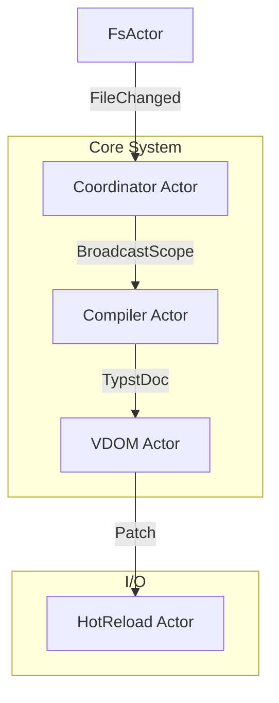

# Tola SSG: VDOM 架构第二阶段 (架构精炼与 Actor 模型)

**状态**: 草稿 (Draft)
**前置文档**: `PLAN_VDOM.md` (第一阶段已完成核心 VDOM 逻辑)
**目标**: 从“功能实现”迈向“架构纯净”，解决耦合与全局状态问题。

---

## 1. 现状回顾与评估

基于对代码库的最新审查：

| 模块 | 状态 | 评价 |
|------|------|------|
| **VDOM Logic** | ✅ 完成 | `StableId` (内容哈希) 和 Diff 算法工作正常且确定性良好。 |
| **Typst 集成** | ⚠️ 耦合 | `typst_lib` 包含 `compile_vdom`，直接依赖了 `vdom` 模块，违反单向依赖原则。 |
| **Hot Reload** | 🚧 混合 | 使用了 `vdom::diff`，但 server 逻辑依赖全局变量 `BROADCAST` 和 `VDOM_CACHE`。 |
| **Concurrency** | ❌ 旧版 | 主循环 `watch.rs` 仍是单线程阻塞模型。`src/actor` 仅为未完成的脚手架。 |
| **Utils** | ⚠️ 耦合 | 工具函数大量依赖 `crate::config` 全局配置，难以单元测试。 |

---

## 2. 详细执行路线图

本阶段目标是将当前“能跑的代码”重构为“设计的代码”。

### Phase 2.1: 清理技术债务 (Technical Debt Cleanup)

### Phase 2.1: 清理 (Cleanup)

- [x] **Delete Orphaned Files**: `src/hotreload/diff.rs` (unused, logic moved to `vdom/diff.rs`).
- [x] **Remove `Node::Frame`**:
    - 既然采用了"立即 SVG 转换"策略，`Node::Frame` 枚举变体目前是死代码。
    - **决定**: 移除 `Node::Frame`，将所有 Frame 在转换阶段直接降级为 `Element::svg`。
    - *注：未来若需支持 AVIF 等光栅化格式，可恢复此变体用于延迟渲染（见 Phase 4）。*
- [~] **Standardize Identity**: `NodeId` 仍用于 `IndexedDocExt` 家族节点追踪，推迟移除。
- [x] **Remove Dead Code**: 无 `#[allow(dead_code)]`，已清理完毕。
- [x] **Harden SVG Parsing**: `convert.rs` 目前使用手动字符串解析 SVG 属性，较为脆弱。考虑引入轻量级 XML 解析器或增强测试覆盖。

### Phase 2.2: 模块解耦 (Decoupling) ✅

这是 Actor 迁移的前置条件。Actor 之间传递的消息必须是纯数据，不能携带复杂的运行时引用。

1.  **净化 `typst_lib` (The \"Clean Compiler\" Goal)**: ✅
    *   **问题**: `typst_lib` 知道 `vdom` 的存在。
    *   **目标**: `typst_lib` 应该只负责 `path -> typst::Document` 的编译。
    *   **方案**:
        *   ✅ 创建 `src/compiler/bridge.rs` (作为适配层)。
        *   ✅ 将 `compile_vdom` 移入 `bridge.rs`。
        *   ✅ 添加 `typst_lib::compile_html` 作为纯编译 API。
        *   旧 `typst_lib::compile_vdom` 保留以向后兼容。

2.  **无状态工具库 (Stateless Utils)**:
    *   **问题**: `utils/minify.rs` 等直接调用 `config::cfg()`。
    *   **方案**: 依赖注入。
        *   修改: `fn minify(html: String) -> String`
        *   改为: `fn minify(html: String, opts: MinifyOptions) -> String`
    *   **收益**: 工具函数将变为纯函数，极大简化测试。

### Phase 2.3: Actor 模型迁移 (The Integration)

利用 `src/actor` 现有的脚手架，逐步替换 `watch.rs` 的核心循环。

#### 2.3.1 Actor 拓扑设计



#### 2.3.2 逐步迁移计划 (Strangler Fig Pattern)

我们采取“并存-替换”策略，而非一次性重写。

*   **Step 1: 激活 Coordinator**:
    *   启用 `Cargo.toml` 中的 `actor` feature。
    *   在 `serve.rs` 启动时初始化 `sys = System::new()`。
    *   将 `notify` 的回调函数改为向 `FsActor` 发送消息。

*   **Step 2: 状态迁移 (State Migration)**:
    *   **VDOM Cache**:
        *   现状: 全局 `static VDOM_CACHE: LazyLock<Mutex<HashMap...>>`。
        *   迁移: 移入 `VDOM Actor` 结构体内部: `struct VdomActor { cache: HashMap... }`。
        *   收益: 移除互斥锁争用，由 Actor 邮箱序列化访问。
    *   **WSServer State**:
        *   现状: 全局 `static BROADCAST`。
        *   迁移: 移入 `HotReload Actor`。所有的广播必须通过 `msg::Broadcast` 消息触发。

*   **Step 3: 替换 Compiler**:
    *   填充 `src/actor/compiler.rs` 的 `do_compile` 方法，接入真正的 `typst_lib`。
    *   实现 rayon 线程池的非阻塞调用 (`tokio::task::spawn_blocking`)。

---

## 3. 详细设计 (Detailed Design)

### 3.1 The Bridge Pattern (`src/compiler/bridge.rs`)

这是解耦 `typst_lib` 的关键。

**目的**:
- `typst_lib` 只负责生成 `typst::Document`。
- `bridge` 负责 `typst::Document` -> `vdom::Document` -> `indexed::Document` 的转换流水线。

**伪代码设计**:

```rust
pub struct CompilerBridge;

impl CompilerBridge {
    /// Convert Typst document to Tola VDOM and apply all transforms
    pub fn to_vdom(
        typst_doc: &typst::Document,
        driver: &dyn BuildDriver
    ) -> Result<Document<Indexed>> {
        // 1. Raw Conversion
        let raw_doc = vdom::from_typst(typst_doc)?;

        // 2. Transformation Pipeline
        let indexed_doc = raw_doc
            .pipe(Transforms::Slugify)      // Inject IDs
            .pipe(Transforms::ProcessLinks) // Fix relative links
            .pipe(Transforms::Index(driver)); // Generate StableIds

        Ok(indexed_doc)
    }
}
```

### 3.2 Actor Protocol Definition (`src/actor/messages.rs`)

精确定义 Actor 间的通信契约。

```rust
// FsActor -> Coordinator
pub enum FsMsg {
    /// Batch of changed files (debounced)
    FilesChanged(Vec<PathBuf>),
}

// Coordinator -> Compiler
pub enum CompilerMsg {
    /// Request compilation of specific files
    Compile {
        files: Vec<PathBuf>,
        // Injects current build configuration (Prod/Dev)
        driver: Box<dyn BuildDriver>,
    },
}

// Compiler -> VDOM
pub enum VdomMsg {
    /// New Typst artifacts ready for VDOM processing
    ProcessArtifacts {
        path: PathBuf,
        doc: Arc<typst::Document>,
    }
}

// VDOM -> HotReload
pub enum PatchMsg {
    /// Diffs ready to be broadcast
    BroadcastPatches {
        path: String, // URL path
        patches: Vec<Patch>,
    }
}
```

### 3.3 Testing Strategy

架构解耦的最大收益是可测试性。

*   **Unit Tests (Pure Core)**: 继续测试 `vdom::diff` 和 `StableId`，无需 Mock。
*   **Integration Tests (Actors)**:
    *   启动 `CompilerActor`，通过 channel 发送 `Compile` 消息。
    *   断言输出 channel 收到了预期的 `ProcessArtifacts` 消息。
    *   **无需**启动真实的 Web Server 或 WebSocket。

---

## 4. Phase 3: 构建流水线优化 (Pipeline Optimization)

*注：原 PLAN_VDOM 的 Part V*

在架构理顺后，解决“两遍编译”的性能问题。

1.  **智能跳过 (Smart Skip)**:
    *   **现状**: 第一遍为了提取 metadata 编译所有文件，丢弃 HTML；第二遍为了注入 metadata 重新编译。
    *   **优化**:
        *   记录每个页面是否访问了 `/_data` (虚拟文件)。
        *   如果未访问虚拟文件，第一遍的 HTML 直接保留作为最终产物。
        *   显著减少静态页面 (如 About, Post Detail) 的重复编译开销。

2.  **增量虚拟文件**:
    *   **现状**: 更新文章会导致所有依赖 `pages.json` 的页面重编。
    *   **优化**: 细粒度依赖追踪 (需配合 Salsa 或手动依赖图优化)。

---

## Phase 4: 未来考量 (Future Considerations)

### 4.1 AVIF/光栅化支持 (Deferred Rasterization)

目前 `Element::svg` 策略对矢量图非常完美。但如果未来需要支持将公式/图表渲染为 AVIF/PNG 以减小体积或保护字体版权，我们需要**恢复并改造 `Node::Frame`**。

- **问题**: 光栅化 (Rasterization) 是 CPU 密集型操作，不能在 `Raw` 转换阶段同步进行，否则会阻塞构建。
- **方案**:
    1.  **恢复 `Node::Frame`**: 在 `Raw` 阶段持有 `Arc<typst::layout::Frame>`。
    2.  **新增 `Rasterizer` Transform**: 在 Actor 模型中，并行地将 `Node::Frame` 转换为 `Node::Element(img)`。
    3.  **并行计算**: 利用 Rayon 或 Actor Pool 进行并行渲染。

### 4.2 架构决策记录 (ADR Update)

### 5.1 为什么坚持 Actor 模型？
虽然目前项目规模尚小，但 Actor 模型强制了**状态隔离**。对于热重载系统，最大的 Bug 来源就是多线程下的状态竞争 (`World` 状态 vs `Render` 状态)。Actor 模型通过消息传递，自然地序列化了对 `World` 的修改，从根本上消除了 Data Race。

### 5.2 为什么保留 `src/driver.rs`？
`BuildDriver` trait 是构建流程的抽象 (Prod vs Dev)。它与 Actor 模型不冲突：
*   Compiler Actor 内部会持有一个 `Box<dyn BuildDriver>`。
*   在 Dev 模式下，注入 `DevelopmentDriver` (生成 data-ids)。
*   在 Prod 模式下，注入 `ProductionDriver` (开启优化)。

---

## 6. 下一步行动清单 (Immediate Actions)

- [ ] **Cleanup**: 删除 `src/hotreload/diff.rs`。
- [ ] **Decouple**: 重构 `typst_lib`，移除 `vdom` 依赖。
- [ ] **Refactor**: 修改 `compile_page` 签名，剥离副作用。
- [ ] **Verify**: 运行测试确保 `StableId` 在重构中保持不变。
